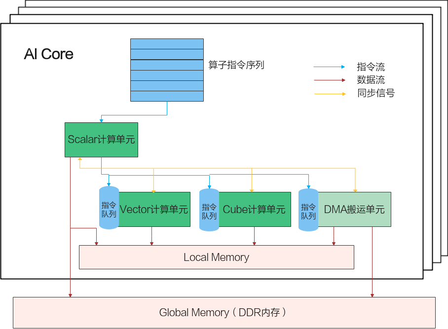

# AI Core内部并行计算架构抽象

使用Ascend C开发方式开发的算子运行在AI Core上。AI Core是昇腾AI处理器中的计算核心，AI处理器内部有多个AI Core。AI Core内部并行计算架构抽象示意图如[图1](javascript:;)所示。

**图1** AI Core内部并行计算架构抽象示意图

AI Core中包含**计算单元、存储单元、搬运单元**等核心组件。计算单元包括了三种基础计算资源：**Cube计算单元、Vector计算单元和Scalar计算单元**。存储单元即为AI Core的内部存储，统称为Local Memory，与此相对应，AI Core的外部存储称之为Global Memory。DMA搬运单元负责在Global Memory和Local Memory之间搬运数据。

AI Core内部核心组件及组件功能详细说明如下表。

| 组件分类 | 组件名称           | 组件功能                                                     |
| -------- | ------------------ | ------------------------------------------------------------ |
| 计算单元 | Scalar             | 执行地址计算、循环控制等标量计算工作，并把向量计算、矩阵计算、数据搬运、同步指令发射给对应单元执行。 |
| Vector   | 负责执行向量运算。 |                                                              |
| Cube     | 负责执行矩阵运算。 |                                                              |
| 存储单元 | Local Memory       | AI Core的内部存储。                                          |
| 搬运单元 | DMA                | 负责在Global Memory和Local Memory之间搬运数据，包含搬运单元MTE2（Memory Transfer Engine，数据搬入单元），MTE3（数据搬出单元）。 |

AI Core内部的异步并行计算过程：Scalar计算单元读取指令序列，并把向量计算、矩阵计算、数据搬运指令发射给对应单元的指令队列，向量计算单元、矩阵计算单元、数据搬运单元异步的并行执行接收到的指令。该过程可以参考[图1](javascript:;)中蓝色箭头所示的指令流。

不同的指令间有可能存在依赖关系，为了保证不同指令队列间的指令按照正确的逻辑关系执行，Scalar计算单元也会给对应单元下发同步指令。各单元之间的同步过程可以参考[图1](javascript:;)中的橙色箭头所示的同步信号流。

AI Core内部数据处理的基本过程：DMA搬入单元把数据搬运到Local Memory，Vector/Cube计算单元完成数据，并把计算结果写回Local Memory，DMA搬出单元把处理好的数据搬运回Global Memory。该过程可以参考[图1](javascript:;)中的红色箭头所示的数据流。