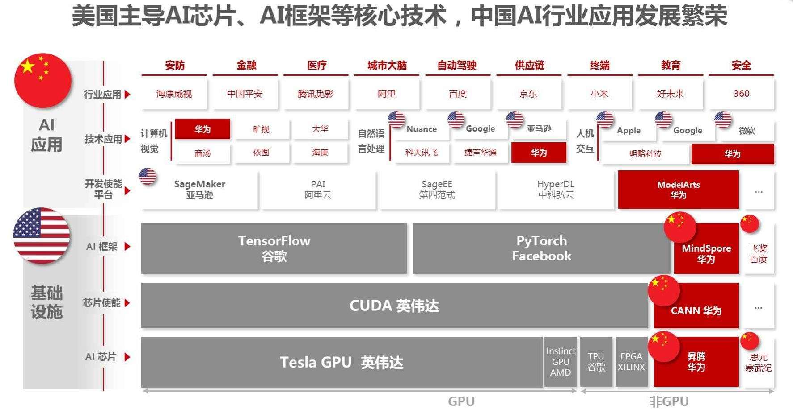
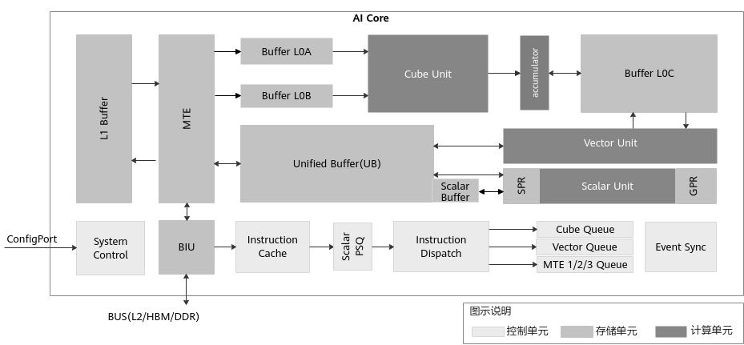
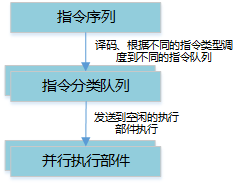
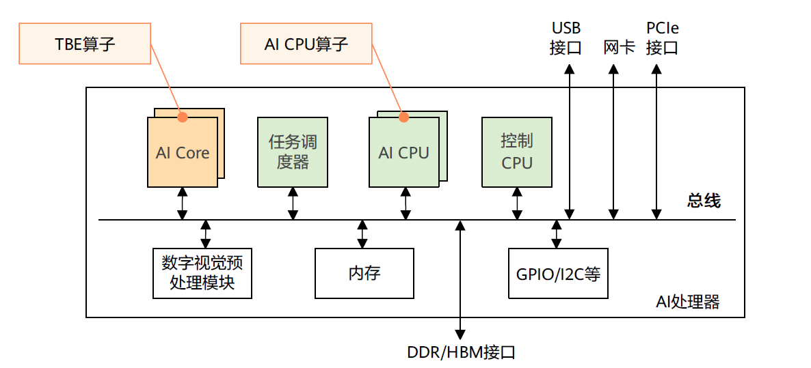
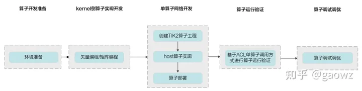
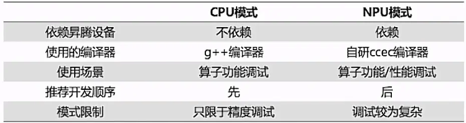
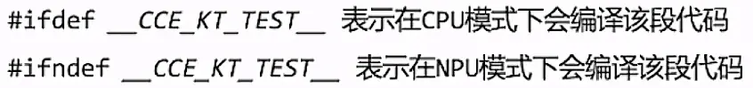
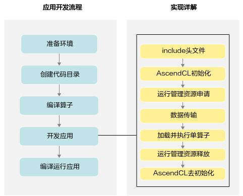

# 使用CANN的C++接口实现BFS

之前在构思项目的时候存在一个错误逻辑：要使用NPU——》必须采用mindspore——》mindspore只支持python，而CPU代码采用C++——》需要解决c++和python之间的调度问题——》文件传输？混合编程？——》……。但是实际上第一步逻辑就错了，因为要使用NPU不一定非要采用mindspore。mindspore只是一个为了提高可编程性，降低开发成本的python框架，它是建立在CANN计算架构的基础上。由于矩阵实现的BFS算法非常简单，实际上可以绕过mindspore框架，直接用CANN的C++算子实现在NPU上执行BFS算法。

## 背景知识

### NPU开发层次结构

图：NPU开发层次结构



#### AI芯片

昇腾（HUAWEI Ascend) 310是一款高能效、灵活可编程的人工智能处理器，在典型配置下可以输出16TOPS@INT8, 8TOPS@FP16，功耗仅为8W。采用自研华为达芬奇架构，集成丰富的计算单元, 提高AI计算完备度和效率，进而扩展该芯片的适用性。全AI业务流程加速,大幅提高AI全系统的性能，有效降低部署成本。

昇腾（HUAWEI Ascend) 910是业界算力最强的AI处理器，基于自研华为达芬奇架构3D Cube技术，实现业界最佳AI性能与能效，架构灵活伸缩，支持云边端全栈全场景应用。算力方面，昇腾910完全达到设计规格，半精度（FP16）算力达到320 TFLOPS，整数精度（INT8）算力达到640 TOPS，功耗310W。

[昇腾（HUAWEI Ascend) 芯片 | 海思官网 (hisilicon.com)](https://www.hisilicon.com/cn/products/Ascend)

#### 计算架构

CANN（Compute Architecture for Neural Networks）是华为针对AI场景推出的异构计算架构，对上支持多种AI框架，对下服务AI处理器与编程，发挥承上启下的关键作用，是提升昇腾AI处理器计算效率的关键平台。

[CANN](https://www.hiascend.com/document/detail/zh/CANNCommunityEdition/600alpha006/overview/index.html)

#### AI框架

昇思MindSpore是一个全场景深度学习框架，旨在实现易开发、高效执行、全场景覆盖三大目标。其中，易开发表现为API友好、调试难度低；高效执行包括计算效率、数据预处理效率和分布式训练效率；全场景则指框架同时支持云、边缘以及端侧场景。

[MindSpore](https://www.mindspore.cn/tutorials/zh-CN/master/index.html)

#### AI开发平台

ModelArts是面向开发者的一站式AI开发平台，为机器学习与深度学习提供海量数据预处理及半自动化标注、大规模分布式Training、自动化模型生成，及端-边-云模型按需部署能力，帮助用户快速创建和部署模型，管理全周期AI工作流。

[ModelArts (huaweicloud.com)](https://support.huaweicloud.com/modelarts/index.html)

### AI Core架构

不同于传统的支持通用计算的CPU和GPU，也不同于专用于某种特定算法的专用芯片ASIC（Application Specific Integrated Circuit），AI Core架构本质上是为了适应某个特定领域中的常见应用和算法，通常称为“特定域架构”（Domain Specific Architecture,DSA）。

昇腾AI处理器的计算核心主要由AI Core构成，从控制上可以看成是一个相对简化的现代微处理器的基本架构。它包括了三种基础计算资源：**矩阵计算单元（Cube Unit）、向量计算单元（Vector Unit）和标量计算单元（Scalar Unit）**。这三种计算单元各司其职，形成了三条独立的执行流水线，在系统软件的统一调度下互相配合达到优化的计算效率。此外在矩阵计算单元和向量计算单元内部还提供了不同精度、不同类型的计算模式。

图：AI Core架构


AI Core中包含计算单元、存储单元、与控制单元。

[昇腾AI处理器](https://bbs.huaweicloud.com/blogs/134295)

#### 计算单元

计算单元是AI Core中提供强大算力的核心单元，相当于AI Core的主力军。AI Core中的计算单元主要包括：Cube Unit（矩阵计算单元）、Vector Unit（向量计算单元）和Scalar Unit（标量计算单元），完成AI Core中不同类型的数据计算。

| 计算单元 | 描述                                                         |
| -------- | ------------------------------------------------------------ |
| Cube     | Cube负责执行**矩阵**运算。Cube每次执行可以完成一个fp16的16*16与16 *16的矩阵乘，例如C=A *B，如果是int8输入，则一次完成16 *32与32 *16的矩阵乘。其中A来源于L0A，B来源于L0B，L0C存储矩阵乘的结果和中间结果。 |
| Vector   | Vector负责执行**向量**运算。**其算力低于Cube，但灵活度高于Cube**（如支持数学中的求倒数，求平方根等）。Vector所有计算的源数据以及目标数据都要求存储在Unified Buffer中，并要求32Byte对齐。 |
| Scalar   | Scalar负责各类型的标量数据运算和程序的流程控制。功能上可以看做一个小CPU，完成整个程序的循环控制、分支判断、Cube/Vector等指令的地址和参数计算以及基本的算术运算等。 |

#### 存储单元

AI Core中存在内部存储，AI Core需要把外部存储（通常包括L2、HBM、DDR等）中的数据加载到内部存储中，才能完成相应的计算。AI Core的主要内部存储包括：L1 Buffer（L1缓冲区），L0 Buffer（L0缓冲区），Unified Buffer（统一缓冲区）和Scalar Buffer（标量缓冲区）。

为了配合AI Core中的数据传输和搬运，AI Core中还包含BIU（Bus Interface Unit，总线接口单元），MTE1（Memory Transfer Engine，存储转换引擎），MTE2，MTE3。其中BIU为AI Core与总线交互的接口；MTE为数据搬运单元，完成不同Buffer之间的数据搬运。

不同类型的昇腾AI处理器，存储单元大小不同，用户可通过[get_soc_spec](https://www.hiascend.com/document/detail/zh/CANNCommunityEdition/63RC2alpha002/operatordevelopment/opdevg/atlasplatform_07_0005.html)接口获取。

AI Core的内部存储列表如[下表](javascript:;)所示。

| 存储单元                | 描述                                                         |
| ----------------------- | ------------------------------------------------------------ |
| MTE                     | AI Core上有多个MTE（Memory Transfer Engine，存储转换引擎），MTE负责AI Core内部数据在不同Buffer之间的读写管理及一些格式转换的操作，比如填充（padding）、转置（transpose）、3D图像转2D矩阵（Img2Col）等。 |
| BIU                     | BIU (Bus Interface Unit，总线接口单元)， AI Core的“大门”，负责AI Core与总线的交互。BIU是AI Core从外部（L2缓冲区/双倍速率内存DDR/高速宽带内存HBM）读取数据以及往外写数据的出入口，负责把AI Core的读写请求转换为总线上的请求并完成协议交互等工作。 |
| L1 Buffer               | L1缓冲区，通用内部存储，是AI Core内比较大的一块数据中转区，可暂存AI Core中需要反复使用的一些数据从而减少从总线读写的次数。某些MTE的数据格式转换功能，要求源数据必须位于L1 Buffer，例如3D图像转2D矩阵（Img2Col）操作。 |
| L0A Buffer / L0B Buffer | Cube指令的输入。                                             |
| L0C Buffer              | Cube指令的输出，但进行累加计算的时候，也是输入的一部分。     |
| Unified Buffer          | 统一缓冲区，向量和标量计算的输入和输出。                     |
| Scalar Buffer           | 标量计算的通用缓冲区，作为GPR（通用寄存器，General-Purpose Register）不足时的补充。 |
| GPR                     | 通用寄存器（General-Purpose Register），标量计算的输入和输出。应用开发工程师不需要具体关注这些寄存器。由系统内部实现封装，程序访问Scalar Buffer并执行标量计算的时候，系统内部自动实现Scalar Buffer和GPR之间的同步。 |
| SPR                     | 专用寄存器（Special-Purpose Register），AI Core的一组配置寄存器。通过修改SPR的内容可以修改AI Core的部分计算行为。 |

AI Core的存储单元分为如下三类：

- Cache：对程序员透明，当指令指定访问下级存储单元的时候，Cache可以对数据进行缓存，从而加快访问速度。
- Buffer：对程序员可见的存储空间，通常用于向量计算或者标量计算中的临时数据保存等。
- Register：对程序员可见的存储空间，通常用于标量计算。

#### 控制单元

控制单元为整个计算过程提供了指令控制，相当于AI Core的司令部，负责整个AI Core的运行。AI Core包含的控制单元如[表3](javascript:;)所示。系统控制模块负责指挥和协调AI Core的整体运行模式，配置参数和实现功耗控制等。当指令通过指令发射模块顺次发射出去后，根据指令的不同类型，将会分别被发送到矩阵运算队列、向量运算队列和存储转换队列。

指令执行过程中，可以提前预取后续指令，并一次读入多条指令进入缓存，提升指令执行效率。多条指令从系统内存通过总线接口（BIU）进入到AI Core的指令缓存模块（Instruction Cache）中等待后续硬件快速自动解码或运算。指令被解码后便会被导入标量队列中，实现地址解码与运算控制。

| 控制单元                             | 描述                                                         |
| ------------------------------------ | ------------------------------------------------------------ |
| 系统控制模块（System Control）       | 外部的Task Scheduler控制和初始化AI Core的配置接口， 配置PC、Para_base、BlockID等信息，具体功能包括：Block执行控制、Block执行完之后中断和状态申报、执行错误状态申报等。 |
| 指令缓存模块（Instruction Cache）    | AI Core内部的指令Cache， 具有指令预取功能。                  |
| 标量指令处理队列（Scalar PSQ）       | Scalar指令处理队列。                                         |
| 指令发射模块（Instruction Dispatch） | CUBE/Vector/MTE指令经过Scalar PSQ处理之后，地址、参数等要素都已经配置好，之后Instruction Dispatch单元根据指令的类型，将CUBE/Vector/MTE指令分别分发到对应的指令队列等待相应的执行单元调度执行。 |
| 矩阵运算队列（Cube Queue）           | Cube指令队列。同一个队列里的指令顺序执行，不同队列之间可以并行执行。 |
| 向量运算队列（Vector Queue）         | Vector指令队列。同一个队列里的指令顺序执行，不同队列之间可以并行执行。 |
| 存储转换队列（MTE Queue）            | MTE指令队列。同一个队列里的指令顺序执行，不同队列之间可以并行执行。 |
| 事件同步模块（Event Sync）           | 用于控制不同队列指令（也叫做不同指令流水）之间的依赖和同步的模块。 |

#### 执行流水线

AI Core采用顺序取指令、并行执行指令的调度方式，如下图所示：

图：AI Core指令调度方式



指令序列被顺序译码。根据指令的类型，有两种可能：

- 如果指令是Scalar指令，指令会被直接执行。
- 其他指令，指令会被调度到5个独立的分类队列，然后再分配到某个空间的执行部件执行。

## 算子开发

### 调用已有算子

调研发现以下CANN中以下两个算子可以分别实现矩阵向量加，以及归约操作

#### 矩阵向量加

| 矩阵向量加                          |                                                              |
| ----------------------------------- | ------------------------------------------------------------ |
| name                                | AddV2()                                                      |
| source code                         | elewise_calculation_ops.h                                    |
| return                              | Returns x1 + x2 element-wise                                 |
| Inputs                              | x1: A tensor. Must be one of the following types: float16, float32, float64, uint8, int8, int16, int32, int64, complex64, complex128. x2: A tensor of the same type as "x1" |
| Attention                           | Constraints: AddV2 supports broadcasting.                    |
| Outputs                             | y: A tensor. Has the same type as "x1".                      |
| Third-party framework compatibility | Compatible with the TensorFlow operator AddV2.               |

#### 归约操作

| 归约操作                            |                                                              |
| ----------------------------------- | ------------------------------------------------------------ |
| name                                | ReduceMin                                                    |
| source code                         | reduce_ops.h                                                 |
| function                            | Computes the minimum of elements across dimensions of a tensor . |
| Inputs                              | input_tensor: A Tensor. Must be one of the following types: float16, float32, int8, uint8. axes: A Tensor of type int8 or int32. Specifies the dimensions to reduce. Defaults to "None". |
| Attributes                          | keep_dims: An optional bool. If "True", reduced dimensions will be retained. Defaults to "False". |
| Outputs                             | A Tensor. Must be one of the following types: float16, float32, int8, uint8 . |
| Attention                           | Constraints: If "axes = None", all dimensions will be reduced. "axes" must be in the range [-rank(input_shape), rank(input_shape)) . |
| Third-party framework compatibility | Compatible with the TensorFlow operator reduce_min.          |

###  开发自定义算子

算子（Operator，简称OP）是算法中的一个个计算单元。CANN支持用户使用多种方式来开发自定义算子，包括TBE DSL、TBE TIK、AICPU、Ascend C四种开发方式。其中TBE DSL、TBE TIK算子运行在AI Core上，AI CPU算子运行在AI CPU上，。

图：算子执行



> AI Core是昇腾AI处理器的计算核心，负责执行矩阵、向量、标量计算密集的算子任务。
>
> AI CPU负责执行不适合跑在AI Core上的算子，是AI Core算子的补充，主要承担非矩阵类、逻辑比较复杂的分支密集型计算。

#### 一览表

下面的开发方式一览表，对上述几种开发方式作对比说明，您可以根据各种开发方式的适用场景选择适合的开发方式。

| 算子开发方式 | TIK                                                          | AI CPU                                                       | AI CPU                                                       | Ascend C                                                     |
| ------------ | ------------------------------------------------------------ | ------------------------------------------------------------ | ------------------------------------------------------------ | ------------------------------------------------------------ |
| 语言         | Python                                                       | Python                                                       | C++                                                          | C++                                                          |
| 计算单元     | AI Cor                                                       | AI Core                                                      | AI CPU                                                       | AI Core                                                      |
| 优点         | 接口高度封装，开发者无需感知硬件内部逻辑，入门较快。         | 开发者可自行控制数据搬运和调度过程，熟悉AI处理器架构的开发者，可以快速开发出高效的算子。 | 提供原生C++接口，具备C++程序开发能力的开发者入门较快。无需感知硬件内部复杂逻辑。 | C/C++原语编程 编程模型屏蔽硬件差异，编程范式提高开发效率 多层级API封装，从简单到灵活，兼顾易用与高效 调试方法简单 |
| 适用场景     | 适用于通用场景下的逻辑运算，开发效率较高；对于特殊场景支持度不足。 | 适用各类算子的开发，对复杂计算场景支持度好。                 | AI CPU算子性能较低，算子无法通过AI Core方式实现或者需要临时快速打通网络的场景下使用。 | 当前TIK C++支持的AI处理器型号为昇腾310P AI处理器、昇腾910 AI处理器，其他型号暂不支持。<br/>当前支持用户使用g++等C/C++编译器编译在cpu侧执行的TIK C++算子，并使用gdb单步调试；支持用户使用CCEC编译器编译在npu侧执行的TIK C++算子，实现加速计算。 |

#### 基于TBE开发框架的算子开发

TBE（Tensor Boost Engine：张量加速引擎）是CANN提供的算子开发框架，开发者可以基于此框架使用Python语言开发自定义算子，通过TBE进行算子开发有TBE DSL、TBE TIK两种方式。

> TBE DSL（Domain-Specific Language ，基于特性域语言）开发方式

为了方便开发者进行自定义算子开发，CANN预先提供一些常用运算的调度，封装成一个个运算接口，称为基于TBE DSL开发。DSL接口已高度封装，用户仅需要使用DSL接口完成计算过程的表达，后续的算子调度、算子优化及编译都可通过已有的接口一键式完成，适合初级开发用户。

> TBE TIK（Tensor Iterator Kernel）开发方式

TIK（Tensor Iterator Kernel）是一种基于Python语言的动态编程框架，呈现为一个Python模块，运行于Host CPU上。开发者可以通过调用TIK提供的API基于Python语言编写自定义算子，TIK编译器会将其编译为昇腾AI处理器应用程序的二进制文件。

TIK需要用户手工控制数据搬运和计算流程，入门较高，但开发方式比较灵活，能够充分挖掘硬件能力，在性能上有一定的优势。

#### AI CPU算子开发方式

AI CPU算子的开发接口即为原生C++接口，具备C++程序开发能力的开发者能够较容易的开发出AI CPU算子。AI CPU算子在AI CPU上运行。

#### Ascend C算子开发方式

TIK C++是一种使用C/C++作为前端语言的算子开发工具，通过四层接口抽象、并行编程范式、CPU侧模拟NPU孪生调试等技术，极大提高算子开发效率，助力AI开发者低成本完成算子开发和模型调优部署。

图：TIK C++算子开发流程




**算子开发流程：**

- 算子分析：分析算子的数学表达式、输入、输出以及计算逻辑的实现，明确需要调用的TIK C++接口。
- 核函数定义：定义TIK C++算子入口函数。
- 根据矢量编程范式实现算子类：完成核函数的内部实现。核函数（Kernel Function）是TIK C++算子设备侧实现的入口。TIK C++允许用户使用核函数这种C/C++函数的语法扩展来管理设备端的运行代码，用户在核函数中进行算子类对象的创建和其成员函数的调用，由此实现该算子的所有功能。核函数是主机端和设备端连接的桥梁
- 核函数是直接在设备端执行的代码。在核函数中，需要为在一个核上执行的代码规定要进行的数据访问和计算操作，当核函数被调用时，多个核将并行执行同一个计算任务。核函数需要按照如下规则进行编写。
- 使用函数类型限定符除了需要按照C/C++函数声明的方式定义核函数之外，还要为核函数加上额外的函数类型限定符，包含__global__和__aicore__。
  使用__global__函数类型限定符来标识它是一个核函数，可以被<<<...>>>调用；使用__aicore__函数类型限定符来标识该核函数在设备端AI Core上执行：
- **__global__****__aicore__** void kernel_name(argument list);


**使用变量类型限定符：**
指针入参变量统一的类型定义为__gm__ uint8_t*，这里统一使用uint8_t类型的指针，在后续的使用中需要将其转化为实际的指针类型；用户亦可直接传入实际的指针类型。


- 核函数的调用语句是C/C++函数调用语句的一种扩展。
  核函数使用内核调用符<<<...>>>这种语法形式，来规定核函数的执行配置：
  kernel_name<<<blockDim, l2ctrl, stream>>>(argument **list**);
  内核调用符仅可在NPU侧编译时调用，CPU侧编译无法识别该符号。
  执行配置由3个参数决定：
- blockDim，规定了核函数将会在几个核上执行。每个执行该核函数的核会被分配一个逻辑ID，表现为内置变量block_idx，可以在核函数的实现中直接使用；
- l2ctrl，保留参数，暂时设置为固定值nullptr，开发者无需关注；
- stream，类型为aclrtStream，stream是一个任务队列，应用程序通过stream来管理任务的并行。核函数的调用是异步的，核函数的调用结束后，控制权立刻返回给主机端，可以调用以下函数来强制主机端程序等待所有核函数执行完毕。
  aclError aclrtSynchronizeStream(aclrtStream stream);

**算子执行的不同模式：**

TIK C++算子可用CPU模式或NPU模式执行

CPU模式：算子功能调试用，可以模拟在NPU上的计算行为，不需要依赖昇腾设备

NPU模式：算子功能/性能调试，可以使用NPU的强大算力进行运算加速



代码里使用内置宏 __CCE_KT_TEST__标识被宏包括的代码在CPU或NPU模式下编译。



## NPU上应用开发流程

### 使用mindspore接口

mindspore提供了python接口，可以直接实现矩阵向量加，以及矩阵归约。使用比较灵活，文件读写，格式转换等操作也比较方便。代价是执行效率比较低。

```python
def BFSMatmul(x,y,eye):
    add = ops.Add()#矩阵向量加
    sum = add(x, y)                
    op = ops.ReduceMin(keep_dims=True)#按列求最小值
    output = op(sum,0)
    return output
```

### 使用单算子调用

**AscendCL（Ascend Computing Language）**是一套用于在昇腾平台上开发深度神经网络推理应用的C语言API库，提供运行资源管理、内存管理、模型加载与执行、算子加载与执行、媒体数据处理等API，实现对所有昇腾资源的调用。

> CANN社区版文档包含应用开发（C&C++），注意较早版本只有python版本的

如果AI应用中不仅仅包括模型推理，还有数学运算（例如BLAS基础线性代数运算）、数据类型转换等功能，也想使用昇腾的算力，可以采用**单算子调用**的方式，直接通过AscendCL接口加载并执行单个算子，省去模型构建、训练的过程，相对轻量级，又可以使用昇腾的算力。另外，自定义的算子，也可以通过单算子调用的方式来验证算子的功能。

图：单算子调用开发流程



1. 准备环境。

   请参见[准备开发和运行环境](https://www.hiascend.com/document/detail/zh/CANNCommunityEdition/63RC2alpha002/infacldevg/aclcppdevg/aclcppdevg_01_0004.html)。

2. 创建代码目录。

   在开发应用前，您需要先创建目录，存放代码文件、编译脚本、测试图片数据、模型文件等。

   参考目录结构：

   ```
   ├App名称
   ├── op_model              // 该目录下存放编译算子的算子描述文件
   │   ├── xxx.json               
   
   ├── data
   │   ├── xxxxxx           // 测试数据
   
   ├── inc                   // 该目录下存放声明函数的头文件
   │   ├── xxx.h               
   
   ├── out                   // 该目录下存放输出结果     
   
   ├── src   
   │   ├── xxx.json         // 系统初始化的配置文件
   │   ├── CMakeLists.txt   // 编译脚本
   │   ├── xxx.cpp          // 实现文件   
   ```

3. 编译算子时，有以下两种方式（参见[单算子调用流程](https://www.hiascend.com/document/detail/zh/CANNCommunityEdition/63RC2alpha002/infacldevg/aclcppdevg/aclcppdevg_000073.html)中的说明）：

   - 使用ATC工具编译算子生成om模型文件

     该种方式，需要先构造*.json格式单算子描述文件（描述算子的输入、输出及属性等信息），借助ATC工具，将单算子描述文件编译成om模型文件；再分别调用AscendCL接口加载om模型文件、执行算子。

     关于ATC工具的使用说明，请参见《[ATC工具使用指南](https://www.hiascend.com/document/detail/zh/CANNCommunityEdition/63RC2alpha002/infacldevg/atctool/atlasatc_16_0003.html)》。

   - 也可以调用AscendCL提供的编译算子接口

     该种方式，直接调用AscendCL接口编译、执行算子。

4. 开发应用。

   依赖的头文件和库文件的说明请参见[调用接口依赖的头文件和库文件说明](https://www.hiascend.com/document/detail/zh/CANNCommunityEdition/63RC2alpha002/infacldevg/aclcppdevg/aclcppdevg_000004.html#ZH-CN_TOPIC_0000001550704284__section1494913184520)。

   单算子调用的流程请参见[单算子调用流程](https://www.hiascend.com/document/detail/zh/CANNCommunityEdition/63RC2alpha002/infacldevg/aclcppdevg/aclcppdevg_000073.html)及相关的示例代码。

   开发应用流程：

   - AscendCL初始化，请参见

     AscendCL初始化与去初始化[AscendCL初始化与去初始化](https://www.hiascend.com/document/detail/zh/CANNCommunityEdition/63RC2alpha002/infacldevg/aclcppdevg/aclcppdevg_000010.html)。

     使用AscendCL接口开发应用时，必须先调用[aclInit](https://www.hiascend.com/document/detail/zh/CANNCommunityEdition/63RC2alpha002/infacldevg/aclcppdevg/aclcppdevg_03_0015.html)接口进行AscendCL初始化，否则可能会导致后续系统内部资源初始化出错，进而导致其它业务异常。

   - 运行管理资源申请，请参见[运行管理资源申请与释放](https://www.hiascend.com/document/detail/zh/CANNCommunityEdition/63RC2alpha002/infacldevg/aclcppdevg/aclcppdevg_000011.html)。

   - 数据传输，请参见[数据传输](https://www.hiascend.com/document/detail/zh/CANNCommunityEdition/63RC2alpha002/infacldevg/aclcppdevg/aclcppdevg_000012.html)。

   - 执行模型推理。请参见[模型推理](https://www.hiascend.com/document/detail/zh/CANNCommunityEdition/63RC2alpha002/infacldevg/aclcppdevg/aclcppdevg_000013.html)。

     若需要处理模型推理的结果，还需要进行数据后处理，例如对于图片分类应用，通过数据后处理从推理结果中查找最大置信度的类别标识。

     模型推理结束后，需及时释放推理相关资源。

   - 所有数据处理结束后，需及时释放运行管理资源，请参见[运行管理资源申请与释放](https://www.hiascend.com/document/detail/zh/CANNCommunityEdition/63RC2alpha002/infacldevg/aclcppdevg/aclcppdevg_000011.html)。

   - 执行AscendCL去初始化，请参见[AscendCL初始化与去初始化](https://www.hiascend.com/document/detail/zh/CANNCommunityEdition/63RC2alpha002/infacldevg/aclcppdevg/aclcppdevg_000010.html)。

5. 编译运行应用，请参见[应用调试](https://www.hiascend.com/document/detail/zh/CANNCommunityEdition/63RC2alpha002/infacldevg/aclcppdevg/aclcppdevg_000100.html)。

## 代码实现

### 功能描述

该样例主要实现矩阵-矩阵相乘的运算：C = αAB + βC，A、B、C都是16*16的矩阵，矩阵乘的结果是一个16 *16的矩阵。

### 目录结构

样例代码结构如下所示。

```
├── inc                                 
│   ├── common.h                    //定义公共函数（例如：文件读取函数）的头文件
│   ├── gemm_runner.h               //定义矩阵乘运算相关函数的头文件
                 
├── run
│   ├── out  
│   │   ├──test_data
│   │   │   ├── config                           
│   │   │   │     ├── acl.json           //系统初始化的配置文件
│   │   │   │     ├── gemm.json          //矩阵乘算子的算子描述信息
│   │   │   ├── data                           
│   │   │   │     ├── generate_data.py   //用于生成矩阵A、矩阵B的数据

├── src
│   ├── CMakeLists.txt             //编译脚本
│   ├── common.cpp                 //公共函数（例如：文件读取函数）的实现文件
│   ├── gemm_main.cpp              //主函数的实现文件                         
│   ├── gemm_runner.cpp            //执行矩阵乘运算相关函数的实现文件
```

### 环境要求

- 操作系统及架构：CentOS 7.6 x86_64、CentOS aarch64、Ubuntu 18.04 x86_64、EulerOS x86、EulerOS aarch64

- 编译器：g++或aarch64-linux-gnu-g++

- 芯片：Ascend 310、Ascend 310P、Ascend 910

- python及依赖的库：python3.7.5

- 已在环境上部署昇腾AI软件栈，并配置对应的的环境变量，请参见[Link](https://www.hiascend.com/document)中对应版本的CANN安装指南。

  以下步骤中，开发环境指编译开发代码的环境，运行环境指运行算子、推理或训练等程序的环境，运行环境上必须带昇腾AI处理器。开发环境和运行环境可以合设在同一台服务器上，也可以分设，分设场景下，开发环境下编译出来的可执行文件，在运行环境下执行时，若开发环境和运行环境上的操作系统架构不同，则需要在开发环境中执行交叉编译。

### 准备单算子模型和测试数据

1. 配置CANN基础环境变量和Python环境变量，请参见[Link](https://file+.vscode-resource.vscode-cdn.net/e%3A/华科实验室论文/Huawei_accelerator/samples-master/cplusplus/environment/environment_variable_configuration_CN.md)。

2. 以运行用户登录开发环境。

3. 下载sample仓代码并上传至环境后，请先进入“cplusplus/level1_single_api/1_acl/4_blas/gemm”样例目录。

   请注意，下文中的样例目录均指“cplusplus/level1_single_api/1_acl/4_blas/gemm”目录。

4. 准备测试数据。

   切换到“样例目录/run/out/test_data/data“目录下，执行generate_data.py脚本，在“run/out/test_data/data“目录下生成矩阵A的数据文件matrix_a.bin、矩阵B的数据文件matrix_b.bin、矩阵C的数据文件matrix_c.bin。

   ```python
   python3.7.5 generate_data.py
   ```

   “run/out/test_data/data“目录下生成的output.bin文件，其中的数据是generate_data.py脚本中直接通过公式计算出来的矩阵乘结果，不作为该样例的输入数据。

5. 准备单算子模型。

   将矩阵乘算子的算子描述信息（*.json文件）编译成适配昇腾AI处理器的离线模型（*.om文件），运行矩阵乘算子时使用。

   切换到样例目录，执行如下命令(以昇腾310 AI处理器为例)：

   ```python
   atc --singleop=run/out/test_data/config/gemm.json --soc_version=Ascend310 --output=run/out/op_models
   ```

   - --singleop：单算子定义文件（*.json文件）。
   - --soc_version：昇腾AI处理器的版本。进入“CANN软件安装目录/compiler/data/platform_config”目录，".ini"文件的文件名即为昇腾AI处理器的版本，请根据实际情况选择。
   - --output：生成的om文件必须放在“run/out/op_models“目录下。

### 编译运行

1. 配置CANN基础环境变量和Python环境变量，请参见[Link](https://file+.vscode-resource.vscode-cdn.net/e%3A/华科实验室论文/Huawei_accelerator/samples-master/cplusplus/environment/environment_variable_configuration_CN.md)。

2. 编译代码。

   1. 以运行用户登录开发环境。

   2. 下载sample仓代码并上传至环境后，请先进入“cplusplus/level1_single_api/1_acl/4_blas/gemm”样例目录。

      请注意，下文中的样例目录均指“cplusplus/level1_single_api/1_acl/4_blas/gemm”目录。

   3. 设置环境变量，配置程序编译依赖的头文件与库文件路径。

      设置以下环境变量后，编译脚本会根据“{DDK_PATH}环境变量值/runtime/include/acl”目录查找编译依赖的头文件，根据{NPU_HOST_LIB}环境变量指向的目录查找编译依赖的库文件。“$HOME/Ascend”请替换“Ascend-cann-toolkit”包的实际安装路径。

      **注意**，在配置{NPU_HOST_LIB}环境变量时，需使用的“runtime/lib64/stub”目录下*.so库，确保在编译基于AscendCL接口的应用程序时，不依赖其它组件（例如Driver）的 *.so库，编译成功后，运行应用程序时，系统会根据LD_LIBRARY_PATH环境变量查找“Ascend-cann-toolkit安装目录/runtime/lib64”目录下的 *.so库，同时会自动链接到所依赖的其它组件的 *.so库。

      - 当开发环境与运行环境的操作系统架构相同时，配置示例如下所示：

        ```python
        export DDK_PATH=/usr/local/Ascend/ascend-toolkit/latest
        export NPU_HOST_LIB=$DDK_PATH/atc/lib64/stub
        ```

      - 当开发环境与运行环境的操作系统架构不同时，配置示例如下所示：

        例如，当开发环境为X86架构、运行环境为AArch64架构时，则涉及交叉编译，需在开发环境上安装AArch64架构的软件包，将{DDK_PATH}环境变量的路径指向AArch64架构的软件包安装目录（如下所示），便于使用与运行环境架构相同的软件包中的头文件和库文件来编译代码。

        ```
        export DDK_PATH=$HOME/Ascend/ascend-toolkit/latest/arm64-linux
        export NPU_HOST_LIB=$DDK_PATH/runtime/lib64/stub
        ```

      您可以登录对应的环境，执行“uname -a”命令查询其操作系统的架构。

   4. 切换到样例目录下，创建目录用于存放编译文件，例如，本文中，创建的目录为“build/intermediates/host“。

      ```
      mkdir -p build/intermediates/host
      ```

   5. 切换到“build/intermediates/host“目录，执行**cmake**生成编译文件。

      修改CMakeList.txt

      “../../../src“表示CMakeLists.txt文件所在的目录，请根据实际目录层级修改。

      将DCMAKE_SKIP_RPATH设置为TRUE，代表不会将rpath信息（即NPU_HOST_LIB配置的路径）添加到编译生成的可执行文件中去，可执行文件运行时会自动搜索实际设置的LD_LIBRARY_PATH中的动态链接库。

      - 当开发环境与运行环境操作系统架构相同时，执行如下命令编译。

        ```python
        cd build/intermediates/host
        cmake ../../../src -DCMAKE_CXX_COMPILER=g++ -DCMAKE_SKIP_RPATH=TRUE
        ```

      - 当开发环境与运行环境操作系统架构不同时，执行以下命令进行交叉编译。

        例如，当开发环境为X86架构，运行环境为AArch64架构时，执行以下命令进行交叉编译。

        ```
        cd build/intermediates/host
        cmake ../../../src -DCMAKE_CXX_COMPILER=aarch64-linux-gnu-g++ -DCMAKE_SKIP_RPATH=TRUE
        ```

   6. 执行**make**命令，生成的可执行文件execute_gemm_op在“样例目录/run/out“目录下。

      ```python
      make
      ```

3. 运行应用。

   1. 以运行用户将开发环境的样例目录及目录下的文件上传到运行环境（Host），例如“$HOME/acl_execute_gemm”。

   2. 以运行用户登录运行环境（Host）。

   3. 切换到可执行文件execute_gemm_op所在的目录，例如“$HOME/acl_execute_gemm/run/out”，给该目录下的execute_gemm_op文件加执行权限。

      ```
      chmod +x execute_gemm_op
      ```

   4. 切换到可执行文件execute_gemm_op所在的目录，例如“$HOME/acl_execute_gemm/run/out”，运行可执行文件。

      ```
      ./execute_gemm_op
      ```

      执行成功后，会直接在终端窗口显示矩阵A的数据、矩阵B的数据以及矩阵乘的结果，同时在“result_files“目录下，生成存放矩阵乘结果的matrix_c.bin文件。

### 关键接口介绍

在该样例中，涉及的关键功能及其对应的接口，如下所示：

- **初始化**
  - 调用aclInit接口初始化AscendCL配置。
  - 调用aclFinalize接口实现AscendCL去初始化。
- **Device管理**
  - 调用aclrtSetDevice接口指定用于运算的Device。
  - 调用aclrtGetRunMode接口获取昇腾AI软件栈的运行模式，根据运行模式的不同，内部处理流程不同。
  - 调用aclrtResetDevice接口复位当前运算的Device，回收Device上的资源。
- **Stream管理**
  - 调用aclrtCreateStream接口创建Stream。
  - 调用aclrtDestroyStream接口销毁Stream。
  - 调用aclrtSynchronizeStream接口阻塞程序运行，直到指定stream中的所有任务都完成。
- **内存管理**
  - 调用aclrtMallocHost接口申请Host上内存。
  - 调用aclrtFreeHost释放Host上的内存。
  - 调用aclrtMalloc接口申请Device上的内存。
  - 调用aclrtFree接口释放Device上的内存。
- **数据传输**
  - 调用aclrtMemcpy接口通过内存复制的方式实现数据传输。
- **单算子调用**
  - 调用aclblasGemmEx接口实现矩阵-矩阵相乘的运算，由用户指定矩阵中元素的数据类型。在aclblasGemmEx接口内部封装了系统内置的矩阵乘算子GEMM。
  - 使用ATC（Ascend Tensor Compiler）工具将内置的矩阵乘算子GEMM的算子描述信息（包括输入输出Tensor描述、算子属性等）编译成适配昇腾AI处理器的离线模型（*.om文件），用于验证矩阵乘算子GEMM的运行结果。

## 链接汇总

昇腾社区官网：

https://www.hiascend.com/

昇腾文档-昇腾社区：

https://www.hiascend.com/document?tag=community-developer

昇腾计算：

https://support.huawei.com/enterprise/zh/category/ascend-computing-pid-1557196528909?submodel=doc 

昇腾论坛：

https://bbs.huaweicloud.com/forum/forum-726-1.html 

AI开发平台ModelArts文档：

https://docs.gaoxinai.com/zh-cn/usermanual/modelarts/modelarts_01_0001_0.html

通过VSCode远程链接ModelArts开发环境

https://bbs.huaweicloud.com/blogs/280541

资源下载-昇腾社区：

https://www.hiascend.com/developer/download

异构计算架构CANN 6.0.RC1用户手册：

https://www.hiascend.com/document/detail/zh/canncommercial/60RC1/overview/index.html