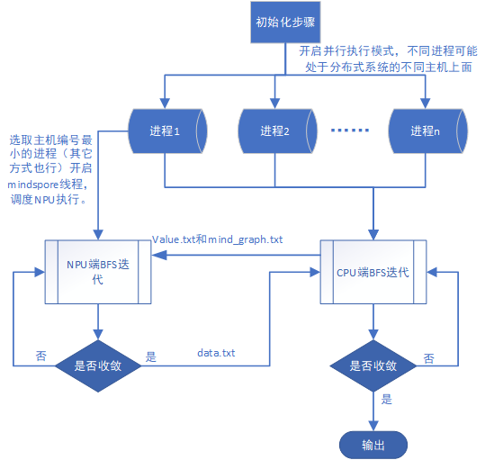
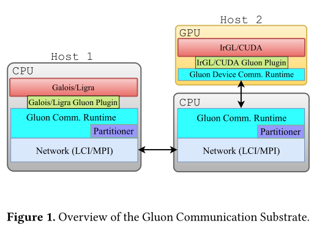
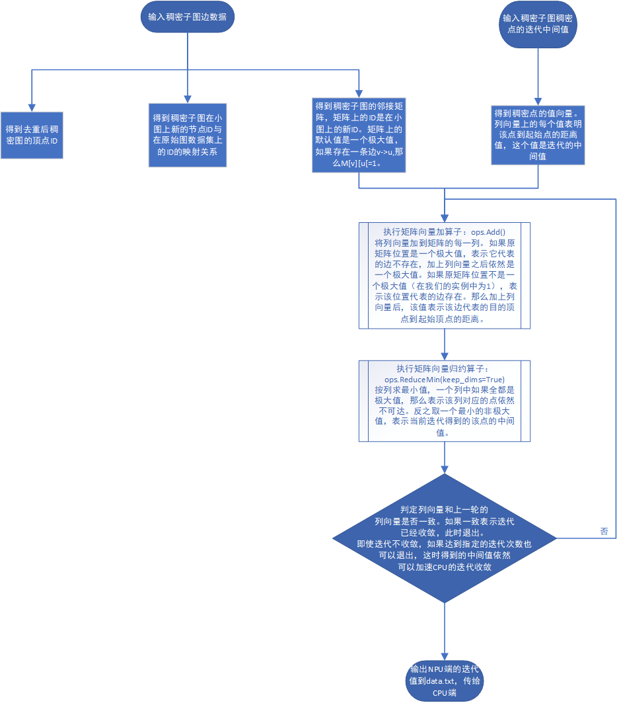

# 算法流程

## 概述

项目代码分为CPU端和NPU端两大部分，两者都执行BFS操作，根据计算架构特点执行不同算法。CPU端适合串行复杂计算任务，所以采用经典的以点为中心的遍历图算法，从起始顶点开始逐轮迭代计算每一跳邻居。NPU端适合并行简单计算任务，所以采用矩阵+向量迭代算法。首先执行”加和操作“，遍历所有边。然后进行”归约操作“，找出本轮迭代的可达边，即代表从源点开始的n阶邻居（假设迭代轮次为n）。

图数据具有幂律分布的特点，不同顶点间的稠密度相差很大。如果把这样一个幂律图全都交给CPU处理，CPU会在高度顶点（度指顶点连接的边数）迭代过多轮次，导致收敛的速度太慢。而如果把幂律图数据全都交给NPU处理，NPU需要为n个顶点开辟n*n大小的存储空间（真实世界图数据集的顶点规模远远大于NPU可用资源），这限制了NPU所能处理的图数据集的规模。此外矩阵+向量迭代算法在矩阵较为稠密时（矩阵上大部分元素都是有效的非零元素）可以快速迭代，当矩阵较为稀疏时，迭代轮次升高，执行效率变差。

针对图数据的特征和两种算法的执行特性，提出CPU+NPU的异构图计算模型。CPU端负责载入图数据，并根据顶点度数筛选稠密顶点，以文件的方式单独保存稠密子图数据。接着采用多线程运行方式，其中一个线程负责调度NPU端执行程序，其余线程则以以点为中心的遍历方式执行BFS查询。NPU端会读取CPU传递过来的稠密子图（稠密子图中两条边都属于稠密顶点），用矩阵向量算法执行运算。运算结束后将保存迭代值，并生成一个结束标志。CPU检测到结束标志会将NPU端的计算值更新到当前迭代值中。CPU采用异步计算的方式进行迭代，当某一轮后发现迭代结果值未发生改变，代表算法已经收敛，计算完成。

## 算法正确性

### CPU使用NPU的收敛结果，如何确保结果正确性？

为了发挥不同计算平台的性能优势，我们把原本交给某一个平台的任务划分为两部分，其中NPU端接收到的是一个稠密子图，也就是说NPU在计算各点到源顶点的最短距离时并未掌握所有的边关系，这时把NPU计算结果交给CPU使用，如何确保正确性呢？

结果正确性是由BFS算法的单调性来保证的。在BFS算法中，图上每个节点 v 都有一个距源点的距离值，它在算法开始时被初始化（源点自身的距离值为0，其余顶点的距离值为无穷大），并在算法执行期间更新（如果顶点v发现有一条从源点到v的路径的距离值比它当前的距离值小，就更新），直到达到全局静止条件（从源点开始所有可达的点都有了距离值，且无法再缩小）。如下图所示，左边蓝色部分对应初始值，中间绿色部分是迭代过程中的中间值，右边红色部分是迭代完成的收敛值。NPU通过子图计算的结果不一定是最终结果，但一定是真实存在的路径值，属于中间的绿色部分。CPU端接收到NPU更新结果后进行判断，如果NPU计算的路径值更小就采纳，更大就舍弃。

### NPU不一定计算起始顶点，如何能得到正确的收敛结果？

无论是CPU端还是NPU端都是从起始点开始不断迭代，得到距离起始点某一跳的邻居节点。但是NPU端接收的是稠密子图，子图中所有的边的两个顶点都必须是稠密点。这样得到的图是原图数据的子图，不一定会包含起始点，这时如何保证正确性呢？

NPU端在计算的时候，会接收到两个文件。一个文件是稠密子图的边文件，一个是被选入稠密子图的顶点的值文件。值文件记录了所有稠密子图中顶点到起始顶点的距离，这里的距离值对应上图中绿色的中间值。NPU会在中甲值的基础上继续运算。

## CPU端执行逻辑

### 整体执行流程

### 初始化逻辑

### BFS逻辑

### 分布式通信逻辑

#### 通信优化基底

分布式通信逻辑是在Gluon-async[4] 上构建的。Gluon-async是一种用于分布式图形分析的通信优化基底，支持编程模型、分区策略和处理器类型中的异构性。 Gluon-async中的通信优化可用于共享内存图形分析系统及分布式内存系统。程序员在他们选择的共享内存编程系统中编写应用程序，并使用轻量级 API 将这些应用程序与 Gluon-async连接。 Gluon-async通过使用可在运行时选择的策略对输入图进行分区并优化该策略的通信，使这些程序能够在异构集群上高效运行，并通过利用图分区策略的结构和时间不变量以一种新颖的方式优化通信。

下图展示了使用Gluon接口实现集群处理的架构。不同机器上可以运行不同图计算系统（galois/ligra)，可以采用不同的计算架构(CPU/GPU），只需借助Gluon-async轻量级的通信接口便可实现集群通信。

#### 批量异步并行编程模型

Gluon-async提出了一种新颖的无锁、非阻塞、异步编程模型：批量异步并行 (BASP)，旨在结合 BSP 模型中批量通信的优势与异步模型的计算进度优势。BASP保留了回合的概念，但一个主机在一个回合的计算完成后不需要等待其他主机；相反，它发送和接收消息（如果可用）并进入下一轮。 在Gluon-async中可以方便地将 BSP 程序修改为 BASP 程序。

### 文件交互逻辑

现有项目通过读取、执行文件的方式解决CPU端和NPU端的计算交互。

| 文件名         | 传递方向                       | 文件作用                                                     | 文件格式          |
| -------------- | ------------------------------ | ------------------------------------------------------------ | ----------------- |
| value.txt      | CPU端产生，传递给NPU端         | 记录稠密子图中所有顶点的中间值                               | 顶点id 顶点值     |
| data.txt       | NPU端产生，传递给CPU端         | 记录稠密子图中所有顶点的中间值                               | 顶点id 顶点值     |
| mind_graph.txt | CPU端产生，传递给NPU端         | 记录稠密子图中所有边                                         | 源点id 目标顶点id |
| ok.flag        | NPU端产生，传递给CPU端         | NPU端执行完毕后，会创建一个文件，表示NPU端已经执行完毕，CPU端检测到该文件后，知晓NPU已经执行完毕，从而进一步操作 | 空                |
| stop.flag      | CPU端产生，传递给CPU端其它进程 | CPU端采用多进程执行方式，但是只会在机器的第一个进程开启mindspore线程，当该线程执行完毕的时候，会产生stop.flag。这样后续线程就会跳过对mindspore的处理。 | 空                |

## NPU端执行逻辑

NPU端采用采用矩阵+向量迭代算法方式实现BFS算法[1] [2]，

## 当前问题

- CPU和NPU端的性能差距过大，NPU执行结果无法为CPU提供增益。

## 参考文献

[1] Kang U , Tsourakakis C E , Faloutsos C . PEGASUS: A Peta-Scale Graph Mining System Implementation and Observations[C]// 2009 Ninth IEEE International Conference on Data Mining. IEEE, 2009.

[2] Song L ,  Zhuo Y ,  Qian X , et al. GraphR: Accelerating Graph Processing Using ReRAM[J].  2017.

[3] Nguyen D ,  Lenharth A ,  Pingali K . A lightweight infrastructure for graph analytics[C]// Proceedings of the Twenty-Fourth ACM Symposium on Operating Systems Principles. ACM, 2013.

[4] Dathathri R, Gill G, Hoang L, et al. Gluon-async: A bulk-asynchronous system for distributed and heterogeneous graph analytics[C]//2019 28th International Conference on Parallel Architectures and Compilation Techniques (PACT). IEEE, 2019: 15-28.