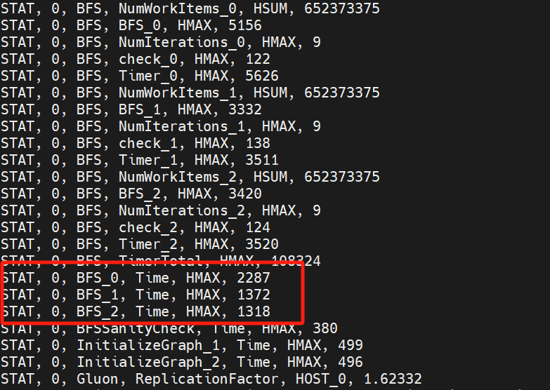

# 环境配置

## 必备配置

- 符合c++ -17标准的现代c++编译器(gcc7, clang >= 7.0)
- CMake (>= 3.13)
- Boost library (>= 1.58.0, 我们建议构建/安装完整的库)
- libllvm (>= 7.0 ，安装libllvm时需要开启RTTI，但是如果使用直接编译好的，则并不会对RTTI提供支持。因此选择下载源代码自己编译安装，并设置`-DLLVM_ENABLE_RTTI=ON`)
- libfmt (>= 4.0)手动安装fmt可能存在cmake找不到的问题，可以尝试将`list(APPEND CMAKE_PREFIX_PATH($install_path/usr/local/lib64/cmake/fmt)`（替换为具体路径）写入到CMakeLists.txt中

## 可选配置

- Linux HUGE_PAGES支持：(请参见www.kernel.org/doc/Documentation/vm/hugetlbpage.txt)。如果不启用HUGE_PAGES，性能很可能会降低。DepGraph使用2MB的巨大页面大小，并依赖于内核配置来留出大量的2MB页面。
- libnuma支持：如果没有它，性能可能会下降。请在Debian类系统上安装libnuma-dev，在Red Hat类系统上安装numactl-dev。
- Doxygen (>= 1.8.5)：用于将文档编译为网页或latex文件。
- PAPI (>= 5.2.0.0 )：用于分析代码。
- Vtune (>= 2017 )：用于分析代码。
- MPICH2 (>= 3.2)： 构建和运行分布式系统应用程序。
- CUDA (>= 8.0 and < 11.0) ：构建GPU或分布式异构应用程序。
- Eigen (3.3.1 works for us) :一些矩阵补全应用变体。

# 文件说明

- build：项目编译目录，存放可执行文件
- libgalois：包含共享内存DepGraph库的源代码 e.g., runtime, graphs, worklists, etc.
- lonestar：包含Lonestar基准测试应用程序和DepGraph教程示例
- libdist：包含分布式内存和异构DepGraph库的源代码
- lonestar：包含分布式内存和异构基准测试应用程序的源代码。
  - analytics
    - distributed
      - bfs：分布式的宽度优先遍历算法

- tools：包含各种辅助程序，例如用于在图形文件格式之间进行转换的图形转换器和用于打印图形属性的图形统计
- libcusp：包含了名为cusp的分区策略
- libgluon：分布式通信库，传递同步信息，根据通信量的不同选择不同的通信策略
- libpangolin：这是用于高效灵活的图挖掘的pangolin框架

# 编译命令

```
cd DepGraph运行目录 #进入项目的最顶层目录
mkdir build #如果没有build目录，构建目录
cd build #进入build目录
cmake .. -DGALOIS_ENABLE_DIST=1 -DDIRECTION_OPT=1
-DGALOIS_ENABLE_DIST=1是可选项，如果需要构建分布式版本，则需要加上这个选项
-DDIRECTION_OPT=1也是可选项，如果分布式版本需要push-pull切换的bfs，需要加上这个选项（同时需要加上-DGAOIS_ENABLE_DIS=1）

cd lonestar\analytics\distributed\bfs #转移到bfs子目录
make -j #加速make编译

```

# 执行命令

## 生成数据集

```
/home/ubuntu/lhy/run/Myproject/generator_graph/src/generator_one_graph 10 10 /home/ubuntu/lhy/run/Myproject/dataset/dataset3.bin
```

### 参数解释

generator_one_graph：生成数据集的可执行文件

10：顶点数n（2^n)

10：边数m(n*m)

dataset3.bin：生成数据集位置

## 数据集格式转化
数据集格式转化分为两种：分布式与单机  
### 分布式转化
分布式转化里有将生成的bin数据转化为gr格式的工具，同时也可以将普通无权的gr文件转化为带权图的文件  
要使用分布式转化，需要在cmake时加上-DGALOIS_ENABLE_DIST=1选项

```
/home/ubuntu/lhy/run/build/tools/dist-graph-convert/dist-graph-convert --edgeType=void --bin2gr --tempDir=/home/ubuntu/lhy/run/Myproject/temp -numNodes=1024 -t=32 /home/ubuntu/lhy/run/Myproject/dataset/dataset3.bin /home/ubuntu/lhy/run/Myproject/dataset/dataset3.gr
```

### 参数解释

dist-graph-convert：数据集格式转换的可执行文件

edgeType：指定边类型

bin2gr：执行何种格式转化，bin2gr表示将bin格式转化为gr格式, 此外还有gr2wgr,将每条边赋予1-100的权重，gr2fgr，去除数据中度数为0的顶点。gr2wgr需要额外增加一个--inPlace参数，无需输出文件，直接将权重加到原数据文件上,一般生成图数据以后，通过bin2gr转为gr文件，在用gr2fgr预处理，去除零度顶点，然后需要权重时再用gr2wgr转为带权图。

tempDir：临时目录，中间需要放临时文件，默认为当前目录

numNodes：顶点数，图数据中的顶点数，一般是数据中顶点的最大值，对于生成数据，可以填生成时的顶点数，即2^n（填具体数字）

dataset3.bin：转换前的数据集文件

dataset3.gr：生成的数据集文件

t: 每个节点使用的线程数

### 单机转化
单机转化里面有较多工具，具体可以使用`./graph-convert -h`查看，这里只介绍一些较为常用的工具  

```
./graph-convert --gr2fgr --edgeType=void ~/data/data.gr ~/data/data.fgr
```

### 参数解释
graph-convert：单机转化的可执行文件

edgeType：边类型

packed2gr：类似于分布式转化的bin2gr，这个也是将生成图转化为gr文件，此外还有gr2cgr，可以去除重复和自环边，gr2tgr，将图转化为对应的转置图，有些图划分策略和图算法会用到转置图

~/data.gr：输入文件

~/data.fgr：输出文件

### 注
框架支持两种格式的gr文件，一种是`version 1`，另一种是`version 2`。`version 1`文件中顶点用32位的无符号整数表示，`version 2`中顶点用64位无符号整数表示。目前算法中为了支持大数据集，使用`version 2`的文件。并且分布式转化经过修改，里面的工具通常会直接输出`version 2`的文件，而单机转化一般是输出`version 1`的文件。所以为了方便，另加了两个文件，分别是`v1tov2`和`v2tov1`，用于两个版本文件的相互转化。直接用g++ 进行编译，使用命令为`./v1tov2 v1file v2file`

使用二进制查看工具如hexdump等可以看文件属于哪个版本，例如使用`hexdump -n 64 30_16.fgr`会输出一下内容：  
```
0000000 0002 0000 0000 0000 0004 0000 0000 0000
0000010 de2b 15c6 0000 0000 0000 0000 0004 0000
0000020 000c 0000 0000 0000 000d 0000 0000 0000
0000030 000e 0000 0000 0000 0010 0000 0000 0000
0000040
```
每行16字节，其中前8个字节代表版本，这里的2代表version 2，4代表是带权图，权重占4字节  
下面一行的16字节，分别代表顶点数和边数
## 执行命令

### 分布式版本

```
GALOIS_DO_NOT_BIND_THREADS=1 mpirun -n=1 /home/ubuntu/lhy/run/build/lonestar/analytics/distributed/bfs/bfs-push-dist  /home/ubuntu/lhy/run/Myproject/dataset/dataset3.gr  -t=1 -startNode=3 -output=true -outputLocation  /home/ubuntu/lhy/run/Myproject/output/   1>>/home/ubuntu/lhy/run/Myproject/output/bfs_push_log.txt
```

#### 参数解释

GALOIS_DO_NOT_BIND_THREADS=1：设置环境变量

mpirun -n 1：使用mpi多进程，指定节点数（可以在一台物理节点上使用多进程）

bfs-push-dist ：执行命令的可执行文件

dataset3.gr：图数据集文件

t=1：在一台机器上使用的线程数，不包括通信线程，它被所有提供的分布式基准所使用。请注意，gpu只使用1个线程（不包括通信线程）

startNode：起始节点，默认为0

output：是否输出

outputLocation：输出结果的文件地址

1>>：将日志输出到文件

#### 注
如果设置了`-DDIRECTION_OPT`，会启用分布式上的push-pull切换优化，生成`bfsDirectionOpt-dist`文件。该应用需要使用同步执行（默认），并且同时需要原矩阵和转置矩阵，转置矩阵文件需要`--graphTranspose=data.tgr`来指定（data.tgr处请使用文件的绝对路径）。

### 单机版本

```
/home/ubuntu/lhy/run/build/lonestar/analytics/cpu/bfs/bfs-cpu /home/ubuntu/lhy/run/Myproject/dataset/dataset3.gr -exec PARALLEL -algo SyncTile -startNode=3 -numRuns=10 -alpha=15 -beta=18 -t 40
```

#### 参数解释

bfs-cpu：执行命令的可执行文件

dataset3.gr：图数据集文件

-exec：PARALLEL，选择并行/串行执行方式

-algo SyncTile：选择同步执行方式，执行方式可选项有：[同步，异步，自动选择，同步变种，异步变种]，变种是对普通的push/pull进行改进，可以对高度顶点进行切分，改善负载均衡

-startNode：BFS算法的起始顶点

-numRuns：算法的执行次数，多次执行可以使统计数据更准确

-alpha，beta：BFS算法可以自动在push和pull两种执行模式之间切换，切换的临界条件由这两个变量来决定。	

​							alpha越小，pull使用的次数越少。具体地，当`”活跃边数“>"边总数"/alpha`时，使用push，否则使用pull。该值默认是15

​							beta越小，则需要有更多的活跃顶点才会使用pull。具体地，当`”活跃点数“>"点总数"/alpha`时，使用push，否则使用pull。该值默认是18

-t=1：在一台机器上使用的线程数

#### 注
sssp算法支持多种不同实现，包括`deltastep`,`dijkstra`,`topo`等等。对于生成图，使用`topo`算法一般性能较好。具体内容可以使用`./sssp -h`命令查看

#### 执行过程
一般的执行流程如下：
1.生成数据
2.使用分布式转化将二进制packaged数据转化为gr格式
3.使用gr2fgr去除零度顶点，使用分布式转换工具
4.如果使用分布式方向优化，使用gr2tgr生成转置图
5.如果需要权重，使用分布式转换工具对fgr加权
5.程序运行

下面是输出的部分截图，红框框起来的是算法执行时间，单位为`ms`
  
