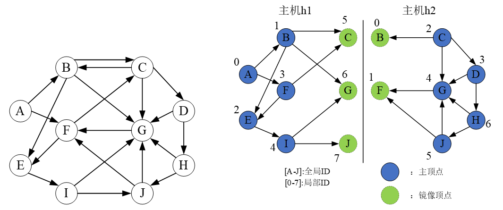

#  	项目介绍

## 背景

DepGraph图计算系统是一个用于解决复杂问题的高性能图计算框架。它的设计目标是提供高度并行化和可扩展的图算法实现，使得在大规模图数据上运行复杂算法变得高效且容易。该系统充分利用现代多核处理器、分布式系统和计算加速器等硬件资源，以实现优异的性能表现。同时，它还提供了易用的编程接口和丰富的图算法库，使开发人员能够更轻松地实现自己的图算法。

主要特点和优势：

1. **高性能并行计算**：DepGraph系统利用多线程和多核心技术，以及分布式内存架构，能够有效地利用多个计算节点，使得图算法在大规模数据上能够高效运行。
2. **丰富的图算法库**：DepGraph提供了许多常用的图算法实现，例如最短路径算法、连通性算法、社区发现、PageRank等，开发人员可以直接调用这些算法，而无需从头开始实现。
3. **易用性**：DepGraph提供了简单而灵活的编程接口，使得开发人员可以快速上手并构建自己的图算法。此外，它还支持C++编程语言，使得在已有C++知识的开发人员中更易于推广使用。
4. **可扩展性**：DepGraph系统被设计为高度可扩展的，可以应对不断增长的数据规模和计算需求，使其在大型图上依然保持良好的性能表现。

本项目在2022年美国得克萨斯州达拉斯举办的全球超级计算大会第25届Graph 500排名中单源最短路算法(SSSP)性能全球第一，宽度优先搜索（BFS）性能在国产处理器中排名第一。

### 同步与异步的计算策略

由于图中的顶点状态与其相邻顶点的状态互相依赖，通常需要多轮迭代以确保结果的收敛。其中的迭代计算方式可分为同步计算方式或异步计算方式，背景部分将对迭代计算方式重点介绍。

- **同步计算**：在此模式下，活跃的顶点先行执行计算，后续进行消息通讯。只有当当前周期内的所有顶点都完成了计算和消息传输后，下一轮才会开始。
  - **优点**：设计简洁，控制直观，算法执行逻辑较为清晰
  - **缺点**：若所有主机必须等待某一轮中最缓慢的顶点，可能会引发“水桶效应”，即整体性能受到最慢顶点的制约。
  - **计算模型**：BSP（Bulk-Synchronous Parallel）。
  - **示例**：Pregel、Giraph。

- **异步计算**：在此模式下，一旦顶点收到消息，即可开始计算并发送新消息，无需等待其他顶点完成。并且发送消息时，不必等待消息传输完成，而是可以继续执行计算。
  - **优点**：能够显著降低“水桶效应”，并加快迭代收敛速度。
  - **缺点**：由于计算和消息传输并发执行，可能增加编程难度和引发冗余计算。此外异步模式可能因为不同节点消息到来的顺序不同，需要使用不同的算法执行策略保证结果正确性。
  - **计算模型**：BASP（Bulk-Asynchronous Parallel）。
  - **示例**：GraphLab、PowerGraph。

### BSP 执行模型

批量同步并行（Bulk-Synchronous Parallel，BSP）模型是同步执行的代表模型。在此模型中，所有计算节点在一个预定的周期内开始计算，后续进行消息通信。所有节点必须完成消息的发送和接收，才能进入下一个周期。此模型囊括两大核心属性：

- **隔离**：确保在单一周期内，各顶点独立运行，新消息不会即刻被其他顶点接收。
- **一致性**：顶点只有在接收到所有传入消息后，才开始进行计算。

这两个属性确保了基于前一轮完整消息集的计算。

### BASP 执行模型

虽然BSP模型设计简洁，但不同场景下可能需要异步操作。为模拟异步计算，可适度放宽BSP的属性。例如，可以放宽一致性，使顶点在未完全接收消息时即开始计算，或放宽隔离，允许顶点处理迭代早期的消息。这种策略能够加速结果收敛。由此诞生了批量异步并行（Bulk-Asynchronous Parallel，BASP）模型。BASP模型的核心在于，一旦计算节点完成当前迭代，它可以无需等待其他节点而直接进入下一迭代，极大地提升了计算并行性和整体效率，但是可能会因为不是最新结果而产生一些冗余计算。

### BSP与BASP的计算准确性

**BSP模型**：由于BSP模型重视隔离与一致性，确保在同一周期内，所有顶点接收到的消息状态均保持一致。此策略保障了在多轮迭代中，数据在各顶点间的一致性，从而确保计算的准确性。

**BASP模型**：尽管BASP模型放宽了部分BSP的约束，某些算法依然能确保准确的执行结果。因为这些算法对延迟或早期的消息具有容错性，能在消息延迟或重排序的环境下得出正确结果。例如，对于广度优先搜索或最短路径算法，即使读取的邻接值已过时，节点仍然朝着正确的结果值收敛。后续的更新会纠正节点值，保证最终的准确性。因此，BASP的正确性部分地来源于算法的特性。通过放宽BSP属性，既能确保结果的准确性，又能加快收敛速度。

总之，BSP与BASP的选择应基于具体的应用场景和计算需求。随着技术进步，我们预期未来会有更多的模型融合或全新的模型诞生，进一步丰富图计算的领域。

## 整体展示

### 整体架构


<center>图：整体架构</center>

DepGraph的整体架构自下而上可分为：图预处理（将原始的图数据集转化为适合分布式系统处理的图数据，并做了一定的优化）、执行策略（描述了系统使用的通信策略，调度策略和并行策略）、算法优化（以BFS算法为例，讲述了我们采用的针对性的优化措施）、系统接口（介绍如何使用系统提供的api接口，快速部署图算法，从而利用系统的性能）。

### 整体流程


<center>图：整体流程</center>

## 图预处理

### 去除零节点

Yasui等人[1]研究发现，GRAPH 500使用的数据集Kronecker生成图中存在大量度数为0的孤立顶点(isolated vertex)。下表展示了对于不同顶点规模的Kronecker生成图,孤立顶点占全部顶点的百分比。可以看到，孤立顶点能够占到全部顶点的一半，而且随着顶点规模的增加,孤立顶点的占比还在不断扩大。由于既不存在出边也不存在入边，因此在BFS、SSSP等算法在计算过程中对这些孤立顶点的访问都是无效的，不会影响自身和其他顶点的结果。因此可以对生成的数据进行预处理，去除掉这些孤立顶点，并将顶点重新编号，最后产生结果时可以直接将孤立顶点的值设置为初始值（例如SSSP中设置为无穷大）。这样一来可以减少图计算过程中顶点的访问数量，提高应用效率。

> [1]Yasui Y, Fujisawa K, Sato Y. Fast and energy-efficient breadth-first search on a single NUMA system//International Supercomputing Conference. New Orleans, USA, 2014: 365-381

| 顶点规模 | 孤立顶点占全部顶点的百分比 |
| :------: | :------------------------: |
|   224    |           47.1%            |
|   225    |           49.2%            |
|   226    |           51.1%            |
|   227    |           53.0%            |
|   228    |           54.8%            |
|   229    |           56.6%            |
|   230    |           58.3%            |

<center>表：Kronecker生成图的孤立顶点占比 </center>

源码位于`tools\dist-graph-convert\dist-graph-convert-helpers.cpp`中的`removeIsolatedVtx`函数，其伪代码如下：

```C++
void removeIsolatedVtx(inputFile, outputfile, ...) {
    
    // 1. 初始化
    prefixSum = allocateMemory(totalNumNodes);
    determineReadPosition(inputFile, nodeToRead);
    // 分配内存和确定读取位置为后续的读取和处理做准备。
    
    // 2. 从输入文件中读取前缀和
    readPrefixSumFrom(inputFile);
    // 前缀和数组使我们能够快速地计算任意节点的度，而不必扫描整个边数组。
    
    // 3. 分析节点度并记录最大、最小度节点
    maxDeg, minDeg = INT_MIN, INT_MAX;
    removeCount = vector of size totalNumNodes;
    for (i from 0 to totalNumNodes) {
        degree = calculateDegree(prefixSum, i);
        updateMaxMinDegreeNodes(degree, i);
        
        // 标记孤立节点
        if (isIsolated(degree)) {
            markForRemoval(i, removeCount);
        }
    }
    // 通过比较前缀和数组的相邻值，我们可以确定每个节点的度。孤立节点没有边，所以它们的度为0。
    
    // 4. 计算新的前缀和数组
    restNodes = totalNumNodes - lastElementOf(removeCount);
    resultPrefixSum = createNewPrefixSum(prefixSum, removeCount, restNodes);
    // 我们创建一个新的前缀和数组，该数组仅包括非孤立节点的前缀和。
    
    // 5. 在新文件中写入数据
    openOutputFile(outputfile);
    
    if (currentHostIsMaster()) {
        writeHeader();
    }
    
    writeUpdatedPrefixSum(resultPrefixSum);
    
    adjustRemoveCount(removeCount);
    
    // 批量读取和写入边数据
    edgeDst = allocateMemoryForEdges();
    for (each block of edges) {
        edges = readEdges(inputFile);
        adjustEdgeIndices(edges);
        writeEdges(outputfile, edges);
    }
    // 对于每一批边数据，我们需要调整边的目标节点索引，以便它们指向新的非孤立节点的索引。
    
    // 6. 清理
    cleanup(prefixSum, edgeDst, ...);
    
    if (currentHostIsMaster()) {
        deleteTemporaryFile();
    }
    // 释放分配的内存，关闭文件，保证资源不被浪费。
}
```

### 图分区

在分布式图计算系统中，为了使每个分布式节点上的工作均衡，需要对图数据进行划分，以确保算法高效运行。DepGraph支持多种图划分策略[2]：

> [2]Roshan DathathriGurbinder GillLoc HoangHoang-Vu DangAlex BrooksNikoli DrydenMarc SnirKeshav Pingali.Gluon: A Communication-Optimizing Substrate for Distributed Heterogeneous Graph Analytics[J].ACM SIGPLAN Notices: A Monthly Publication of the Special Interest Group on Programming Languages, 2018, 53(4).


- 无约束顶点划分（Unconstrained Vertex-Cut UVC）：这种策略可以将一个顶点的出边和入边分给不同的主机，不受主顶点还是镜像顶点的限制。由于节点的主节点和镜像节点可以具有传出和传入边缘，因此可以在计算阶段写入任何代理节点。在每一轮结束时，镜像节点的标签被传送给主节点并组合以产生最终值。该值被写入主节点并广播到镜像节点。因此，reduce和broadcast都是需要的。
- 笛卡尔顶点划分（Cartesian Vertex-Cut CVC）：这是一种受约束的顶点划分策略，只有主顶点可以同时拥有入边和出边，而镜像代理可以有入边也可以有出边，但是不能同时拥有两者。因此，镜像节点要么从标签读取，要么写入标签，但不能同时读取两者。在一轮结束时，仅具有传入边缘的一组镜像将其值传达给主设备以产生最终值。然后主设备将该值广播到仅具有传出边缘的镜像组。与 UVC 一样，CVC 需要减少和广播同步模式，但每种模式仅使用镜像节点的特定子集，而不是所有镜像节点。这可以为许多程序带来更好的大规模性能。
- 入边划分（Incoming Edge-Cut IEC）：这种策略只有主顶点可以拥有入边，而镜像顶点只能拥有出边。主节点将此更新后的值传送给镜像节点以进行下一轮。因此，仅需要广播同步模式。
- 出边划分（Outgoing Edge-Cut OEC）：这种策略是IEC的镜像，即只有主代理可以拥有出边，其他代理只能拥有入边。在一轮结束时，推送到镜像的值被组合以在主设备上产生最终结果，并且镜像上的值可以被重置为下一轮归约操作的（广义）零。因此，只需要reduce同步模式。

我们主要采用了OEC的图分区策略，具体如下：



<center>图：OEC出边划分策略</center>

上图是一个**出边划分策略**（OEC，Outgoing Edge-Cut）的例子。这种策略按照边的数量进行划分，每个主机负责的边数大致相同，同时被分配的顶点在原始图数据中也是连续的。原始图有十个顶点`A-J`，其中顶点`{A,B,E,F,I}`被分配给主机`h1`，其他被分配给`h2`。每个主机为分配给它的顶点创建一个代理顶点，称为主顶点（master），它保存着该顶点的准确值。而有的边（如边`(B,G)`）的两个顶点跨越了不同主机（顶点`B`在主机`h1`，而顶点`G`在主机`h2`），则OEC分区会在该条边的源顶点`B`所在主机`h1`上，为目标顶点`G`创建一个代理顶点，称为镜像顶点（mirror），并且在`h1`上创建一条从`B`到`G`的边。即这种分区策略会将每一个顶点`N`分配给（且只分配给）一个主机，则该主机上的顶点称为`N`的主顶点，而其他主机虽然未被分配`N`，但是它也可能使用到顶点`N`，所以其他主机也可能存在`N`副本，称为`N`的镜像顶点。而在每个主机获得的子图中，所有的边连接的目的顶点都在该主机上有一个代理。在OEC策略中，每个主机拥有其主顶点的所有出边，而镜像顶点只会有入边而没有出边（镜像顶点的出边在拥有其作为主顶点的主机上）。这样一来，每个主机执行计算时便可以直接获取所需的所有数据，而无需在计算时进行数据传输，而每台主机也就不会意识到其他分区或者主机的存在，在每次计算完毕后统一进行数据同步，从而将计算与通信独立开来。

分区格式代码位于`libcusp\include\galois\graphs\CuSPPartitioner.h`中的`cuspPartitionGraph`函数，伪代码如下：

```C++
/**
 * 函数: cuspPartitionGraph
 * 描述: 该函数根据CuSP算法将磁盘上的图进行分区，按照每个主机创建一个分区。该方法可以处理对称和非对称图，并且可以自定义分区策略。
 */

template <typename PartitionPolicy, typename NodeData = char, typename EdgeData = void>
DistGraphPtr<NodeData, EdgeData> cuspPartitionGraph(参数...) {

    // 初始化网络接口，获取当前主机的ID和总主机数。
    net = initializeNetworkInterface();

    // 针对非对称图，我们需要单独处理入边和出边。
    if (!symmetricGraph) {
        
        // 基于提供的输入和输出类型决定要使用的图输入。
        // 在分区之前确定是否需要转置图的边。
        if (inputType == CSR) {
            inputToUse   = graphFile;
            useTranspose = (outputType == CSC);
        } else if (inputType == CSC) {
            inputToUse   = transposeGraphFile;
            useTranspose = (outputType == CSR);
        } else {
            throwError("无效的输入图类型");
        }
        
        // 使用输入数据和分区策略创建新的分布式图。
        // 如有必要，图可能会被转置。
        return createDistributedGraph(inputToUse, 参数..., useTranspose);
        
    } else {
        // 对于对称图，不需要单独处理入边和出边。
        // 图直接进行分区，无需转置。
        return createDistributedGraph(graphFile, 参数..., false);
    }
}
```

## 执行策略

### 通信策略

DepGraph支持同步和异步两种通信策略，并且两种方案里都针对图计算做了专门优化：

- 在同步通信时，我们针对顶点跨分区同步时，需要进行”局部ID——全局ID——局部ID“的转化过程，提出了一种”地址转换记忆“策略，减少了通信时ID转化开销。
- 在异步通信时，我们利用了许多图形分析算法对陈旧读取具有鲁棒性这一事实，根据BSP执行策略提出了BASP批量异步并行策略，它结合 BSP 模型中批量通信的优势与异步模型的计算进度优势，同时保留了回合的概念，但一个主机在一个回合的计算完成后不需要等待其他主机；只要可以继续发送和接收新消息，它就可以进入下一轮。

#### 同步通信策略

同步算法采用批量同步并行 (Bulk-Synchronous Parallel BSP) 编程模型，执行时，首先利用分区策略生成图分区。在分区内部按照迭代轮次依次执行计算和同步直至收敛。等到所有分区计算阶段都执行完成，进入通信阶段。


<center>图：BSP执行模型</center>

在大图处理过程中，往往每轮迭代都有许多顶点（数百万）数据需要同步。同时由于不同主机处理自己的子图时会使用顶点的局部ID，而在数据同步时显然需要全局ID来让其他分区知道数据属于哪些顶点。所以就需要局部ID到全局ID（发送时）以及全局ID到局部ID（接收时）的转换，同时发送数据时还要带上顶点的全局ID。这样就会增加传输开销与数据转换开销。采用一种”地址转换记忆“策略，可以让不同主机之间无需全局ID就可以进行数据交换，进而降低甚至消除这种额外开销。 


<center>图：主机之间交换彼此的镜像数组，以避免通信时的ID转换开销</center>

如上图所示，在分区完毕以后，每个主机将其所拥有的镜像顶点生成`mirrors`数组，并通知给其他主机。例如主机`h1`通知`h2`它拥有镜像顶点`C、G、J`。在通知完毕以后，所有主机都可以形成`masters`数组，例如`master[h2]`就是那些在主机`h2`上的有镜像而主顶点在`h1`上的顶点。然后各个主机将全局ID转化为局部ID，这种转化每次图划分只会进行一次，如果以后不再重新划分，则整个程序运行时只进行一次。然后每个主机都保存着其与其他各个主机进行数据交换的顶点数组。然后在每次广播或者规约操作时，它可以获取对应主机`hx`的`mirrors[hx]`或`masters[hx]`数组，然后按照该数组顺序将数据发送到目标主机。同时目标主机将其写入到对应的`masters`或者`mirror`s数组中。整个过程都是顺序进行的，所以不用传递全局ID，也不用进行额外的全局-局部ID转换。  
上面的方法虽然可以避免额外的数据传输开销，但是很多图应用在每轮迭代中活跃顶点的数据可能较少，所以每次数据传输可能只需要传输镜像顶点的一部分。而如果直接使用上述方法的话，目标主机可能无法得知哪些顶点需要更新。所以DepGraph引入了一个**位数组**，它跟踪主机中的顶点值是否发生改变。在发送数据时，发送方根据位数组生成对应`mirros`数组的更新位数组，连同更新数据发送给目标主机。目标主机则根据更新位数组中值为`0`或`1`，来判断对应的数据是否需要更新。同时DepGraph会根据数据传输是否密集来选择不同的策略。如果更新密集，则不传输更新位数组，而是将整个`mirrors[hx]`的数据发送到目标主机。而如果更新比较稀疏，则发送更新位数组。如果更新非常稀疏，则可以利用传统的方法同时传输全局ID。

#### 异步通信策略

在 BSP 模型中，在每一轮执行中都会通过主机间通信对节点进行协调，并且主机必须在该轮中发送和接收来自其他主机的所有更新，然后才能继续下一轮。因此，一轮中最慢的主机决定了所有主机何时完成该轮。这可能会增加其他主机的空闲时间并导致主机之间的负载不平衡。大型真实世界图数据集具有非平凡的直径，可能会在 BSP 模型中执行几轮。这反过来可能会导致主机之间的负载不平衡，从而损害性能。克服这个问题的一种方法是放宽每一轮所需的批量同步。批量异步并行 (Bulk-Asynchronous Parallel BASP) 执行模型基于以下直觉：当主机在一轮中完成计算时，它可以向其他主机发送消息并从其他主机接收消息，但它可以继续进行下一轮无需等待来自任何落后者的消息即可进行计算。从概念上讲，每个 BSP 回合结束时的障碍成为每个主机发送和摄取消息的点，而无需等待所有其他主机到达该点。这种执行策略的正确性取决于图形分析算法对过时读取具有弹性的事实：只要没有丢失更新，执行就会正确完成。

BSP和BASP中的算法执行都是在本地轮次中完成的，其中每个轮次执行批量计算，然后进行批量通信。批量通信又分为归约阶段和广播阶段。因此，每轮有 3 个阶段：计算、归约和广播。BSP和BASP中的计算阶段相同，但其他阶段不同。归约和广播阶段在BSP中是阻塞的，在BASP中是非阻塞的。在BSP中，主机在每个阶段交换消息（即使消息为空）并且主机等待接收这些消息；而与之相比，BASP仅当镜像节点有更新（由于同步屏障的放松，不需要空消息）并且没有主机等待接收消息时，才会在归约或广播阶段发送消息。 BASP中接收到的消息的操作取决于它们是在reduce阶段还是在broadcast阶段发送的。由于有两个阶段，并且消息可能会无序传递，因此我们使用标签来区分在规约阶段和广播阶段发送的消息。


<center>图：BSP模型和BASP模型</center>

通信相关代码主要在`libgluon\include\galois\graphs\GluonSubstrate.h`中。
下面是发送数据的大致流程：
```C++
/**
 * 函数: syncNetSend
 * 描述: 向其他节点发送数据
 */

template <WriteLocation writeLocation, ReadLocation readLocation,
          SyncType syncType, typename SyncFnTy, typename BitsetFnTy,
        typename VecTy, bool async>
void syncNetSend () {
    // 初始化网络接口，获取当前主机的ID和总主机数。
    net = initializeNetworkInterface();

    for (uint h = 1; h < numHosts; ++h) {
        // 获取要发送的节点id
        uint x = (id + h) % numHosts;
        // 如果两个节点之间没有需要传输的数据，就会跳过该节点
        if(nothingToSend(x)) {
            continue;
        }
        
        // 将要发送的数据写入buffer
        getSendBuffer(x, buffer);
        if(buffer.size() > 0){
            net.sendTagged(x, buffer); // 发送数据
        }
    }

    // 同步策略需要等待数据发送完毕
    if(!async){
        net.flush();
    }
}
```
接收数据的大致流程如下：
```C++
/**
 * 函数: syncNetRecv
 * 描述: 接收其他节点的数据
 */

template <WriteLocation writeLocation, ReadLocation readLocation,
          SyncType syncType, typename SyncFnTy, typename BitsetFnTy,
        typename VecTy, bool async>
void syncNetRecv () {
    // 初始化网络接口，获取当前主机的ID和总主机数。
    net = initializeNetworkInterface();

    // 异步通信每当有数据来时就更新数据
    if (async) {
        do {
            p = net.recieveTagged();
            if (p) {
                // 更新接收到的数据
                syncRecvApply(p->first, p->second);
            }
        } while (p);
    } else {
        // 同步通信需要其他节点的数据全部接收完毕
        for (uint x = 0; x < numHosts; ++x) {
            if (x == id)
                continue;

            if (nothingToRecv(x))
                continue;

            do {
                p = net.recieveTagged();
            } while (p);
            // 更新接收到的数据
            syncRecvApply(p->first, p->second);
        }
    }
}
```

### 调度策略

#### CPU——拓扑感知+软优先级的异步调度策略

传统的以点为中心的计算模型通常采用同步调度策略，虽然能够满足处理一般性的图分析任务的要求，但在执行高性能图分析任务时效率不高，而基于数据驱动的异步调度，应用程序在其数据可用时被安排执行，所以能够实现更好的性能（不是所有算法都能采用异步调度方式实现），但需要有相应的优先级设置和细粒度调度以实现负载均衡。为此，提出了拓扑感知工作窃取调度策略（适用于无优先级调度）和obim软优先级调度策略（适用于有优先级调度）。

调度器的核心是基于机器拓扑感知的任务调度，当应用没有设置特定优先级时，它会使用并发包装载任务，这些任务是无序可并行执行的，可以插入新任务也可以请求内部任务。具体过程如下图所示，每个计算核心都有一个chunk结构，它是一个环状缓冲区，可以容纳8-64（由用户在编译时确定）个任务，计算核心可以用它插入新任务或获取任务工作。大致的调度分级如下，一个Bag并发包中有多个package列表，每个package列表记录一组chunk数据结构，如果某个计算核心的chunk已满，就会从package中插入任务到其他chunk，如果chunk为空，就会从package中查找其他chunk的任务，如果package也为空，就去另一个package查找。


<center>图：无优先级情况，采用机器拓扑感知任务调度</center>

针对一些应用需要进行优先级调度的情况，提出了obim软优先级调度器，将机器拓扑感知任务调度策略与任务具有优先级的情况结合。obim包含一系列并发包，每个包中放置同等优先级的任务，可以任意顺序并发执行，不同包之间的任务按优先级执行。如下图所示，图中包含3个包，分别存放任务1、3、7，全局维护一个操作日志记录全局包活跃；每个线程维护一个本地包映射，缓存全局包结构，记录日志点。当线程需要插入和获取任务时，首先到本地查找特定优先级的包，若无，从全局获取最新结构，若仍无，则创建新优先级的包，同步全局和本地包和日志。使得所有线程共享当前处理任务的优先级，提高任务获取效率，保证任务的执行顺序。


<center>图：有优先级情况，采用obim软优先级调度</center>  

obim相关内容在`libgalois/include/galois/worklist/Obim.h`中  
chunk相关内容在`libgalois/include/galois/worklist/Chunk.h`中

#### GPU——基于Scan + Warp + CTA的负载均衡策略

在常用的以顶点为中心的图算法中，GPU的每个线程会负责处理图的一个顶点，而现实中的图大多是幂律分布（power-law）的，各个顶点的度数分布不均匀。有的顶点的度数很大，而有的顶点的度数很小，这就导致了在GPU中，有的线程会处理很多的边，而有的线程会处理较少的边，这就导致了负载不均衡的问题，影响算法整体性能。因此我们采用一种基于Scan+Warp+CTA的负载均衡策略。该策略的核心思想是：根据顶点度数执行混合调度策略，以解决同一个Warp中不同线程以及同一个CTA中不同Warp间的负载不均衡问题。

> [3]   MerrillK. Wang, D. Fussell, and C. Lin, “A fast work-efficient SSSP algorithm for GPUs,” in *Proceedings of the 26th ACM SIGPLAN Symposium on Principles and Practice of Parallel Programming*, New York, NY, USA, Feb. 2021, pp. 133–146. doi: [10.1145/3437801.3441605](https://doi.org/10.1145/3437801.3441605).

遍历顶点的边阶段，采用不同的任务处理粒度的效果：

-  顺序收集


<center>图：顺序收集情况，一个线程负责收集一个顶点的所有邻居</center>

顺序收集的方法为每个线程分配一个顶点，各个线程获取其处理顶点对应的邻居。如上图所示，线程所处理的顶点分别有2、1、0、3个邻居。显然，在各个顶点的度分布不均匀的情况下，这种方法会导致同一个Warp中不同线程的负载不均衡。

- 基于warp的粗粒度收集


<center>图：基于warp的粗粒度收集，一个线程负责一批顶点的处理，多个线程竞争warp内的资源</center>

基于warp的粗粒度收集方法允许线程对其所在warp的控制权进行竞争，竞争成功的线程可以使用整个warp的资源来处理其所分配的顶点，处理完以后其他线程继续竞争。这种方法一定程度上可以减少warp内部负载不均衡问题，但是很多时候一个顶点的邻居数目是少于一个warp中的线程数目的，这样就会产生性能未充分利用的问题。同时，有时候不同warp中线程被分配顶点的总度数相差较大，又会产生warp之间的负载不均衡。


<center>图：基于扫描的细粒度收集，各线程共享一个收集向量，每个线程每次从共享向量中取出一条边进行处理</center>

基于扫描的细粒度收集方法允许一个CTA中的线程共享一个列索引偏移量数组，并生成相应的共享收集向量（shared gather vector）。这个向量的内容对应于分配给该CTA的顶点的邻接表，然后利用整个CTA对于相应的顶点进行处理：每个线程从共享向量中取出一条边进行处理。这样一来，线程间的负载不均衡就不会被昂贵的全局内存访问放大。但是，这种方法也可能出现共享数组无法充分利用的问题，例如某个顶点的邻居数据过大，几乎占满了整个共享向量，其他线程对应的邻接表就无法被处理。

**Scan + Warp + CTA**：将基于扫描的细粒度以及基于CTA和warp的粗粒度的任务分配策略结合起来。基于CTA的策略与warp类似，只是线程将会争夺整个CTA的控制权。首先将顶点分配个线程，那些顶点的邻接表大于CTA（中的线程个数）的线程，会竞争CTA，使用整个CTA来处理其顶点的邻接表；那些邻接表比CTA小，但是比warp大的，会竞争warp；而对于那些比warp还要小的邻接表，则使用scan，将线程对应的邻接表整合到共享内存中来共同处理。这种混合策略能有效地克服单独一种方法的不足，从而在多种图算法中都达到较好的负载均衡效果。

BFS的GPU实现相关代码在`lonestar/analytics/distributed/bfs/bfs_push_cuda.cu`下的`BFS`函数中

## 算法优化

算法优化部分主要实现了BFS算法的push、pull切换，并且附加了一些其他优化措施。

### BFS算法-Top-down与Bottom-up切换

#### 基础方案

在传统的BFS算法中，遍历方向是自顶向下(Top-down, TD)。 Beamer等人[4-5]开创性地提出一种方向性优化技术，将自顶向下与自底向上(Bottom-up, BU)的遍历方式相结合，并在两种遍历方式间动态切换，减少遍历过程中不必要的边访问。 针对非一致内存访问架构(Non-uniform memory access, NUMA)。

> [4] Beamer S, Asanovic K, Patterson D, et al. Searching for a parent instead of fighting over children: A fast breadth-first search implementation for graph500. EECS Department, University of California, Berkeley, Tech. Rep. UCB/EECS-2011-117, 2011.
>
> [5] Beamer S, Asanovic K, Patterson D. Direction-optimizing breadth-first search//Proceedings of the International Conference on High Performance Computing, Networking, Storage and Analysis. IEEE, 2012: 1-10.

##### Top-down 算法

传统的BFS算法采用Top-down的遍历方式，从已访问的顶点出发，沿着出边，寻找未访问过的顶点。 具体的过程如下所示：

```C++
parents[s] = s
current_frontier = {s}
next_frontier = {}

while(current_frontier != {}){
    parallel for(uint v : vertices){
        // 如果v是活跃顶点，并且其邻居u未被访问过，则访问其邻居
        if(current_frontier[v]){
            for(uint u : neighbor[v]){
                if(parents[u] == u){
                    parents[u] = v;
                    next_frontier.push_back(u);
                }
            }
        }
    }
    swap(current_frontier, next_frontier);
    next_frontier.clean();
}
```

其中，`parents`记录了当前顶点在BFS生成树上的父亲顶点，``current_frontier``和``next_frontier``分别保存着当前层和下一层的活跃顶点集。

Top-down算法是一种迭代式的算法，分为初始化阶段和迭代阶段。 在算法的初始化阶段，将起始点`s`设置为已访问并加入到`current_frontier`(当前层活跃顶点集)中。 随后算法就开启了一轮又一轮的迭代，直至`current_frontier`为空。 在每轮迭代中，对于每个在`current_frontier`中的活跃顶点`v`，算法会检查它是否有未访问过的出边邻居顶点，然后将所有未访问过的出边邻居顶点设置为已访问并加入到`next_frontier`中。 每轮迭代结束前，设置新的`current_frontier`和`next_frontier`。

##### Bottom-up 算法

Top-down算法需要遍历从活跃顶点集出发的每条出边，在大多数顶点已经被访问过的情况下会产生大量无效边遍历。 于是提出了Bottom-up算法，以减少了BFS算法中后期的无效边遍历。 Bottom-up遍历过程如下所示。

```C++
visited[] = {0};
visited[s] = 1;
parents[s] = s;
current_frontier = {s};
next_frontier = {};

while(current_frontier != {}){
    parallel for(uint v : vertices){
        // 如果v未被访问过，则遍历其入边顶点，找到一个活跃的入边邻居
        if(!visited[v]){
            for(uint u : inNeighbor[v]){
                if(current_frontier[u]){
                    parents[v] = u;
                    next_frontier.push_back(v);
                    break;
                }
            }
        }
    }
    swap(current_frontier, next_frontier);
    next_frontier.clean();
}
```

如上图所示,Bottom-up算法采用了与Top-down算法相反的搜索方向，从未访问的顶点出发，在它的入边邻居中寻找活跃顶点。 只要在入边邻居中寻找到一个活跃顶点，便可跳出循环，避免无效的边遍历

单机上的Top-down于Bottom-up的切换较为简单，因为节点内拥有所有顶点的活跃状态和数据，但是对于分布式系统来讲，每个节点只拥有自己的主节点和镜像节点，并不知道其他顶点的活跃状态，所以中间需要状态同步。以下是分布式系统上Top-down与Bottom-up自动切换的大致流程：

- 输入原始图数据与转置图数据，其中转置图数据用来获取顶点的入边
- 根据出边进行图划分，每个节点获取其负责的主顶点
- 根据出边以及主顶点的入边获取每个节点的镜像顶点
- 若当前活跃边数超过总边数的1/20（参数可调），则使用`Bottom-up(pull)`策略，否则使用`Top-down(push)`策略
- `push` 策略：遍历当前主顶点，如果主顶点是活跃顶点，则通过出边用主顶点更新镜像顶点
- `pull` 策略：遍历当前主顶点，如果主顶点未被访问过，则通过入边用镜像顶点更新主顶点
- 当使用`push`策略时，需要将本节点更新过的顶点（本节点的镜像顶点，是其他节点的主顶点）发送给其他节点进行数据通信。当使用`pull`策略是，需要将本节点更新过的顶点（本节点的主顶点，是其他节点的镜像顶点）发送给其他节点
- 在通信阶段，每个节点会根据收到的数据更新本地顶点的值，并对更新过的顶点设置为活跃顶点

在分布式异步通信的情况下，每个节点数据到达的先后不一致，可能会出现离某个顶点`v`较远的邻居`u`先达到该节点的情况，在这种情况下，如果使用`pull`策略进行剪枝，那么可能会出现最后结果不正确的情况。因此，为了使用`push-pull`切换策略，最好使用同步通信。具体代码在`lonestar/analytics/distributed/bfs/bfsDirecetionOpt.cpp`中

算法伪代码：

```c++
    class Graph {
        vector<NodeData> distance;
        vector<EdgeTy> outEdges;
        vector<EdgeTy> inEdges;
    public:
        Iterator outNeighbors(NodeTy);
        Iterator inNeighbors(NodeTy);
        NodeData getData(NodeTy v){return distance[v];};
        void setData(NodeTy v, NodeData d);
        uint getDegree(NodeTy v);
    };

    uint infinity = INT_MAX;

    void push(frontier, graph, next){
        parallel for(uint src : vertices){
            if(frontier[src]){
                for(dst : graph.outNeighbors(src)){
                    if(getData(dst) == infinity){
                        NodeData new_dist = getData(src) + 1;
                        // 更新顶点
                        NodeData old_dist = getData(dst);
                        cas(getData(dst), old_dist, new_dist);
                        next[dst] = 1;
                        active_edges += graph->getDegree(dst);
                        active_vertices += 1;
                    }
                }
            }
        }
    }

    void pull(frontier, graph, next){
        parallel for(uint src : vertices){
            // 遍历未访问的顶点
            if(getData(src) == infinity){
                for(dst : graph.inNeighbors(src)){
                    if(frontier[dst]){
                        // 更新顶点
                        graph.setData(src, getData(dst)+1);
                        next[src] = 1;
                        active_edges += graph->getDegree(src);
                        active_vertices += 1;
                        break;
                    }
                }
            }
        }
    }


    void BFS (){
        Graph graph;
        // 进行图划分并读取数据
        LoadGraph(graph);
        // 图数据初始化，将顶点值赋为infinity
        InitGraph(graph);

        bitset<bool> frontier;
        bitset<bool> next;
        uint active_edges = 0;
        uint active_vertices = 0;
        bool isPull = false;
        do{
            if(isPull){
                pull(frontier, graph, next);
            }else{
                push(frontier, graph, next);
            }
            swap(frontier, next);
            next.clean();

            // 通信，更新顶点
            communicate();
            // 通信，获取全局活跃边和活跃顶点
            active_edges.reduce();
            active_vertices.reduce();
            // 活跃边超过总边书的1/20则用pull
            if(active_edges > numEdges/20)
                isPull = true;
        }while(active_vectices > 0)
    }
```

#### 优化措施

##### 图重排序

在基于Pull的BFS算法中，当遍历到一个为访问顶点时，需要查找其入边邻居，并且只需找到一个已访问的入边邻居顶点便可提前终止寻找。因此，如果能够将已访问的入边邻居顶点排在未访问的入边邻居顶点的前面,便可快速终止寻找，避免过多的无效内存访问。我们容易发现，一个顶点的度数越高，其被访问的概率越大，因此我们可以将子图的顶点按照度数从大到小进行排序，并将每个顶点度数最高的入边邻居放置在一个单独的数据结构中，在进行Pull遍历时，优先访问这些入边邻居顶点，能够提高访存效率[6]。

> [6]Yasui Y, Fujisawa K, Sato Y. Fast and energy-efficient breadth-first search on a single NUMA system//International Supercomputing Conference. New Orleans, USA, 2014: 365-381.

该部分代码位于`libgalois\include\galois\graphs\LC_CSR_CSC_Graph.h`中的`sortInEdgesByDegree`函数，其源码如下：


<center>图：图重排序操作</center>

##### 访存优化

随着众核架构下核心数的增多，在一个芯片内部放置如此多核心变得越来越困难，因此需要采用NUMA(Non-Uniform Memory Access)技术，将核心分散在不同的芯片上,以增加系统的可扩展性。但是NUMA技术的存在会给软件的设计带来新的挑战。 使用NUMA技术后,CPU访问不同区域的内存的速度不再是均一的,分为本地访问和远端访问。 本地内存访问的带宽会比远端内存访问的带宽高不少。
因此如果程序启用了NUMA库，则会使用不同的内存分配策略：
```c++
if(UseNumaAlloc){
    inEdgeIndData.allocateBlocked(BaseGraph::numNodes);
    inEdgeDst.allocateBlocked(numInEdges);
    inEdgeData.allocateBlocked(numInEdges);
    }else{
    inEdgeIndData.allocateInterleaved(BaseGraph::numNodes);
    inEdgeDst.allocateInterleaved(numInEdges);
    inEdgeData.allocateInterleaved(numInEdges);
}
```
此外，Linux的HugePage支持允许程序使用内存中的HugePage，HugePage往往比一般的页要大，在2MB左右。使用HugePage可以减少对TLB的查找时间，提高TLB命中率。默认情况下程序会首先尝试分配HugePage
```c++
void* ptr =
        trymmap(num * hugePageSize, preFault ? _MAP_HUGE_POP : _MAP_HUGE);
    if (!ptr) {
      gDebug("Huge page alloc failed, falling back");
      ptr = trymmap(num * hugePageSize, preFault ? _MAP_POP : _MAP);
    }
```

##### 异步处理
在原来的异步状态下，每次迭代都需要准备数据，将更新的数据发送给其他节点然后再进行下一次迭代。虽然是异步通信，但是每次都需要将更新数据写到发送缓冲中。因此我们在每个节点的子图上都迭代到收敛，这样能够减少通信次数和通信量。具体代码在`lonestar/analytics/distributed/bfs/bfs_push.cpp`和`sssp_push.cpp`中。伪代码如下所示：
```C++
do{
    active_vectices = 0;
    // 节点内部迭代到收敛
    do{
        act_vec = 0;
        process(act_vec);
        active_vectices += act_vec;
    }while(act_vec > 0);

    communicate();
}while(active_vectices > 0)
```

### SSSP算法

#### 基础方案

SSSP算法采用了修改后的Bellman-Ford算法，项目实现了推送式和拉取式2种 SSSP 的分布式实现。 两者都是批量同步并行 (BSP)实现：逐轮执行计算，并在每轮计算间隙完整各个机器之间的同步。

推送式版本代码会检查上一轮计算结束后节点的距离值是否发生了改变。如果发生改变，它将使用”新距离+出边的权重“更新它所有的出边邻居。 拉取式版本会遍历所有节点：每个节点检查其入边邻居，如果邻居的距离将导致新的最短路径距离，节点就会使用其邻居的数据更新自身。 两个版本的程序都会程序迭代，直至所遇节点收敛。

用于 2 个实现的计算步骤的伪代码如下：

- /push方式实现的sssp算法的伪代码

```c++
//push方式实现的sssp算法的伪代码
for (node n in graph) {
  if (n.distance != n.old_distance) {
    for (neighbor a of node n) {
      a.distance = min(n.distance + weight of edge(n,a), a.distance)
    }
  }
}
```

- pull方式实现的sssp算法的伪代码

```c++
//pull方式实现的sssp算法的伪代码
for (node n in graph) {
  for (in-neighbor a of node n) {
    if (a.distance + weight of edge(a,n)  < n.distance) {
        n.distance = a.distance + weight of edge(a,n)
      }
    }
  }
```

#### 优化措施

## 系统接口

DepGraph提供了一个隐式并行编程模型，用户按照按照指定编程规范，实现图算法的结构体函数，选择合适的并行迭代器，程序就会按照规定的顺序并发执行。这个过程用户无需关注系统底层的并行、同步等细节。如下图实现了BFS算法的结构体。其中的成员函数go规定了BFS算法的执行过程，do_all函数规定了计算任务之间的并行执行策略，operator()运算符重载函数规定了针对每个节点的计算的逻辑。


<center>图：使用系统接口实现图算法步骤</center>

### 并行循环迭代器

DepGraph包括三种主要类型的并行循环结构：do_all、for_each、on_each。这些并行循环提供了一个接口，用于运行具有各种计划的给定运算符。

其中do_all 适用于需要运行一系列完全独立的任务的情况，它在可用的线程之间平均划分工作项，并且假定不需要冲突检测。do_all支持工作窃取选项，如果关闭了工作窃取，则将计算分区均匀划分，并且每个线程独立地在自己的分区上工作。如果启用了工作窃取，则工作范围将划分为 N 次迭代的区块，其中 N 是区块大小。然后为每个线程分配一组初始块，并从集合的开头开始工作。如果一个线程完成了它自己的块，但其他线程仍在处理他们的块，它将从另一个线程的块集末端窃取块。

for_each 适用于任务可能发生冲突的情况，例如，在正在运行的运算符中需要每次迭代分配、需要特殊调度或在循环运行时可以发现新工作等更一般的情况。on_each 是一个较低级别的接口，用于在每个线程上运行操作，并行程度最低。

在BFS实现算法中，采用do_all循环方式，每一轮循环都会执行该操作。该操作会获取活跃顶点，并遍历活跃顶点的每一条出边邻居。每次操作会更新顶点到起始点的距离，以及活跃顶点集。同时操作过程会统计活跃顶点数和活跃边数。

### 操作逻辑实现

operator运算符重载函数，定义了do_all函数在执行并行算法时针对基础运算单元执行运算的逻辑。例如，在以点为中心的BFS算法中，基础的运算单元应当是一个个顶点，它的计算逻辑是，比较所有的入边邻居到起始点的距离d，选取d的最小值dmin，如果这个值加一比自己当前的距离值更小，那么就更新自己当前的距离值。下面展示了push和pull两种风格的操作函数

- push-style的运算符重载函数 

```c++
//push-style的运算符重载函数 
void operator()(GNode src) const  //push-style的运算符重载函数 
  {
    NodeData &snode = graph->getData(src);  //push-style的运算符重载函数 
    if (snode.dist_old > snode.dist_current)  //如果顶点的值发生了更新,就进入下面的处理逻辑,将顶点的影响传递给它的出边邻居
    {
      snode.dist_old = snode.dist_current;  //更新顶点的dist_old值
      for (auto jj : graph->edges(src))  //访问顶点的边
      {
          GNode dst = graph->getEdgeDst(jj);   //访问顶点的出边邻居
          auto &dnode = graph->getData(dst);
          uint32_t new_dist = 1 + snode.dist_current;   //更新顶点的new_dist值
          uint32_t old_dist = galois::atomicMin(dnode.dist_current, new_dist);  //原子方式写入顶点值
          if (old_dist > new_dist)
              bitset_dist_current.set(dst);  // 分布式程序顶点可能有多个镜像节点，这句话是用于分布式同步
        }
    }
  }
```

- pull-style的运算符重载函数 

```c++
//pull-style的运算符重载函数 
void operator()(GNode src) const {  //pull-style的运算符重载函数 
    NodeData& snode = graph->getData(src);  //pull-style的运算符重载函数 
    for (auto jj : graph->edges(src)) {  //访问顶点的入边
        GNode dst         = graph->getEdgeDst(jj);  
        auto& dnode       = graph->getData(dst);  //访问顶点的入边邻居
        uint32_t new_dist = dnode.dist_current + 1;
        uint32_t old_dist = galois::min(snode.dist_current, new_dist);  //比较入边邻居的距离值+1,和自身当前的距离值,选取最小值.
        if (old_dist > new_dist) {
            bitset_dist_current.set(src);  // 分布式程序顶点可能有多个镜像节点，这句话是用于分布式同步
        }
    }
}
```


#### 优化内容
顶点去零预处理:`tools\dist-graph-convert\dist-graph-convert-helpers.cpp`中的`removeIsolatedVtx函数  

顶点重排序:`libgalois\include\galois\graphs\LC_CSR_CSC_Graph.h`中的`sortInEdgesByDegree`函数  

分布式push-pull切换:`lonestar/analytics/distributed/bfs/bfsDirecetionOpt.cpp`  
异步计算：`lonestar/analytics/distributed/bfs/bfs_push.cpp`和`sssp_push.cpp`中的`go`函数    

32位顶点修改位64位顶点: 这点修改比较碎，可以看`libgalois/include/galois/graphs/BufferedGraph.h`中的`loadEdgeDest`函数中数据加载

二进制packaged到gr文件转化（减少内存占用）：`tools/dist-graph-convert/dist-graph-convert.cpp`中的`bin2gr`工具  
