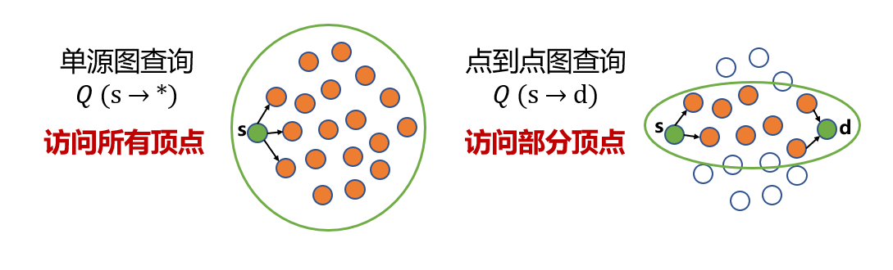

# 2023年9月16日进展汇报

- 目标：研究图分析领域的“并发点对点查询”，投IEEE TC

## 背景调研

### 点对点查询

典型的图形应用程序仅在访问每个连接的顶点（多次）后才会终止，比如一个单源图查询，只有在访问了图中的所有连通顶点之后才能完成，因此会导致计算和通信方面的巨大开销。图应用程序的这种详尽（exhaustive）的性质导致无法以亚秒级延迟实现图查询。幸运的是，最近的研究人员观察到，对于许多现实场景来说，回答“点对点”成对查询（只需要访问图中的一小部分顶点，减少了很多计算量）就足够了，而不是计算详尽的“一对所有”单源查询。

### 已有工作

| 项目                                                         | 贡献                                                         | 缺点                                                         |
| ------------------------------------------------------------ | ------------------------------------------------------------ | ------------------------------------------------------------ |
| PnP: Pruning and Prediction for Point-To-Point Iterative Graph Analytics | 1，提出“图查询很复杂，很难快速完成，但是点对点版本的查询比较简单，有优化潜力”这个结论。 2，使用“上界剪枝”减少计算量。 3，提出不同查询方向对查询速度的影响很大。 | 1，”上界剪枝“中对于“上界”的确认的工作量很大 2，指出方向对查询性能很重要，但是采用的方式有些奇怪，提出了一个两阶段算法：第一阶段确定方向，第二阶段在这个方向上查询（是否有更合适的方法？） |
| Tripoline: Generalized Incremental Graph Processing via Graph Triangle Inequality | 1，提出“三角不等式”概念，更好地解释PnP中的“上界剪枝” 2，在日常维护一些“常设顶点”，这些顶点作为“中介”可以提供近似的”上界“，这样实现了”无先验知识“的上界查询。 3，支持对动态图的处理 | 1，是一个共享内存系统。 2，仅用“上界剪枝”，效果有限。   |
| SGraph——Achieving Sub-second Pairwise Query over Evolving Graphs | 1，提出基于“上界+下界”的剪枝方法 2，对于“三角不等式”的阐述更加通透，提出更高层次，更抽象的通用处理逻辑。支持BFS，PPSP,𝑅𝑒𝑎𝑐ℎ𝑎𝑏𝑖𝑙𝑖𝑡𝑦 𝐶𝑜𝑛𝑛𝑒𝑐𝑡𝑖𝑣𝑖𝑡𝑦,PPWP,PPNP,Viterbi等算法，计算时只需将算法中的 Value 类型的 +/-/≥ 定义重写为抽象运算符 ⊕/⊖/⪰ 的实际逻辑即可 3，设计了特殊的快照结构，图查询和图更新可以并发执行 4，分布式系统 | 1，没有考虑高负载场景下，并发点对点查询需求。                |

## 进展

- 读完论文：PnP、Tripoline、SGraph、GraphM
- 跑通SGraph代码，测试了一个小图(数据集cnr-2000，有325557个顶点， 3216152条边)，但是还没有做横向对比。

## 思考

- 基于剪枝的方法只能适用于单调图算法，有没有适用于非单调图算法的方法。
- SGraph的代码是基于gemini修改来的，对比发现，比较大的改动是加入了对分布式系统的支持，其它的很相似。想看看有没有针对gemini的优化可以用到这上面。
- GraphM论文的主要思路是“用数据来触发相应的任务”，从而提高数据利用率，这样做的前提是任务和数据的对应关系是已知的。但是对于查询来说，这个对应关系恰恰是不知道的。所以要如何执行数据共享?
- 之前的工作每次查询到结果后，并没有做一些结果重用，下次再次查询，还是要重新查一遍。能不能做一些重用工作？

## 待办

- 确定好有可行性的优化思路。
- 测试动态更新+查询。