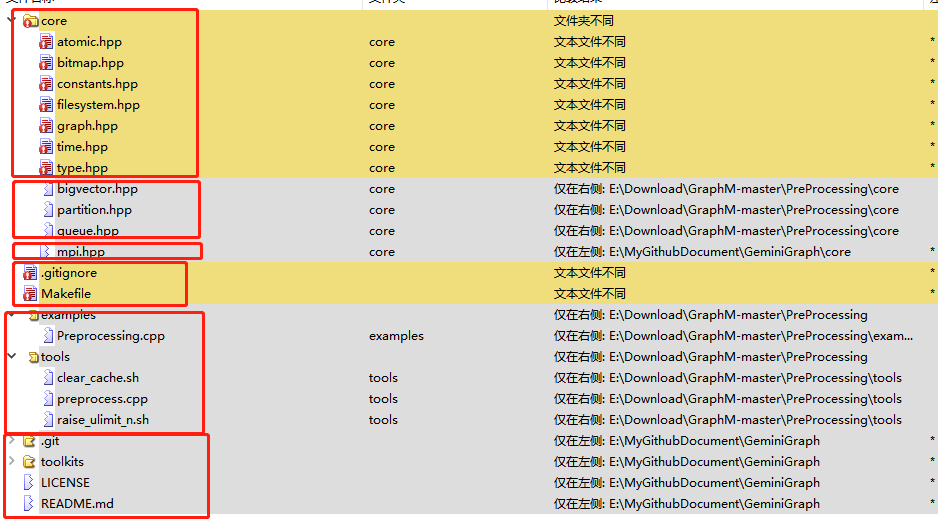

# 代码对比

## Gemini与GraphM代码

- core
  - atomic.hpp：变量名有些不一样，内容一样
  - bitmap.hpp：内容基本一样，做了顺序微调
  - constants.hpp：只有几行代码，定义了块大小和IO大小，这个和特定的机器有关。
  - filesystem.hpp：在原来的基础上，加上了对文件夹的操作
  - graph.hpp：变动较大，也是GraphM的核心实现文件。
  - time.hpp：一样
  - type.hpp：不一样，但是很简单
  - bigvector.hpp：实现了一个大数组
  - partition.hpp：获取分区的ID和范围
  - queue.hpp：封装了一个队列
  - mpi.hpp：gemini中关于mpi的实现
- tools
  - preprocess.cpp：把原始数据集转化为GridGraph所需要的图格式
- examples
  - Preprocessing.cpp：进一步把图分区从逻辑上划分为细粒度的块

## 原始GridGraph和添加GraphM功能的GridGraph

只有几个文件不同

- core
  - ==graph.hpp：部分内容不同==
  - memory_occupy.hpp：仅在修改版本
- examples
  - concurrent_jobs.cpp：仅在修改版本。应该是用于获知存储占用情况
  - 案例的不同，可以忽略

总结只有graph.hpp不同
