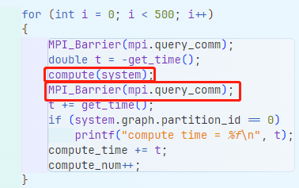

# 并发测试

## 概念

1. **MPI (Message Passing Interface)**

   MPI 是一个标准，用于在分布式内存系统中的进程之间传递消息。这意味着你可以在多台机器上运行多个进程，而这些机器可能分布在不同的地点。这段代码使用MPI来实现进程间的并行化。

   - `MPI_Instance mpi(&argc, &argv);`: 初始化 MPI，使得程序可以使用 MPI 通信。
   
   - `MPI_Barrier(MPI_COMM_WORLD);`: 这是一个同步操作，意味着所有在`MPI_COMM_WORLD`通信组内的进程都要到达这一点，然后才能继续执行。这确保了在进行下一步之前，所有进程都已完成其工作。
   
   - `MPI_Barrier(mpi.query_comm);`: 另一种屏障同步，但可能是在一个不同的通信组`mpi.query_comm`中。
   
2. **OpenMP**

   OpenMP 是一个用于多线程并行计算的API。与MPI不同，OpenMP是用于在单个机器的多个处理器核心上运行的，这样一个机器内的多个线程可以并行工作。

   - `omp_set_num_threads(96);`: 这告诉 OpenMP 使用96个线程来并行执行下面的并行代码段。

   - `omp_set_num_threads(48);`: 之后，代码又将线程数设置为48。这意味着后续的OpenMP并行区域将使用48个线程。

3. **并行的意义和使用**

   在此代码中，MPI 和 OpenMP 被用作两种并行化方法。MPI使得代码可以在多台机器（或同一机器的多个进程）上并行运行，而OpenMP则在单一机器的多个核心上进行并行。

   具体在这段代码中，似乎MPI被用来并行地处理图的不同部分或分区。每个MPI进程都可能处理图的一个部分。OpenMP则用于在这些进程内部进一步并行化，使每个进程能够在多个线程上执行工作。

4. **为什么使用两种并行化方法？**

   这种混合的并行策略通常在需要在大型集群上处理非常大的任务时使用。**MPI可以让你在多台机器上运行代码，从而处理大型数据集，而OpenMP则可以充分利用每台机器上的所有核心。**

总之，这段代码利用了MPI和OpenMP的结合，实现了高效的并行计算。MPI为进程间提供了并行，而OpenMP为每个进程内部提供了多线程并行。这样的结合使得代码可以在大型集群上高效运行，处理大型图数据。

## 代码

循环体自身没有使用OpenMP的指令（例如`#pragma omp parallel for`）来明确地并行化这个循环。因此，循环的迭代是串行的，也就是说，每次迭代都会在前一个迭代完成后开始。

`MPI_Barrier(mpi.query_comm);`：这是MPI的一个同步操作，确保每次迭代时所有在`mpi.query_comm`通信组内的进程都达到这一点然后再继续。尽管这不是并行操作，但它确保了多个进程在某一时刻同步。

综上，我认为500次查询是线性的。多进程设置是为了分布式系统多节点直接可以进行通信。多进程只在明确开始多线程的地方生效，如使用\#pragma omp parallel for。