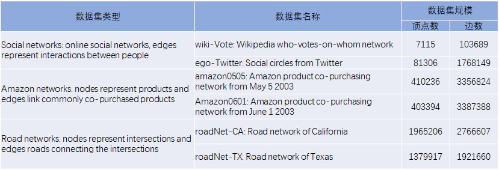
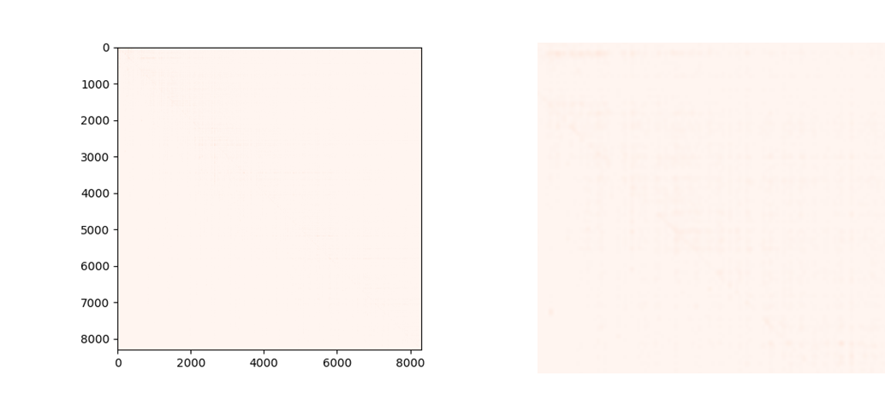
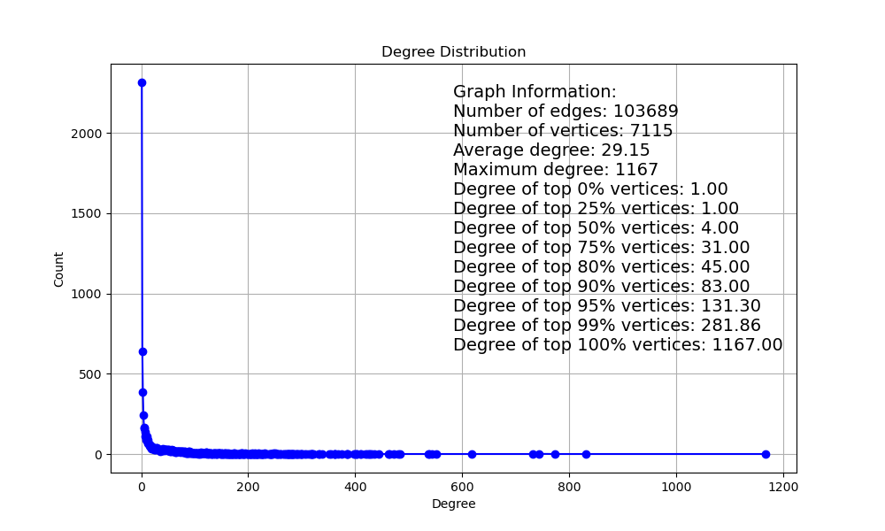
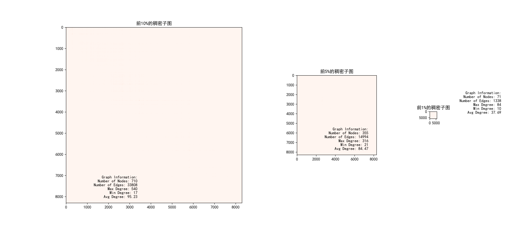
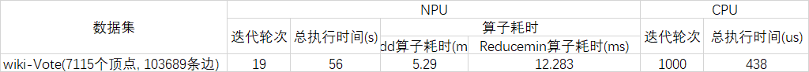
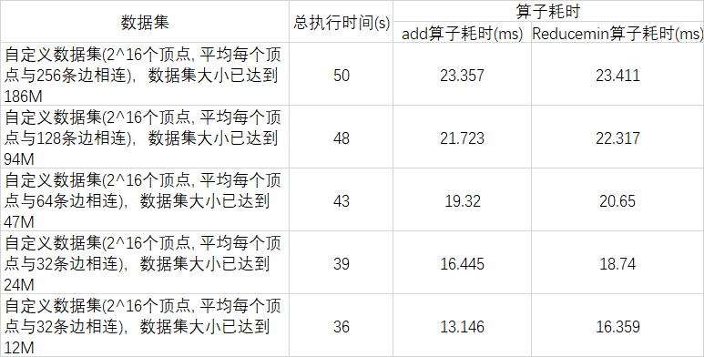

# 性能测试

性能测试的目的是设计合理的实验流程，证明实验方法的**“理论正确性”和“操作正确性”**。

## 数据集分析

### 数据集选取

所有数据集都选自**真实世界的自然图**，数据集来源：[Stanford Large Network Dataset Collection](http://snap.stanford.edu/data/)

测试选取了三种不同类型的数据集：分别是社交网络图、电商平台交易图、道路交通图。实验尽可能涵盖了不同规模的图数据，但是由于网上开源的图数据有限，无法做同一类型不同规模的图数据集的横向测试，且由于资源限制，图数据的规模无法选取过大。

> 选取了ego-Gplus: Social circles from Google+，具有107614个点，13673453条边。实际测试解压后数据集规模达到数G,放弃实验。 

### 原始图分布

#### Wiki-Vote

- ==结论：真实世界原始图数据集很稀疏。==

### 稠密子图分布

#### Wiki-Vote

==结论：对原始图进行重排序后的数据集依然很稀疏。==

## CPU端和NPU端的执行效率

==结论：NPU端的执行效率远落后于CPU端。==

## 进一步理论分析

### 算子的执行时间

==结论：数据集的稠密度会极大影响总体执行时间，但是对于单个算子的影响不大==

### NPU端的理论最佳性能

==结论：NPU端理论的最佳性能依然弱于CPU端的性能，无法带来性能增益。==

