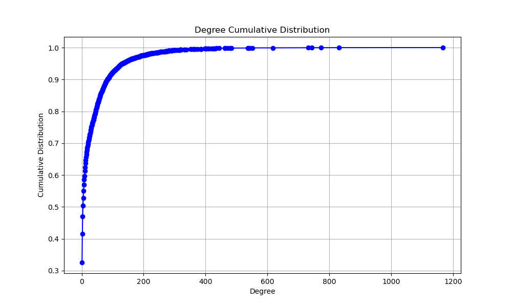
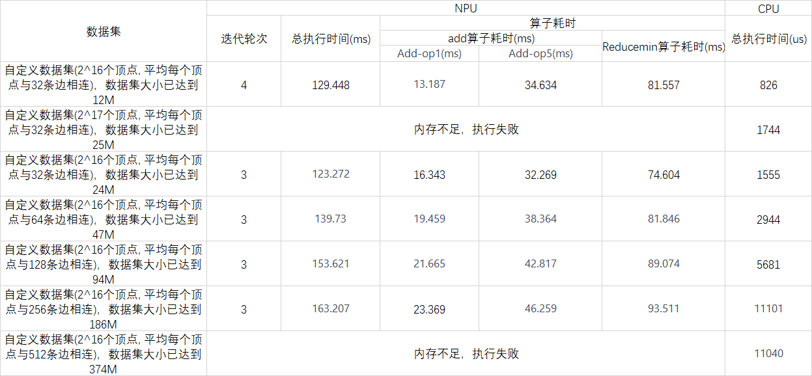

# 实验论证

实验测试的目的是设计合理的实验流程，证明实验方法的**“理论正确性”和“操作正确性”**。

## 数据集分析

### 数据集选取

实验选取了两种数据集：

- 1、**真实世界的自然图**，数据集来源：[Stanford Large Network Dataset Collection](http://snap.stanford.edu/data/)
- 2、Graph500提供的图生成项目，可以指定生成的顶点的数目和边的数目。

测试选取了三种不同类型的数据集：分别是社交网络图、电商平台交易图、道路交通图。实验尽可能涵盖了不同规模的图数据，但是由于网上开源的图数据有限，无法做同一类型不同规模的图数据集的横向测试，且由于资源限制，图数据的规模无法选取过大。

> 选取了ego-Gplus: Social circles from Google+，具有107614个点，13673453条边。实际测试解压后数据集规模达到数G,放弃实验。 

### 原始图分布

- 原始分布，以Wiki-Vote为例。

首先将图数据转化为矩阵形式，然后将矩阵绘制成图像。矩阵的非零点（表示该位置存在一条边）用红色像素表示，矩阵的零点（表示该位置不存在边）用白色像素表示。整幅图像呈现淡红色，原因是红色像素稀疏地分布在整幅图像。放大看图像的细节，在对角线附近红色像素较为集中，这是图的幂律分布特性所决定的[1]。

> [1] Arai, Junya, et al. "Rabbit order: Just-in-time parallel reordering for fast graph analysis." *2016 IEEE International Parallel and Distributed Processing Symposium (IPDPS)*. IEEE, 2016

- 不同度数顶点的度数，以Wiki-Vote为例。

横轴是顶点的度数，纵轴是该度数出现的次数。右上角有统计信息，展示了边的数目、顶点的数目、顶点的平均度数、顶点的最大度数。此外我还将顶点按度数从小到大排序，最小的度数是1，最大的度数是1167。

- 顶点度数的累积分布函数，以Wiki-Vote为例。

根据统计到的度绘制了累计分布函数。

==结论：真实世界原始图数据集很稀疏。==

### 稠密子图分布

以Wiki-Vote为例，使用三个阈值划分稠密子图。

- 阈值选取：度数排名（从大到小）第10%的度数值、第5%的度数值、第1%的度数值。
- 子图划分：遍历图数据集的每一条边，如果边的两个顶点（源点和目的顶点）的度数都大于阈值，那么该边就被划分为稠密子图。
- 下方展示了按照10%、5%、1%三个阈值进行划分。

- 不同度数顶点的度数，以Wiki-Vote为例。

- 稠密子图的顶点度数的累积分布函数，以Wiki-Vote为例。

==结论：对原始图进行重排序后的数据集依然很稀疏。==

## 性能分析

- 由于自然图数据集可选项很少，灵活性较差。所以该部分使用Graph500图生成工具，生成特定规模、特定度数的图。
- 之前的代码没有考虑过起始点选取的问题，但是对于BFS算法来说，选取不同起始点对性能的影响很大。所以我增设了一个处理步骤，测试前遍历图数据集，选择出度最大的顶点作为BFS起始点。
- 原有代码中NPU端牵涉复杂的数据传输、类型转换以及Profiling工作，为了准确起见，这里把Profiling得到的算子执行总时间作为NPU端时间。
- NPU中不止加算子和reduce算子，这里只展示了主要的算子（所以单算子相加的时间和总算子耗时不一致）。

==结论：    1、NPU端的执行效率远落后于CPU端。==

​				==2、NPU端的可计算的矩阵规模受限。==

​				==3、NPU的性能与矩阵稠密度无关，与矩阵规模有关。CPU性能与矩阵规模和稠密度成正相关。==

## 思考

- 当前按照顶点度数阈值的划分方式，提取出来的子图不够稠密。

- 如果采用某种方式提取稠密子图，需要避免预处理开销太大，否则可能反向优化。

- 即使提取处理稠密子图，按照目前的性能对比，是否能带来性能增益。

- 可以找一些特定的应用场景，可以以低开销的方式找出稠密子图。

  

