# 项目汇报

## 摘要

现实世界中图数据具有幂律分布的特点，常常导致严重的负载不均衡问题。我们对比了许多图计算方式观察到：

1. 经典的“以顶点为中心”的图计算方式，在图数据稀疏时能快速实现收敛。但是在图数据较为稠密时，收敛速度很慢。
2. 以矩阵方式实现的图计算方案对数据集的稠密度不敏感。

两种方案分别适用于图数据的稀疏部分和稠密部分，于是提出了一种新颖的异构计算方案：将同一数据集划分为稠密子图和稀疏子图。稠密子图交由擅长矩阵运算的NPU计算，稀疏子图交由擅长“以顶点为中心”的图计算方式的CPU计算。NPU在计算完成后将子图计算结果传回CPU，加速CPU的收敛。

> 幂律分布指图中大部分边集中在少量高度顶点之间，其余边稀疏的分布在大量低度顶点之间。

## 项目简介

### 设计灵感

#### 大部分图算法可以用“以顶点为中心”和“矩阵计算”两种方式实现

很多图算法中对顶点的操作可以转化为稀疏矩阵乘的形式。如下图所示：

- 左边展示了图计算中经典的“**以顶点为中心**”的“**pull-style**”计算模型。在Process Edge阶段顶点4会拉取它所有的入边邻居的信息，在Reduce阶段顶点4对所有拉取的邻居信息进行处理。
- 右边展示了使用**稀疏矩阵乘**实现同样的计算过程。方块代表图的邻接矩阵。绿色条带代表所有顶点目前的值向量。紫色条带代表顶点计算更新后的值向量。橙色条带代表了指向顶点4的入边邻居顶点。条带中的黑色点是非零值（对于有权图，该位置的值为权值，对无权图，该位置的值为1），代表真实存在的顶点，其余位置为零值，表示该位置的顶点关系并不存在（因为图是用邻接矩阵形式表示的，所以无论是存在，都要保留）。进行稀疏矩阵乘时，矩阵的每一行（橙色条带）都会与值向量（绿色条带）相乘，图中的示例行代表顶点4的入边邻居将自身的值加到顶点4上，然后经历一步Reduce操作后得到顶点4的更新值。其它顶点的更新过程也是这样。

大部分可以用“以顶点为中心”形式实现的图算法都可以实现上述转换过程。它们的计算步骤可以被抽象为Process Edge和Reduce两步：

Process Edge和Reduce的具体实现会根据不同的图算法而调整，相应的它们转换为稀疏矩阵乘后的操作也不同。下表统计了几个常见图算法的操作：

| **图算法**                   | Process Edge操作 | Reduce操作 |
| ---------------------------- | ---------------- | ---------- |
| PageRank                     | ×                | +          |
| NumPaths                     | ×                | +          |
| Adsorption                   | ×λ               | +          |
| BFS                          | +                | min        |
| Single Source Shortest Path  | +                | min        |
| Connected Components         | ×                | min        |
| Single Source Widest Path    | min              | max        |
| Single Source Narrowest Path | min              | min        |
| Minimum Reliability Path     | ×                | min        |
| Maximum Reliability Path     | ×                | max        |
| Maximum Cost Path            | +                | max        |
| Single Source Reachability   | and              | or         |

#### 异步执行性能通常优于同步执行性能

根据图计算过程中顶点更新要求的不同，可以将图算法划分为同步算法和异步算法。

- 同步：执行流程被划分为多次迭代过程，连续两次迭代过程之间需要严格进行同步，产生同步开销、负载不均衡问题。
- 异步：没有迭代间同步，图顶点状态的更新立即可用，可实现更快图顶点状态传递，具有更高灵活性。

异步执行性能通常优于同步执行性能主要是因为：

- 异步可以立即快速传播图顶点状态，每次邻居顶点看到的都是最新的图顶点状态。
- 异步可以省去同步开销，执行快的线程无需等待执行慢的线程。

异步算法为异构架构的实现提供了有力支持，用户可以对稠密子图和异构子图分别处理，CPU端可以等到NPU处理完成后再进行更新。

### 项目架构

#### 概述

项目代码分为CPU端和NPU端两大部分，两者都执行BFS操作，根据计算架构特点执行不同算法。CPU端适合串行复杂计算任务，所以采用经典的以点为中心的遍历图算法，从起始顶点开始逐轮迭代计算每一跳邻居。NPU端适合并行简单计算任务，所以采用矩阵+向量迭代算法。首先执行”**Process Edge操作**“，遍历所有边。然后进行”**Reduce操作**“，找出本轮迭代的可达边，即代表从源点开始的n阶邻居（假设迭代轮次为n）。

图数据具有幂律分布的特点，不同顶点间的稠密度相差很大。如果把这样一个幂律图全都交给CPU处理，CPU会在高度顶点（度指顶点连接的边数）迭代过多轮次，导致收敛的速度太慢。而如果把幂律图数据全都交给NPU处理，NPU需要为n个顶点开辟n*n大小的存储空间（真实世界图数据集的顶点规模远远大于NPU可用资源），这限制了NPU所能处理的图数据集的规模。此外矩阵+向量迭代算法在矩阵较为稠密时（矩阵上大部分元素都是有效的非零元素）可以快速迭代，当矩阵较为稀疏时，迭代轮次升高，执行效率变差。

针对图数据的特征和两种算法的执行特性，提出CPU+NPU的异构图计算模型。CPU端负责载入图数据，并根据顶点度数筛选稠密顶点，以文件的方式单独保存稠密子图数据。接着采用多线程运行方式，其中一个线程负责调度NPU端执行程序，其余线程则以以点为中心的遍历方式执行BFS查询。NPU端会读取CPU传递过来的稠密子图（稠密子图中两条边都属于稠密顶点），用矩阵向量算法执行运算。运算结束后将保存迭代值，并生成一个结束标志。CPU检测到结束标志会将NPU端的计算值更新到当前迭代值中。CPU采用异步计算的方式进行迭代，当某一轮后发现迭代结果值未发生改变，代表算法已经收敛，计算完成。

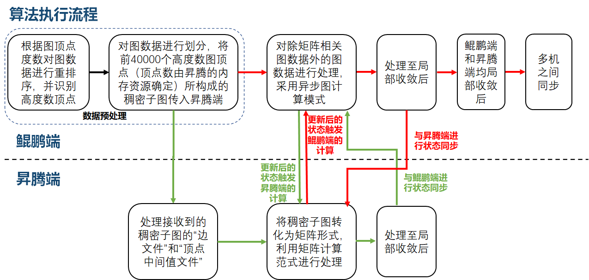

#### 鲲鹏端执行逻辑

鲲鹏端运行DepGraph图计算框架，框架本身对分布式图计算系统初始化、内存管理、通信[2]进行了很好的封装。用户在执行时只需要在通用图算法执行流程的基础上，按照给定的接口规范，实现自己的图算法的结构体。

> [2]Dathathri R, Gill G, Hoang L, et al. Gluon-async: A bulk-asynchronous system for distributed and heterogeneous graph analytics[C]//2019 28th International Conference on Parallel Architectures and Compilation Techniques (PACT). IEEE, 2019: 15-28.

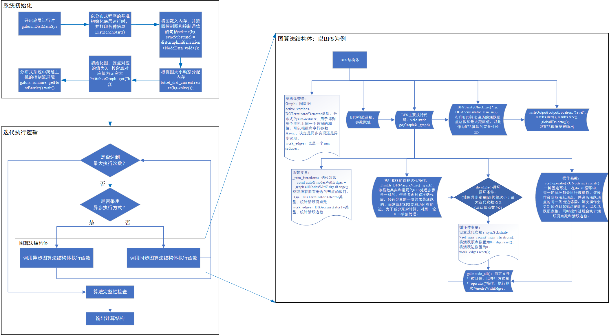

#### 昇腾端执行逻辑

下图展示了昇腾端接收稠密子图，并进行稀疏矩阵乘操作的流程：

上图展示了昇腾端在稠密子图上执行通用图算法的过程，其中processEdge操作和Reduce操作因算法而异，具体可以参照1.1.2章节。下面以BFS为例，介绍其实现：

- BFS的processEdge操作：执行矩阵向量加算子：ops.Add()
  将列向量加到矩阵的每一列。如果原矩阵位置是一个极大值，表示它代表的边不存在，加上列向量之后依然是一个极大值。如果原矩阵位置不是一个极大值，表示该位置代表的边存在。那么加上列向量后，该值表示该边代表的目的顶点到起始顶点的距离。 

- BFS的Reduce操作：执行矩阵向量归约算子：ops.ReduceMin(keep_dims=True) 

  按列求最小值，一个列中如果全都是极大值，那么表示该列对应的点依然不可达。反之取一个最小的非极大值，表示当前迭代得到的该点的中间值。

- 判断哪是否收敛：将本轮得到的值向量与上一轮得到的值向量进行比较（如果是第一轮迭代，则将第一轮迭代的向量与用户输入的值向量进行比较）。如果两个值向量是一致的，则表示迭代已经收敛此时退出，否则回到processEdge步骤。注意，在特殊情况下，如果迭代执行到用户指定的最大迭代次数仍然未收敛，此时也可以将值返回，此时的中间值也是有效的。

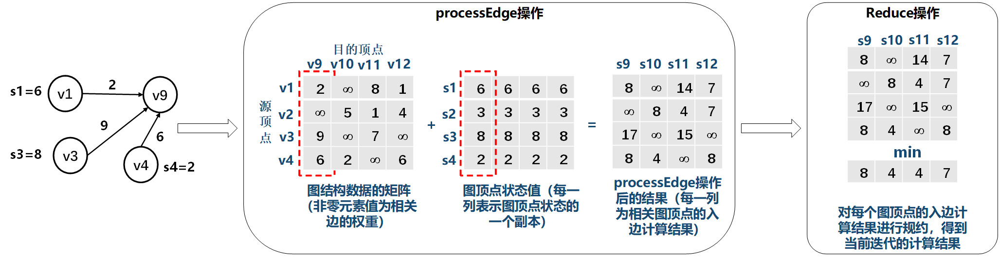

## 实验测试

实验测试的目的是设计合理的实验流程，证明实验方法的**“理论正确性”和“操作正确性”**。

### 实验一：验证数据集的幂律分布特性

#### 数据集选取

实验选取了两种数据集：

1. **真实世界的自然图**，数据集来源：[Stanford Large Network Dataset Collection](http://snap.stanford.edu/data/)
2. **Graph500提供的图生成工具**，可以指定生成特定规模（顶点的数目）和稠密度（边的数目）的图。

测试选取了三种不同类型的数据集：分别是社交网络图、电商平台交易图、道路交通图。实验尽可能涵盖了不同规模的图数据，但是由于网上开源的图数据有限，无法做同一类型不同规模的图数据集的横向测试，且由于资源限制，图数据的规模无法选取过大。

> 选取了ego-Gplus: Social circles from Google+，具有107614个点，13673453条边。实际测试解压后数据集规模达到数G,放弃实验。 

#### 数据集分布

以下图片以各种维度展示了真实世界图数据集（以Wiki-Vote为例）的分布，以验证数据集具有幂律分布的特点

- 将原始数据集表示成稀疏矩阵形式，并可视化。

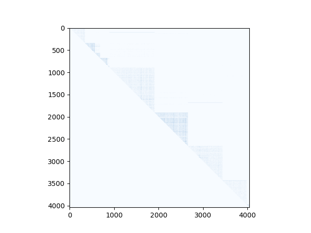

首先将图数据转化为矩阵形式，然后将矩阵绘制成图像。矩阵的非零点（表示该位置存在一条边）用蓝色像素表示，矩阵的零点（表示该位置不存在边）用白色像素表示。整幅图像呈现淡蓝色，原因是蓝色像素稀疏地分布在整幅图像。放大看图像的细节，在对角线附近蓝色像素较为集中，这是图的幂律分布特性所决定的[1]。

> [1] Arai, Junya, et al. "Rabbit order: Just-in-time parallel reordering for fast graph analysis." *2016 IEEE International Parallel and Distributed Processing Symposium (IPDPS)*. IEEE, 2016

- 统计数据集中顶点度数的分布情况。

上图横轴是顶点的度数，纵轴是度数出现的次数。右上角有统计信息，展示了边的数目、顶点的数目、顶点的平均度数、顶点的最大度数。此外我还将顶点按度数从小到大排序，然后展示了排名从小到大的度数值。

- 顶点度数的累积分布函数图

上图中横轴是顶点的度数，纵轴表示“小于该度数的顶点的占比”。

- 统计数据集中的非零节点数

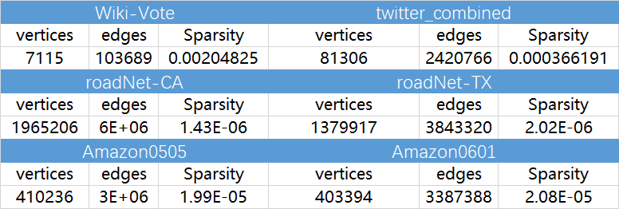

==结论：真实世界图数据集具有幂律分布的特点，整体看很稀疏。==

#### 稠密子图分布

以Wiki-Vote为例，使用不同阈值划分稠密子图。

- 阈值选取：将度数从小到大排序，然后依次选取排名在top50%的度数值、top25%的度数值、top10%的度数值、top5%的度数值、top1%的度数值.
- 子图划分：遍历图数据集的每一条边，如果边的两个顶点（源点和目的顶点）的度数都大于阈值，那么该边就被划分为稠密子图。
- 下方展示了原始图，及按照50%、25%、10%、5%、1%等阈值进行划分的稠密子图。

> 除了以顶点度数划分稠密子图，还实现了使用图划分、图聚类的方式来划分稠密子图。

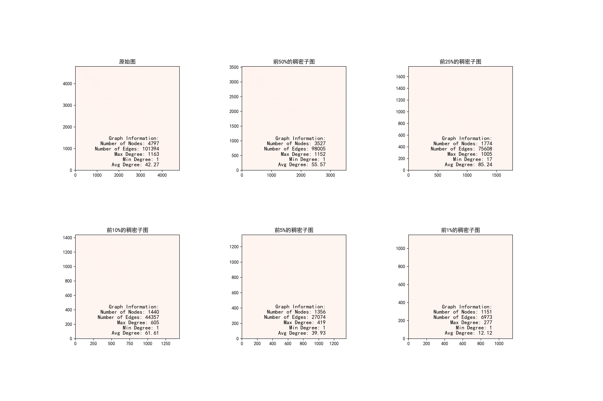

实验证明选择合适的阈值提取出的稠密子图，子图的稠密度大于原始图的稠密度。

- 以20%的阈值筛选稠密子图，并统计不同度数顶点的度数分布情况，以Wiki-Vote为例。

与原始图像相比，幂律分布的情况有所改善。

- 稠密子图的顶点度数的累积分布函数，以Wiki-Vote为例。

上图中横轴是顶点的度数，纵轴表示“小于该度数的顶点的占比”。

==结论：对原始图进行重排序可以提取到稠密子图，但是要选择合适的阈值才能取得较好效果。==

### 实验二：验证在面临稠密数据集时，NPU相比CPU有性能优势

我们的异构计算方案有一个实现前提：在面对稠密数据集时，NPU相比CPU有性能增益。下面的实验设置了不同稠密度的数据集，对比了NPU和CPU的处理性能。

- 由于开源自然图数据集可选项很少，灵活性较差。所以该部分测试使用Graph500图生成工具，以生成特定规模、特定度数的图。
- 我们的实验只对比了两个平台针对同一数据集执行同功能算法的计算时间，而在实际的异构计算方案中，还包含了数据预处理、数据传输，数据转换的开销（这部分的开销巨大，有时甚至超出了计算所需要的时间）。我们的实验是为了证实在计算时，NPU对比CPU确实有性能增益，所以剔除掉了对数据处理的时间。
- NPU执行过程中会用到很多算子，有些算子的执行时间几乎可以忽略不计，实验中只统计了主要的算子耗时，所以单算子相加的时间掠小于总算子耗时。

#### BFS实验

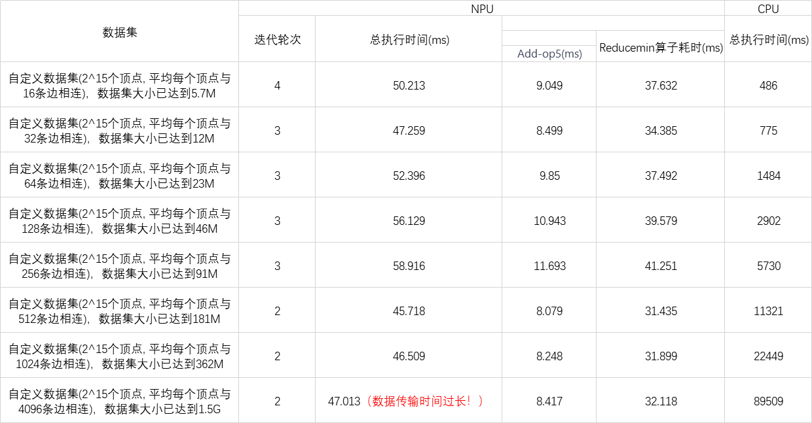

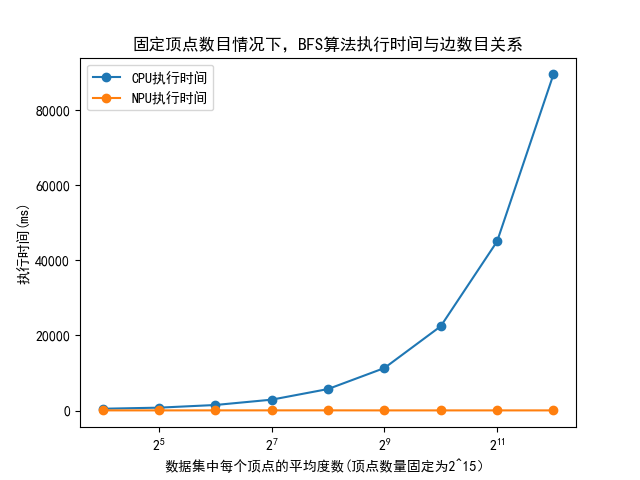

**笔记：**

1. 实验中为了使结果更加明显，设置了很极端的稠密度吗，而实际图中的稠密度无法达到这么高。
2. 在执行BFS算法时，NPU对比CPU有明显优势。数据集规模不变（即顶点的数目不变）,NPU的处理时长几乎不变，CPU的处理时长线性增加。CPU处理时长增加的原因是稠密度上升，每个顶点需要遍历的邻居节点增多，减缓了收敛速度。
3. 稠密度对于NPU的矩阵运算方式并非完全没有影响，稠密度越高，BFS算法遍历起来越容易，需要迭代的次数也会变少。所以可以看到随着稠密度增加，NPU的执行时间范围变少。
4. 实际执行中NPU的优势并没有这么明显，因为稠密度增大后，数据集的大小也成倍增加，带来的数据处理，数据转换、数据传输的时间过长！！！

#### PageRank实验

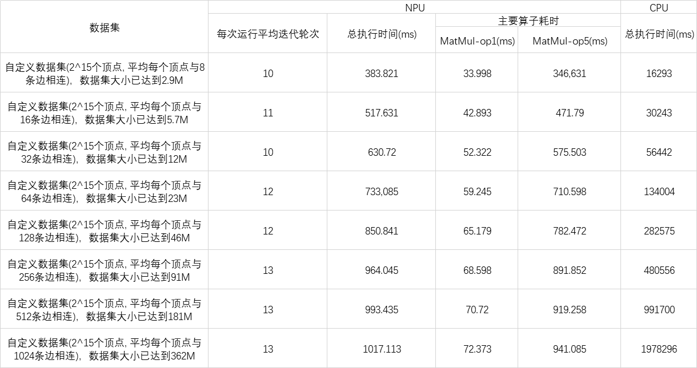

**笔记：**

1. PageRank算法和BFS算法的不同之处在于，随着迭代的进行，BFS算法需要遍历的顶点数不断减少。也就是说越往后处理图越稀疏，CPU在稀疏图上会快速收敛，所以处理的速度会越来越快。反观PageRank，它在迭代处理过程中需要处理的顶点数始终保持高位，所以CPU运算起来很吃力，NPU运算起来反而很高效。
2. Pagerank算法是一个近似算法，每次运行的结果可能有偏差，为了使实验更可信，每次测试都会让PageRank算法运行10次。

## 问题记录

### 在稠密子图的顶点数不变的情况下，增加稠密度，NPU报错内存不足？

NPU端将稠密子图转化为矩阵进行处理，所以理论上当稠密子图的顶点数固定时，增加数据集的稠密度并不会增大NPU的内存开销。但是实验中发现将顶点数目设置为2^16，增大稠密度会导致原本可以容纳的内存变得捉襟见肘。

经过分析发现，图数据集文件以edgelist的格式存储，部分顶点属于没有边的孤立点，它们在读入的过程中被代码自动过滤了。所以实际上读入的顶点数小于2^16，此时内存可以容纳。而随着数据集稠密度的提升，实际读入的顶点数越来越多，超出内存限制。也就是说，NPU内存原本无法容纳2 ^16个顶点，但是在去重后，顶点数目是小于2 ^16的，所以看上去似乎可以容纳。

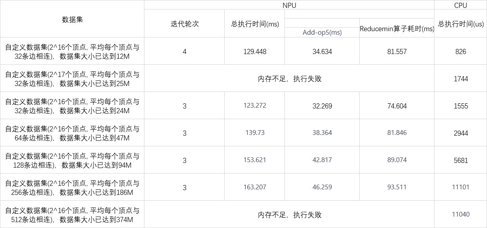

### 稠密子图的稠密度比原始图还要小？

原本以为采用阈值筛选出的稠密子图一定比原始图要稠密，但是实验中发现有些子图的稀疏度比原始图还要小。

难道是测试错误？或是说明筛选稠密子图的方案不可行？

提出猜想：原始图数据集本身就非常系数，采用的筛选条件过于苛刻的话就会导致入选的边过少，平均度数过小。反之如果筛选条件过于宽松，许多稀疏顶点的加入，也会拉低稠密度。下面的统计结果证明了这一猜想：

所以关键点在于，==如何找到一个合适的阈值来筛选稠密子图？==

### 针对同一数据集CPU和NPU的处理性能差别过大？

之前很长一段时间一直被困扰，CPU和NPU的处理性能差别过大，CPU的处理时间是us级的，NPU的处理时间却是毫秒级的，一直怀疑NPU的性能不佳。直到在测试Pagerank算法发现NPU执行比CPU快，但是统计的计算市场却比CPU慢，才发现CPU的计算时长单位被弄错了，CPU的处理时长的单位也是ms。反思了一下，之所以弄混原因有二：

1. 代码中并没有说明统计的处理时长的单位，需要自行推测。我看到代码使用了C++11中的时间库chrono，同时设置了间隔为std::chrono::microseconds，就以为单位是us，实际上代码中进行了一次数量级转换，我没有仔细看。

   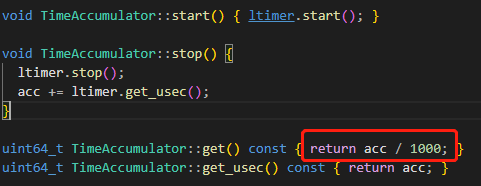

2. 一开始对BFS算法进行测试，CPU处理的一直很快，而NPU端对数据的转换耗时太长导致整体运行一直很慢，所以没有怀疑两者的性能是否真的差别那么大。后来测试PageRank算法，发现NPU算上数据转换的时间比CPU还要快，但是统计出的计算时长却比CPU慢，这才怀疑CPU的统计单位是不是弄混了。

## 待解决问题

1. 不同数据集的分布情况不同，选用不同的方式、选择不同的阈值，得到的稠密子图也会天差地别，应当如何以较低的开销，筛选出尽可能稠密的子图？（注意稠密子图的规模不能过小，过小性能增益无法弥补数据传输开销。也不能过大，过大会超出NPU内存限制）
2. 如何实现CPU-NPU端高效、低时延的数据传输。

