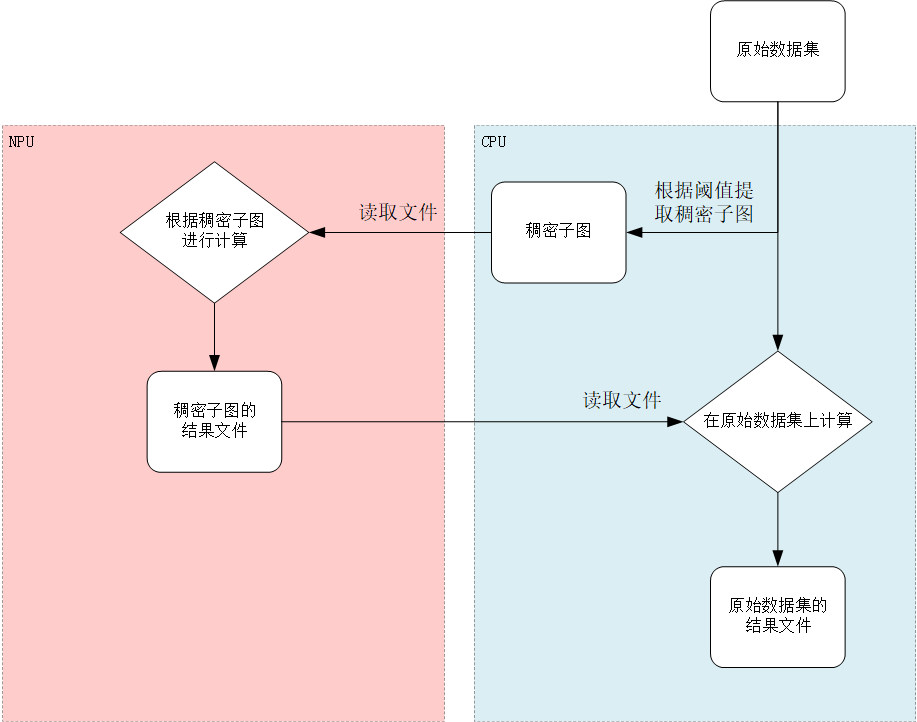
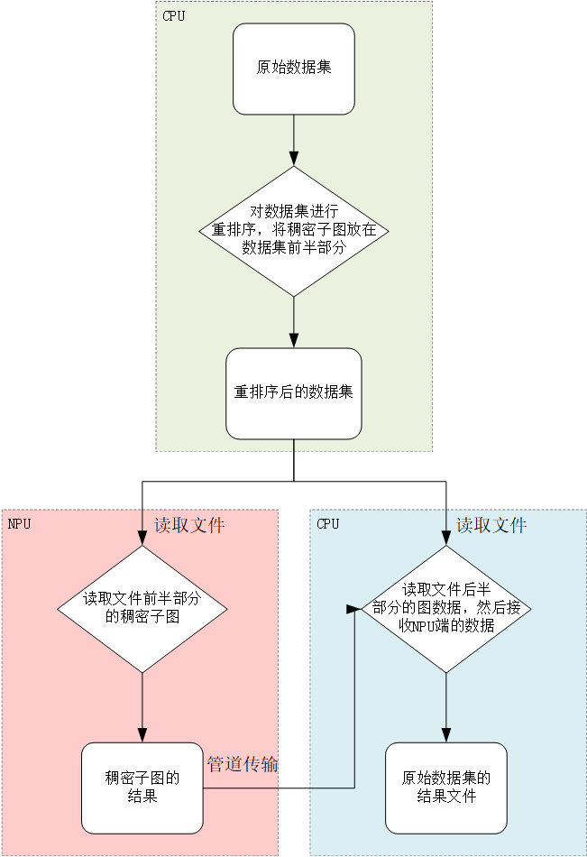
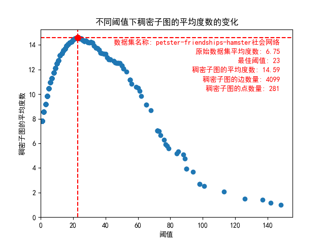
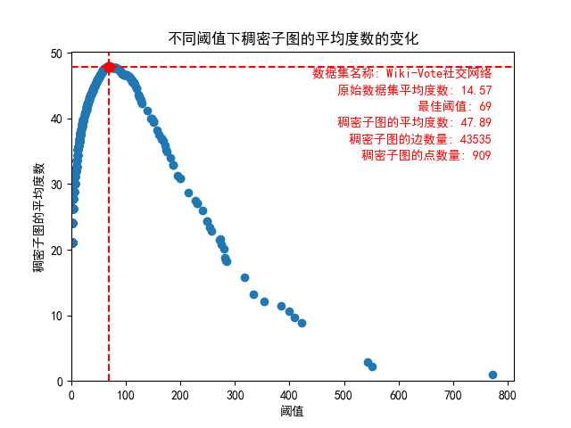
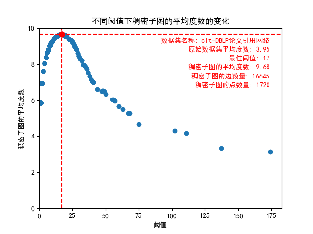
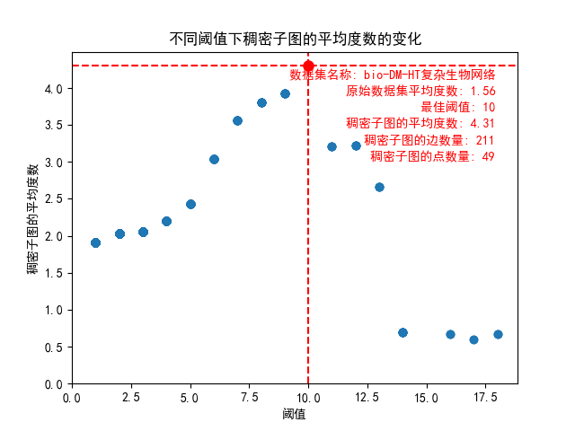

# 项目总结

近期进行了以下几个实验

## 实验一：改进数据传输方式

### 新旧数据传输方式

- 旧数据传输方式

- 新数据传输流程

### 改进点

- 之前的计算模式中，CPU端筛选出稠密子图后，将稠密子图传给NPU，自己**仍然计算完整数据集**，针对**稠密顶点存在冗余计算**。现在**NPU负责计算稠密部分，CPU负责计算稀疏部分**。等到NPU计算完成，CPU再读入NPU计算结果，加速迭代。
- 之前是读取数据集后再提取稠密子图。现在将图排序步骤前置，稠密子图包含在完整数据集中，CPU和NPU都读取同一份数据文件，文件的前半部分是稠密子图，后半部分是稀疏子图。
- NPU端的计算结果直接管道传输至CPU。

### **实现管道传输**

python代码和c++代码读取同一份文件，当python代码执行完成后，需要将计算结果传给c++.

- **Python 代码流程：**
  - Python 程序获取环境变量 `PIPE_FD` 中的管道写入端文件描述符。
  - Python 程序将要传输的数据编码为字节流。
  - Python 程序使用 `os.write` 函数将数据写入管道的写入端文件描述符。

- **C++ 代码流程：**
  - C++ 程序创建管道，获取两个文件描述符，一个用于写入数据，一个用于读取数据。
  - C++ 程序创建子进程，fork 函数调用返回子进程的 PID。
  - 在子进程中，关闭管道的读取端。
  - 子进程中执行 Python 程序的逻辑，将子进程的标准输出重定向到管道的写入端。
  - C++ 程序的主进程中，关闭管道的写入端。
  - 主进程等待子进程退出。
  - 主进程从管道的读取端读取数据。
  - 主进程输出从 Python 程序接收到的数据。

这样，Python 程序通过管道的写入端向 C++ 程序传输数据，C++ 程序通过管道的读取端从 Python 程序接收数据。

## 改进提取稠密子图的方式

### 统计不同类型图数据集中“稠密子图的平均度数”随“阈值”变化而变化的趋势

之前实验存在一个错误结论，认为提取的稠密子图太过稀疏原因是提取方法不可行，在经过进一步实验论证后发现：==利用度数阈值提取稠密子图是行之有效的方法，**只要选择好合适的阈值**，可以使提取出的稠密子图的稠密度大幅提高。==

回顾一下利用度数阈值提取稠密子图的步骤：

1. 用户自定义一个度数阈值。
2. 统计所有的顶点度数，用一个字典存放顶点id和度数的映射。
3. 遍历数据集的边集，如果一条边的两个顶点对应的度数都大于阈值（两个顶点都属于“稠密顶点”），将这条边纳入稠密子图。
4. 统计稠密子图的信息：筛选阈值，稠密子图的平均度数，稠密子图的边数，稠密子图的顶点数。

不同的数据集有不同的分布特点，不同的阈值会影响生成的稠密子图的分布。为了找出不同图数据集的分布特征，我选择了几个不同领域的图数据集，统计了阈值的选择与生成稠密子图之间的关系。

- petster-friendships-hamster社会网络

- Wiki-Vote社交网络

- cit-DBLP论文引用网络

- bio-DM-HT复杂生物网络

可以看出不同类型的图数据集之间存在着共同规律，“稠密子图的平均度数”会随“阈值”的增大先增大再减小。这也印证了之前的实验结果，之前的实验提取出来的稠密子图的平均度数之所以很低，是因为之前选择的阈值过高。可见只有选择合适的阈值，才能有效地提取稠密子图。

### 利用粗中细三种粒度快速确定阈值并筛选稠密子图

不同图数据集的分布不同，它们各自的最佳阈值的选择也不同。而寻找最佳阈值的过程开销是巨大的，因为每次确定好一个阈值之后，都要遍历图数据集中所有的边，图数据的边的规模可能非常巨大，所以要选择合适的方法，尽量减少阈值对比的次数。还好，我们之前的统计中发现，“稠密子图的平均度数”会随“阈值”的增大先增大再减小，这个规律可以帮助我们快速确定最佳阈值。

**代码流程：**

- 首先定义了辅助函数，用于读取图数据文件和计算每个顶点的度数。
- 主要函数是：find_best_threshold，该函数根据给定的粗粒度、中粒度和细粒度搜索比例，在给定的边列表和度数字典中找到数据集的最佳阈值。其流程如下：
  - 粗粒度搜索：根据粗粒度搜索比例，确定一个粗粒度阈值区间。对于每个阈值，在边列表中筛选出度数大于阈值的顶点对，并记录边数量。计算平均度数，并记录最大平均度数和对应的阈值。
  - 中粒度搜索：根据中粒度搜索比例，确定一个中粒度阈值区间。对于每个阈值，在边列表中筛选出度数大于阈值的顶点对，并记录边数量。计算平均度数，并记录最大平均度数和对应的阈值。
  - 细粒度搜索：根据细粒度搜索比例，确定一个细粒度阈值区间。对于每个阈值，在边列表中筛选出度数大于阈值的顶点对，并记录边数量。计算平均度数，并记录最大平均度数和对应的阈值。
- 在`main`函数中，读取图数据文件，统计每个顶点的度数，并按度数从大到小进行排序。然后调用`find_best_threshold`函数找到最佳阈值，并输出最佳阈值、最佳阈值的平均度数、稠密子图的边数量和顶点数量。

**代码创新点：**

- 使用粗粒度、中粒度和细粒度搜索比例确定阈值区间，避免了固定大小的步长。
- 在筛选稠密子图时，记录稠密子图的边数量而不是具体的边数据，减少了存储开销。
- 引入了边数量的限制条件，如果稠密子图的顶点数大于40000，则抛弃该阈值，并缩小搜索范围。
- 使用多种搜索比例和阈值区间的组合，以找到最佳阈值。
- 输出了完整的实验结果，包括数据集名称、最佳阈值、最佳阈值的平均度数、稠密子图的边数量和顶点数量，方便后续分析和比较。

**实验结果：**

| 数据集名称                          | 数据集信息                                  | 最佳稠密度 | 最佳稠密子图信息                              | 近似最佳稠密度 | 近似最佳稠密子图信息                                |
| ----------------------------------- | ------------------------------------------- | ---------- | --------------------------------------------- | -------------- | --------------------------------------------------- |
| petster-friendships-hamster社会网络 | 顶点数：2000  边数：15000，平均度数：6.75   | 23         | 平均度数：14.59  边数目：4099  顶点数目：281  | 26.93          | 平均度数： 14.37  边的数量： 3478  顶点的数量： 242 |
| Wiki-Vote社交网络                   | 顶点数：4797  边数：101394，平均度数：14.57 | 69         | 平均度数：47.89  边数目：43535  顶点数目：909 | 115.531        | 平均度数： 45.36  边的数量：20639  顶点的数量： 455 |
| cit-DBLP论文引用网络                | 顶点数：13000  边数：50000，平均度数：3.95  | 17         | 平均度数：9.68  边数目：16645  顶点数目：1720 | 70.29          | 平均度数： 5.32 边的数量： 394  顶点的数量： 74     |
| bio-DM-HT复杂生物网络               | 顶点数：3000  边数：5000，平均度数：1.56    | 10         | 平均度数：4.31   边数目：211 顶点数目：59     | 7.36           | 平均度数： 3.57  边的数量： 414 顶点的数量： 116    |

**实验结果非常好，利用上述方法确定阈值的速度非常快，并且根据得到的“近似最佳稠密度”提取的“稠密子图”，其平均度数跟“最佳稠密度”提取的“稠密子图”的平均度数非常接近。**

## 待办事项

- 目前实现了NPU读稠密子图，CPU读稀疏子图。当NPU将计算结果返回时，还需要让CPU将这部分数据合并到自己的迭代中，这个合并过程还没实现。