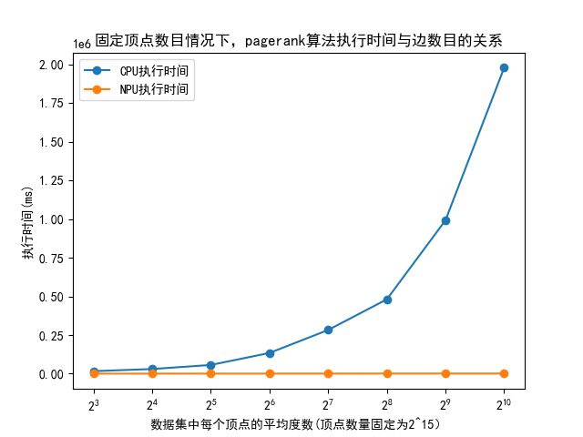

# 昇腾-鲲鹏异构计算架构介绍

## 简介

现实世界中图数据具有幂律分布的特点，常常导致严重的负载不均衡问题。我们对比了许多图计算方式观察到：

1. 经典的“以顶点为中心”的图计算方式，在图数据稀疏时能快速实现收敛。但是在图数据较为稠密时，收敛速度很慢。
2. 以矩阵方式实现的图计算方案对数据集的稠密度不敏感。

两种方案分别适用于图数据的稀疏部分和稠密部分，于是提出了一种新颖的异构计算方案：将同一数据集划分为稠密子图和稀疏子图。稠密子图交由擅长矩阵运算的NPU计算，稀疏子图交由擅长“以顶点为中心”的图计算方式的CPU计算。NPU在计算完成后将子图计算结果传回CPU，加速CPU的收敛。

> 幂律分布指图中大部分边集中在少量高度顶点之间，其余边稀疏的分布在大量低度顶点之间。

## 技术点

### 图算法的计算方式

#### “以顶点为中心”和“矩阵计算”

大部分图算法可以用“以顶点为中心”和“矩阵计算”两种方式实现，如下图所示：


- 左边展示了图计算中经典的“**以顶点为中心**”的“**pull-style**”计算模型。在Process Edge阶段顶点4会拉取它所有的入边邻居的信息，在Reduce阶段顶点4对所有拉取的邻居信息进行处理。
- 右边展示了使用**稀疏矩阵乘**实现同样的计算过程。方块代表图的邻接矩阵。绿色条带代表所有顶点目前的值向量。紫色条带代表顶点计算更新后的值向量。橙色条带代表了指向顶点4的入边邻居顶点。条带中的黑色点是非零值（对于有权图，该位置的值为权值，对无权图，该位置的值为1），代表真实存在的顶点，其余位置为零值，表示该位置的顶点关系并不存在（因为图是用邻接矩阵形式表示的，所以无论是存在，都要保留）。进行稀疏矩阵乘时，矩阵的每一行（橙色条带）都会与值向量（绿色条带）相乘，图中的示例行代表顶点4的入边邻居将自身的值加到顶点4上，然后经历一步Reduce操作后得到顶点4的更新值。其它顶点的更新过程也是这样。

大部分可以用“以顶点为中心”形式实现的图算法都可以实现上述转换过程。它们的计算步骤可以被抽象为Process Edge和Reduce两步：


#### 操作汇总

Process Edge和Reduce的具体实现会根据不同的图算法而调整，相应的它们转换为稀疏矩阵乘后的操作也不同。下表统计了几个常见图算法的操作：

|          **图算法**          | Process Edge操作 | Reduce操作 |
| :--------------------------: | :--------------: | :--------: |
|           PageRank           |        ×         |     +      |
|           NumPaths           |        ×         |     +      |
|          Adsorption          |        ×λ        |     +      |
|             BFS              |        +         |    min     |
| Single Source Shortest Path  |        +         |    min     |
|     Connected Components     |        ×         |    min     |
|  Single Source Widest Path   |       min        |    max     |
| Single Source Narrowest Path |       min        |    min     |
|   Minimum Reliability Path   |        ×         |    min     |
|   Maximum Reliability Path   |        ×         |    max     |
|      Maximum Cost Path       |        +         |    max     |
|  Single Source Reachability  |       and        |     or     |

### 划分子图

异构算法将同一副图的不同子图部分交由不同的硬件进行计算。根据摘要中的分析，我们需要将完整的图数据集划分为稠密子图和稀疏子图，分别交给昇腾端和鲲鹏端，分别执行“以顶点为中心”和“矩阵计算”算法。在划分子图时，我们采用了阈值法来进行划分。

#### 阈值与稠密度

**利用度数阈值提取稠密子图的步骤：**

1. 用户自定义一个度数阈值。
2. 统计所有的顶点度数，用一个字典存放顶点id和度数的映射。
3. 遍历数据集的边集，如果一条边的两个顶点对应的度数都大于阈值（两个顶点都属于“稠密顶点”），将这条边纳入稠密子图。
4. 统计稠密子图的信息：筛选阈值，稠密子图的平均度数，稠密子图的边数，稠密子图的顶点数。

**阈值选择与子图的稠密度：**

不同的数据集有不同的分布特点，不同的阈值会影响生成的稠密子图的分布。为了找出不同图数据集的分布特征，我选择了几个不同领域的图数据集，统计了阈值的选择与生成稠密子图之间的关系。


可以看出不同类型的图数据集之间存在着共同规律，“稠密子图的平均度数”会随“阈值”的增大先增大再减小。这也印证了之前的实验结果，之前的实验提取出来的稠密子图的平均度数之所以很低，是因为之前选择的阈值过高。可见只有选择合适的阈值，才能有效地提取稠密子图。

#### 利用粗中细三种粒度快速确定阈值并筛选稠密子图：

不同图数据集的分布不同，它们各自的最佳阈值的选择也不同。而寻找最佳阈值的过程开销是巨大的，因为每次确定好一个阈值之后，都要遍历图数据集中所有的边，图数据的边的规模可能非常巨大，所以要选择合适的方法，尽量减少阈值对比的次数。还好，我们之前的统计中发现，“稠密子图的平均度数”会随“阈值”的增大先增大再减小，这个规律可以帮助我们快速确定最佳阈值。

**代码流程：**

- 首先定义了辅助函数，用于读取图数据文件和计算每个顶点的度数。
- 主要函数是：find_best_threshold，该函数根据给定的粗粒度、中粒度和细粒度搜索比例，在给定的边列表和度数字典中找到数据集的最佳阈值。其流程如下：
  - 粗粒度搜索：根据粗粒度搜索比例，确定一个粗粒度阈值区间。对于每个阈值，在边列表中筛选出度数大于阈值的顶点对，并记录边数量。计算平均度数，并记录最大平均度数和对应的阈值。
  - 中粒度搜索：根据中粒度搜索比例，确定一个中粒度阈值区间。对于每个阈值，在边列表中筛选出度数大于阈值的顶点对，并记录边数量。计算平均度数，并记录最大平均度数和对应的阈值。
  - 细粒度搜索：根据细粒度搜索比例，确定一个细粒度阈值区间。对于每个阈值，在边列表中筛选出度数大于阈值的顶点对，并记录边数量。计算平均度数，并记录最大平均度数和对应的阈值。
- 在`main`函数中，读取图数据文件，统计每个顶点的度数，并按度数从大到小进行排序。然后调用`find_best_threshold`函数找到最佳阈值，并输出最佳阈值、最佳阈值的平均度数、稠密子图的边数量和顶点数量。

**代码创新点：**

- 使用粗粒度、中粒度和细粒度搜索比例确定阈值区间，避免了固定大小的步长。
- 在筛选稠密子图时，记录稠密子图的边数量而不是具体的边数据，减少了存储开销。
- 引入了边数量的限制条件，如果稠密子图的顶点数大于40000，则抛弃该阈值，并缩小搜索范围。
- 使用多种搜索比例和阈值区间的组合，以找到最佳阈值。
- 输出了完整的实验结果，包括数据集名称、最佳阈值、最佳阈值的平均度数、稠密子图的边数量和顶点数量，方便后续分析和比较。

**实验结果：**

| 数据集名称                          | 数据集信息                                  | 最佳稠密度 | 最佳稠密子图信息                              | 近似最佳稠密度 | 近似最佳稠密子图信息                                |
| ----------------------------------- | ------------------------------------------- | ---------- | --------------------------------------------- | -------------- | --------------------------------------------------- |
| petster-friendships-hamster社会网络 | 顶点数：2000  边数：15000，平均度数：6.75   | 23         | 平均度数：14.59  边数目：4099  顶点数目：281  | 26.93          | 平均度数： 14.37  边的数量： 3478  顶点的数量： 242 |
| Wiki-Vote社交网络                   | 顶点数：4797  边数：101394，平均度数：14.57 | 69         | 平均度数：47.89  边数目：43535  顶点数目：909 | 115.531        | 平均度数： 45.36  边的数量：20639  顶点的数量： 455 |
| cit-DBLP论文引用网络                | 顶点数：13000  边数：50000，平均度数：3.95  | 17         | 平均度数：9.68  边数目：16645  顶点数目：1720 | 70.29          | 平均度数： 5.32 边的数量： 394  顶点的数量： 74     |
| bio-DM-HT复杂生物网络               | 顶点数：3000  边数：5000，平均度数：1.56    | 10         | 平均度数：4.31   边数目：211 顶点数目：59     | 7.36           | 平均度数： 3.57  边的数量： 414 顶点的数量： 116    |

**实验结果非常好，利用上述方法确定阈值的速度非常快，并且根据得到的“近似最佳稠密度”提取的“稠密子图”，其平均度数跟“最佳稠密度”提取的“稠密子图”的平均度数非常接近。**

### 消息传输

1. 常见的程序间通信方式

程序间通信（Inter-Process Communication, IPC）是任何计算系统的基础，用于在多个进程间交换数据。以下是一些常见的IPC机制：

- 管道（Pipe）：管道是最早的进程间通信方式，主要用于进程间的数据流转换，其特性是半双工通信，数据只能单向流动，且只能在有共同祖先的进程间使用。
  
- 共享内存（Shared Memory）：这种方式允许多个进程访问同一块内存空间。虽然其速度快，但是可能会导致复杂的同步问题。
  
- 信号（Signals）：信号是一种用于通知给进程的简单消息，当某个事件发生时，系统通过发送信号来通知进程。
  
- 套接字（Socket）：套接字是最常用的进程间通信机制，它支持不同机器间的进程通信。

2. 管道传输方式的弊端

使用管道传输数据存在一些问题。首先，管道的容量有限（在Linux系统中，默认为64KB）。当管道填满时，写入操作将被阻塞，直到有进程从管道读取数据，为新的数据腾出空间。因此，当传输的数据量较大时，管道容易发生阻塞。

3. 使用分块的管道传输

项目中针对上述问题，提出了分块的管道传输方法。在这种方法中，数据被分割成多个块，并依次发送每个块。每个块被发送后，发送进程会暂停，直到接收进程读取了这个数据块。这样可以避免管道填满并阻塞写入操作。

4. 伪代码

以下是分块传输数据的伪代码。

Python端：
```python
def write_pagerank(pipe, data):
    serialize_data = serialize(data)
    total_size = len(serialize_data)
    chunk_size = calculate_chunk_size(total_size)
    
    pipe.write(total_size)
    pipe.write(chunk_size)
    
    for chunk in chunkify(serialize_data, chunk_size):
        pipe.write(chunk)
        pipe.flush()
    
    pipe.close()
```

C++端：
```cpp
void main() {
    int pipe = create_pipe();
    pid_t pid = create_subprocess();
    
    if (pid == 0) { // 子进程
        execute_python_program_with_env("PIPE_FD", pipe);
    } else { // 父进程
        close_pipe_write_end(pipe);
        
        int total_size = pipe.read();
        int chunk_size = pipe.read();
        
        for (int i = 0; i < total_size; i += chunk_size) {
            string data_chunk = read_data_from_pipe(pipe, chunk_size);
            process_data_chunk(data_chunk);
        }
        
        close_pipe_read_end(pipe);
    }
}
```
总结：管道的使用确实能够实现进程间的通信，但需要对其进行有效的管理和控制，避免因为数据量过大导致的管道阻塞问题。本项目中的分块传输方法，就是一种有效的改进方案，它能够确保管道在传输大量数据时依然能够高效运行。

## 系统设计

### 项目架构

#### 概述

项目代码分为CPU端和NPU端两大部分，两者都执行BFS操作，根据计算架构特点执行不同算法。CPU端适合串行复杂计算任务，所以采用经典的以点为中心的遍历图算法，从起始顶点开始逐轮迭代计算每一跳邻居。NPU端适合并行简单计算任务，所以采用矩阵+向量迭代算法。首先执行”**Process Edge操作**“，遍历所有边。然后进行”**Reduce操作**“，找出本轮迭代的可达边，即代表从源点开始的n阶邻居（假设迭代轮次为n）。

图数据具有幂律分布的特点，不同顶点间的稠密度相差很大。如果把这样一个幂律图全都交给CPU处理，CPU会在高度顶点（度指顶点连接的边数）迭代过多轮次，导致收敛的速度太慢。而如果把幂律图数据全都交给NPU处理，NPU需要为n个顶点开辟n*n大小的存储空间（真实世界图数据集的顶点规模远远大于NPU可用资源），这限制了NPU所能处理的图数据集的规模。此外矩阵+向量迭代算法在矩阵较为稠密时（矩阵上大部分元素都是有效的非零元素）可以快速迭代，当矩阵较为稀疏时，迭代轮次升高，执行效率变差。

针对图数据的特征和两种算法的执行特性，提出CPU+NPU的异构图计算模型。CPU端负责载入图数据，并根据顶点度数筛选稠密顶点，以文件的方式单独保存稠密子图数据。接着采用多线程运行方式，其中一个线程负责调度NPU端执行程序，其余线程则以以点为中心的遍历方式执行BFS查询。NPU端会读取CPU传递过来的稠密子图（稠密子图中两条边都属于稠密顶点），用矩阵向量算法执行运算。运算结束后将保存迭代值，并生成一个结束标志。CPU检测到结束标志会将NPU端的计算值更新到当前迭代值中。CPU采用异步计算的方式进行迭代，当某一轮后发现迭代结果值未发生改变，代表算法已经收敛，计算完成。


#### 鲲鹏端执行逻辑

鲲鹏端运行DepGraph图计算框架，框架本身对分布式图计算系统初始化、内存管理、通信[2]进行了很好的封装。用户在执行时只需要在通用图算法执行流程的基础上，按照给定的接口规范，实现自己的图算法的结构体。

> [2]Dathathri R, Gill G, Hoang L, et al. Gluon-async: A bulk-asynchronous system for distributed and heterogeneous graph analytics[C]//2019 28th International Conference on Parallel Architectures and Compilation Techniques (PACT). IEEE, 2019: 15-28.


#### 昇腾端执行逻辑

下图展示了昇腾端接收稠密子图，并进行稀疏矩阵乘操作的流程：


上图展示了昇腾端在稠密子图上执行通用图算法的过程，其中processEdge操作和Reduce操作因算法而异，具体可以参照1.1.2章节。下面以BFS为例，介绍其实现：

- BFS的processEdge操作：执行矩阵向量加算子：ops.Add()
  将列向量加到矩阵的每一列。如果原矩阵位置是一个极大值，表示它代表的边不存在，加上列向量之后依然是一个极大值。如果原矩阵位置不是一个极大值，表示该位置代表的边存在。那么加上列向量后，该值表示该边代表的目的顶点到起始顶点的距离。 

- BFS的Reduce操作：执行矩阵向量归约算子：ops.ReduceMin(keep_dims=True) 

  按列求最小值，一个列中如果全都是极大值，那么表示该列对应的点依然不可达。反之取一个最小的非极大值，表示当前迭代得到的该点的中间值。

- 判断哪是否收敛：将本轮得到的值向量与上一轮得到的值向量进行比较（如果是第一轮迭代，则将第一轮迭代的向量与用户输入的值向量进行比较）。如果两个值向量是一致的，则表示迭代已经收敛此时退出，否则回到processEdge步骤。注意，在特殊情况下，如果迭代执行到用户指定的最大迭代次数仍然未收敛，此时也可以将值返回，此时的中间值也是有效的。


## 代码实现


## 性能测试

- 由于开源自然图数据集可选项很少，灵活性较差。所以该部分测试使用Graph500图生成工具，以生成特定规模、特定度数的图。
- 我们的实验只对比了两个平台针对同一数据集执行同功能算法的计算时间，而在实际的异构计算方案中，还包含了数据预处理、数据传输，数据转换的开销（这部分的开销巨大，有时甚至超出了计算所需要的时间）。我们的实验是为了证实在计算时，NPU对比CPU确实有性能增益，所以剔除掉了对数据处理的时间。
- NPU执行过程中会用到很多算子，有些算子的执行时间几乎可以忽略不计，实验中只统计了主要的算子耗时，所以单算子相加的时间掠小于总算子耗时。

### BFS实验


**笔记：**

1. 实验中为了使结果更加明显，设置了很极端的稠密度吗，而实际图中的稠密度无法达到这么高。
2. 在执行BFS算法时，NPU对比CPU有明显优势。数据集规模不变（即顶点的数目不变）,NPU的处理时长几乎不变，CPU的处理时长线性增加。CPU处理时长增加的原因是稠密度上升，每个顶点需要遍历的邻居节点增多，减缓了收敛速度。
3. 稠密度对于NPU的矩阵运算方式并非完全没有影响，稠密度越高，BFS算法遍历起来越容易，需要迭代的次数也会变少。所以可以看到随着稠密度增加，NPU的执行时间范围变少。
4. 实际执行中NPU的优势并没有这么明显，因为稠密度增大后，数据集的大小也成倍增加，带来的数据处理，数据转换、数据传输的时间过长！！！

### PageRank实验




**笔记：**

1. PageRank算法和BFS算法的不同之处在于，随着迭代的进行，BFS算法需要遍历的顶点数不断减少。也就是说越往后处理图越稀疏，CPU在稀疏图上会快速收敛，所以处理的速度会越来越快。反观PageRank，它在迭代处理过程中需要处理的顶点数始终保持高位，所以CPU运算起来很吃力，NPU运算起来反而很高效。
2. Pagerank算法是一个近似算法，每次运行的结果可能有偏差，为了使实验更可信，每次测试都会让PageRank算法运行10次。

## 结论