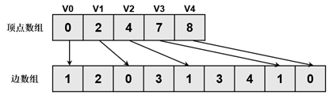
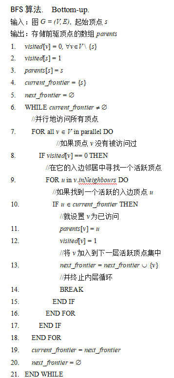

# 代码原理

## 整体结构1


## 划分子图

随着要处理的图数据集规模逐渐增大，分布式内存图计算系统成为主流，这就带来了图分区的需求。许多图计算系统采用内置图分区器，但是往往不够灵活，也有一些独立图分区器被提出，但是分区策略都不够完善。一般来说图分区器的性能可以从三个维度进行评估：1，通用性：分区器是否支持多种分区策略，还是仅限于一种或少数内置策略？2，速度：它对图进行分区的速度有多快？3，质量：针对感兴趣的算法、输入和平台生成的分区有多好？我们libcus目录实现了CuSP[1]快速流图分区框架，它的优势为：1，允许用户在高抽象级别指定所需的分区策略。2，可以快速生成高质量的图分区。我们的实验表明，它生成高质量分区的速度比文献中的独立分区器快 6 倍，同时生成高质量分区并支持广泛的分区策略。

> [1]CuSP: A Customizable Streaming Edge Partitioner for Distributed Graph Analytics
>
> 注意，这里并不是对流图进行图分区，而是在分区的时候，采用一些并行的策略来加快图分区任务。

###  CuSP处理流程

- 首先，要分区的图必须以压缩稀疏行 (CSR) 或压缩稀疏列 (CSC) 格式存储在磁盘上。为了便于解释，我们假设该图以 CSR 格式读取（注意 CSC 中的传出边对应于 CSR 中的传入边）。

- 为了指定特定的分区策略，程序员必须向 CuSP 提供所需分区的数量，并提供 (i) 选择主顶点和 (ii) 向分区分配边的规则。 CuSP 从磁盘流入图的边缘，并使用这些规则将它们分配给分区并选择主分区。

- 为了指定分区规则，可以方便地假设存在一个名为 prop 的结构，它存储分区的数量和图的静态属性，例如节点和边的数量、节点的传出边或邻居以及输出- 节点的度。这个结构体可以通过分区规则来查询；例如，prop.getNumNodes() 返回图中的节点数。分区规则可能是历史敏感的；例如，可以将边分配给当前分配给它的边数最少的分区。每个分区规则都可以定义自定义类型来跟踪可更新状态。CuSP 在主机之间透明地同步此状态。

- 为了指定策略，用户编写两个函数：

  - getMaster(prop, nodeID, mState, masters)：返回节点nodeID的主代理的分区； masters 可用于查询节点邻居的主代理的（先前）分配的分区。

  - getEdgeOwner(prop, srcID, dstID, srcMaster, dstMaster, eState)：返回必须分配边（srcID，dstID）的分区； srcMaster和dstMaster分别是包含srcID和dstID节点的主代理的分区。

- 用户分别在 getMaster() 和 getEdgeOwner() 中定义跟踪的 mState 和 eState 的类型。使用相同参数多次调用这些函数必须返回相同的值。当不需要状态时，mState 或 eState 类型无效。当节点的主分配不依赖于其邻居的分配时，可以在没有 masters 参数的情况下定义 getMaster()。

- CuSP 在与所需分区数量相同数量的分布式主机上运行。对图进行分区后，CuSP 在每个主机上构建一个分区。

### CuSP框架

与上节的处理流程对应，CuSP的整体框架如下：


<center>图：CuSP的控制流和数据流（注意，上图省略了图分区后续的同步处理步骤）</center>

- 输入图以 CSR 或 CSC 格式存储在磁盘上。不失一般性，我们假设该图以 CSR 格式存储。每台主机以 CSR 或 CSC 格式构建图的一个分区。如果应将边分配给本地分区，则将其添加到该分区；否则，它将被转发到适当的主机。 CuSP 可以有效地处理并行实施此方法时出现的许多复杂情况。

  - CSR 或CSC 格式的图无法增量构建，因为为CSR 或CSC 格式分配底层数组需要了解节点数量以及每个节点的传出或传入边。因此，在构建图表之前必须确定这些计数。

  - 主机之间需要进行边缘通信，因为主机可能会处理边缘并确定它属于与其正在构建的分区不同的分区。

  - 如果分区规则是历史敏感的，则一台主机上所做的决策将影响其他主机上所做的决策。因此，分区状态必须在所有主机上同步。

- 图形读取

  - CSR 格式的边数组在主机之间大致均等划分，以便每个主机从该数组读取并处理一组连续的边。为了减少主机间的同步，这种划分被四舍五入，以便给定节点的传出边缘不会在主机之间划分。实际上，此方法为每个主机分配一组连续的顶点，以便每个主机具有大致相同数量的边，并且这些顶点的传出边由该主机处理。用户可以更改此初始分配，以便将节点考虑在内，并为节点和/或边缘平衡分配重要性。每个主机将其一组顶点和边从磁盘加载到内存中，因此未来的阶段将直接从内存中读取它们。

- 主分配

  - 每个主机循环遍历从磁盘读取其边的顶点。对于每个这样的顶点 v，它使用 getMaster() 确定分配该顶点的主节点的分区，并将其存储在本地主节点映射中，该映射将顶点的全局 ID 映射到分配的分区。主站映射可以定期与其他主机的映射同步。

    

- 边缘分配

  - 每个主机 hi 循环遍历它从磁盘读取的边缘（算法 3）。对于它负责的每个顶点 v 以及每个主机 h j ，它确定 (i) v 的多少个传出边将被发送到 h j 以及 (ii) h j 上这些边的目的地的代理顶点是否将是镜像。一旦所有边缘都被处理，该信息就会被发送到其他主机。

    

- 图分配

  - 当边缘分配阶段完成时，主机对其分区中将有多少顶点和边缘有了完整的了解。每个主机以CSR格式为其分区分配内存，并为其顶点创建从全局id到本地id的映射。主机还没有从其他主机接收到它的边，但是通过事先为边分配内存，可以在从其他主机接收到边时并行地将边插入数据结构中。分区状态被重置为初始值，以便在图构建阶段调用用户指定的函数将返回与在边缘分配阶段相同的值。

- 图构建

  - 每个主机将再次循环遍历其所有读边(算法4)。它不像在赋值阶段那样编译元数据，而是将边缘发送到适当的主机getEdgeOwner()返回的信息。当边从传入消息反序列化时，将并行地插入到前一阶段构造的CSR结构中。如果需要的话，一旦图形构建完成，每个主机都会在内存中执行CSR图形的转置，以构建(无需通信)它们的CSC图形。

    

    


## 去除子图中的孤立顶点

Yasui等人[2]研究发现，GRAPH 500使用的数据集Kronecker生成图中存在大量度数为0的孤立顶点(isolated vertex)。下表展示了对于不同顶点规模的Kronecker生成图,孤立顶点占全部顶点的百分比。可以看到，孤立顶点能够占到全部顶点的一半，而且随着顶点规模的增加,孤立顶点的占比还在不断扩大。这些孤立顶点的存在会使得BFS算法访问所有顶点时一半的访问是无效的。项目在生成子图时，会筛选出度数为0的孤立顶点，从而提高了BFS算法的计算效率。

> [2]Yasui Y, Fujisawa K, Sato Y. Fast and energy-efficient breadth-first search on a single NUMA system//International Supercomputing Conference. New Orleans, USA, 2014: 365-381

| 顶点规模 | 孤立顶点占全部顶点的百分比 |
| :------: | :------------------------: |
|   224    |           47.1%            |
|   225    |           49.2%            |
|   226    |           51.1%            |
|   227    |           53.0%            |
|   228    |           54.8%            |
|   229    |           56.6%            |
|   230    |           58.3%            |

<center>表：Kronecker生成图的孤立顶点占比 </center>

## 生成裁剪CSR子图

为处理图数据规模超过GPU内存容量(out-of-GPU-memory)的情况，现有的基于GPU的图分析算法主要采用基于分区的方法。具体来说，大规模图首先被划分为多个分区，使每个图分区都能完整加载入GPU内存，然后在每轮迭代图处理过程中依次将每个图分区加载入GPU进行处理。图划分示例如下图所示。这种基于分区的方法会使得GPU图算法面临高额的数据传输开销。为了减小CPU-GPU之间的传输开销，我们采用了一种基于依赖感知的GPU图算法优化技术，该优化技术使用一种高效的运行时依赖子图生成算法，能够在迭代图处理过程中利用GPU的高并行性提取稀疏分布的活跃顶点来构建依赖子图，使图算法只需加载和处理与活跃顶点相关的图数据，从而显著地减少CPU-GPU数据传输开销，提高图算法的执行速度。


<center>图：图划分示例</center>

子图的原始图数据采用CSR(Compressed Sparse Row)格式进行存储。如图所示，CSR格式的图数据由两个数组构成：顶点数组(数组下标对应顶点Id，数组内容存储顶点出边偏移量)与边数组(存储出边)。通常，大规模图数据中的边数据占用绝大部分存储空间，而顶点数据仅占用小部分存储空间，为减少CPU-GPU通信开销，该优化技术在GPU中同样存储一组原始图数据的顶点数组，而原始图数据的边数组则只存储在CPU内存中。



<center>图：CSR图存储格式</center>

为了高效地从CSR格式的图数据中提取依赖子图，依赖子图生成算法采用CSR风格的依赖子图存储格式，具体而言，依赖子图由三个数组构成，分别是子图顶点数组(存储活跃顶点Id)、顶点出边偏移数组和子图边数组。依赖子图存储格式如图所示：


<center>图：依赖子图存储格式</center>

运行时的依赖子图生成由CPU与GPU共同完成，除了需要使用CSR格式的原始图数据(CSR顶点数组与边数组)，还需要活跃顶点标记数组与顶点出度数组。具体的依赖子图生成步骤如下：

- 首先根据活跃顶点标记数组计算活跃顶点标记前缀和，即子图中活跃顶点对应位置。此步骤可通过GPU的高并行性快速完成。如图所示：


<center>图：获取活跃顶点标记前缀和</center>

- 然后根据活跃顶点标记数组与活跃顶点标记前缀和获得子图顶点数组，此步骤也可通过GPU的高并行性快速完成。如图所示：


<center>图：构建子图顶点数组</center>

- 生成子图顶点数组之后，根据活跃顶点标记数组与顶点度数数组获取子图顶点度数数组。如图所示，将非活跃顶点的度数置为0，此步骤可利用GPU快速完成。


<center>图：获取子图顶点度数数组</center>

- 获取子图顶点度数数组之后，计算其前缀和，即对应子图顶点的出边偏移量，如图所示，此步骤可通过GPU快速完成。


<center>图：获取子图顶点度数前缀和</center>

- 根据活跃顶点标记数组、活跃顶点标记前缀和子图顶点度数前缀和获取子图顶点出边偏移数组，如图所示，此步骤可利用GPU快速完成


<center>图：构建子图顶点出边偏移数组</center>

- 最后，根据子图顶点数组与子图顶点出边偏移数组，以及CSR格式的原始图数据获取子图边数组。如图所示，将由于原始图数据的边数组只存储在CPU内存中，此步骤的并行性只能通过多个CPU线程完成。


<center>图：构建子图边数组</center>


## pull-push自动切换的BFS算法

在传统的BFS算法中,遍历方向是自顶向下(Top-down, TD). Beamer等人[3-4]开创性地提出一种方向性优化技术,将自顶向下与自底向上(Bottom-up, BU)的遍历方式相结合,并在两种遍历方式间动态切换,减少遍历过程中不必要的边访问. 针对非一致内存访问架构(Non-uniform memory access, NUMA)。

> [3] Beamer S, Asanovic K, Patterson D, et al. Searching for a parent instead of fighting over children: A fast breadth-first search implementation for graph500. EECS Department, University of California, Berkeley, Tech. Rep. UCB/EECS-2011-117, 2011.
>
> [4] Beamer S, Asanovic K, Patterson D. Direction-optimizing breadth-first search//Proceedings of the International Conference on High Performance Computing, Networking, Storage and Analysis. IEEE, 2012: 1-10.

### Top-down 算法

传统的BFS算法采用Top-down的遍历方式,从已访问的顶点出发,沿着出边,寻找未访问过的顶点. 具体的过程如下所示：


其中,**visited**数组保存着顶点是否被访问过的状态,**parents**记录了当前顶点在BFS生成树上的父亲顶点,**current_frontier**和**next_frontier**分别保存着当前层和下一层的活跃顶点集.

Top-down算法是一种迭代式的算法,分为初始化阶段和迭代阶段. 在算法的初始化阶段(第1行到第5行),将起始点**s**设置为已访问并加入到**current_frontier**(当前层活跃顶点集)中. 随后算法就开启了一轮又一轮的迭代,直至**current_frontier**为空. 在每轮迭代中,对于每个在**current** **frontier**中的活跃顶点**u**,算法会检查它是否有未访问过的出边邻居顶点,然后将所有未访问过的出边邻居顶点设置为已访问并加入到**next_frontier**中. 每轮迭代结束前,设置新的**current_frontier**和**next_frontier**.

### Bottom-up 算法

Top-down算法需要遍历从活跃顶点集出发的每条出边,在大多数顶点已经被访问过的情况下会产生大量无效边遍历. 于是提出了Bottom-up算法,以减少了BFS算法中后期的无效边遍历. Bottom-up遍历过程如下所示。



如上图所示,Bottom-up算法采用了与Top-down算法相反的搜索方向,从未访问的顶点出发,在它的入边邻居中寻找活跃顶点. 只要在入边邻居中寻找到一个活跃顶点,便可跳出循环,避免无效的边遍历

### Top-down 算法和Bottom-up 算法自动切换

- 初始化 `visited` 数组，`queue`。
- 开始 BFS 循环。
- 在每次循环中，判断当前队列的大小。
- 若队列的大小小于总节点数的一半，采用 `push` 策略；否则采用 `pull` 策略。
- 对于 `push` 策略：对队列中的每个节点，将其未访问的邻居节点加入队列并标记为已访问。
- 对于 `pull` 策略：遍历所有未访问的节点，检查它们是否有邻居在当前的队列中，如果有则将它们加入队列并标记为已访问。

算法伪代码：

```c++
class Graph {
public:
    vector<vector<int>> adjList;  // 邻接表，表示图的结构
};

/**
 * 使用 push 策略处理 BFS 的当前层。
 * @param adjList: 图的邻接表
 * @param queue: 当前需要处理的节点队列
 * @param visited: 标记每个节点是否被访问
 */
void processPush(vector<vector<int>>& adjList, vector<int>& queue, vector<bool>& visited) {
    int n = queue.size();
    vector<int> nextLayer;

    // 遍历当前层的每个节点
    for (int i = 0; i < n; ++i) {
        int node = queue[i];
        for (int neighbor : adjList[node]) {
            if (!visited[neighbor]) {
                visited[neighbor] = true;
                nextLayer.push_back(neighbor);
            }
        }
    }
    queue = nextLayer;  // 更新队列为下一层节点
}

/**
 * 使用 pull 策略处理 BFS 的当前层。
 * @param adjList: 图的邻接表
 * @param queue: 当前需要处理的节点队列
 * @param visited: 标记每个节点是否被访问
 */
void processPull(vector<vector<int>>& adjList, vector<int>& queue, vector<bool>& visited) {
    vector<bool> inCurrentLayer(queue.size(), false);
    for (int val : queue) {
        inCurrentLayer[val] = true;
    }

    vector<int> nextLayer;
    // 遍历所有未访问的节点，查找与当前层相邻的节点
    for (int i = 0; i < adjList.size(); ++i) {
        if (!visited[i] && any_of(adjList[i].begin(), adjList[i].end(), [&](int neighbor) { return inCurrentLayer[neighbor]; })) {
            visited[i] = true;
            nextLayer.push_back(i);
        }
    }
    queue = nextLayer;  // 更新队列为下一层节点
}

/**
 * 使用双向策略进行 BFS。
 * @param graph: 图的数据结构
 * @param start: BFS 的起始节点
 */
void BFS_bidirectional(Graph& graph, int start) {
    vector<bool> visited(graph.adjList.size(), false);
    vector<int> queue = {start};
    visited[start] = true;

    // BFS 循环
    while (!queue.empty()) {
        // 根据当前队列的大小判断使用哪种策略
        if (queue.size() < graph.adjList.size() / 2) {
            processPush(graph.adjList, queue, visited);
        } else {
            processPull(graph.adjList, queue, visited);
        }
    }
}

```

## CPU拓扑感知+软优先级的异步调度策略

### 并行算法的调度难题

- 可编程性差：许多时候图非常大，为了加速图计算可以使用并行编程。但是要实现高效的并行程序是非常困难的，尤其是对于共享内存机器。

- 效率低：图形分析的特定领域语言 (domain-specific languages DSL)作用是简化程序编写。程序表示为顶点运算符的迭代应用，其中顶点运算符是读取和写入节点及其直接邻居的函数。通过以批量同步方式将运算符同时应用于图的多个节点来利用并行性；同步调度插入必要的同步以确保一轮中的所有操作在下一轮开始之前完成。虽然DSL解决了易用性的问题，但是这种编程模型不足以实现高性能、通用的图形分析，在这种情况下，通用是指算法和被分析的输入图形类型的多样性。

### 同步调度和异步调度

- 同步调度将活动的调度限制为执行轮次，如批量同步并行 (BSP) 模型 。整个程序的执行分为一系列由屏障同步分隔的超步。在每个超级步骤中，选择并执行活动节点的子集。在共享内存实现中写入共享内存，或在分布式内存实现中写入消息，被认为是从一个超步到下一个超步的通信。因此，每个超步都包括根据前一个超步的通信更新内存、执行计算，然后向下一个超步发出通信。对同一位置的多次更新以不同的方式解决，就像各种 PRAM 模型所做的那样，例如通过使用归约操作 。

- 在异步调度中，活动是用事务语义执行的，因此它们的执行看起来是原子的和孤立的。并行活动是可序列化的，因此整个程序的输出与一些顺序交错的活动相同。线程从工作列表中检索活动节点并执行相应的活动，仅在需要时与其他线程同步以确保事务语义。这种细粒度同步可以通过对图元素使用逻辑锁或无锁操作的推测执行来实现。当活动提交时，活动的副作用在外部变得可见。

DepGraph指出，传统的以点为中心的计算模型通常采用同步调度策略，虽然能够满足处理一般性的图分析任务的要求，但在执行高性能图分析任务时效率不高，而基于数据驱动的异步调度，应用程序在其数据可用时被安排执行，所以能够实现更好的性能（不是所有算法都能采用异步调度方式实现）。为了提高效率，异步调度需要特定于应用程序的优先级函数，这些函数必须由程序员提供，因此必须得到编程模型的支持。为了实现异步调度，DepGraph相比之前的图计算系统做出了如下改进：拓扑感知工作窃取调度程序、优先级调度程序和可扩展数据结构库。

### 拓扑感知的任务调度

DepGraph调度器的核心是基于机器拓扑感知的任务调度，当应用没有设置特定优先级时，它会使用并发包装载任务，这些任务是无序可并行执行的，可以插入新任务也可以请求内部任务。具体过程如下图所示，每个计算核心都有一个chunk结构，它是一个环状缓冲区，可以容纳8-64（由用户在编译时确定）个任务，计算核心可以用它插入新任务或获取任务工作。DepGraph的调度分级如下，一个Bag并发包中有多个package列表，每个package列表记录一组chunk数据结构，如果某个计算核心的chunk已满，就会从package中插入任务到其他chunk，如果chunk为空，就会从package中查找其他chunk的任务，如果package也为空，就去另一个package查找。


<center>图：DepGraph并发包结构示意图</center>

### 优先级调度

DepGraph提出了obim软优先级调度器，将机器拓扑感知任务调度策略与任务具有优先级的情况结合。obim包含一系列并发包，每个包中放置同等优先级的任务，可以任意顺序并发执行，不同包之间的任务按优先级执行。如下图所示，图中包含3个包，分别存放任务1、3、7，全局维护一个操作日志记录全局包活跃；每个线程维护一个本地包映射，缓存全局包结构，记录日志点。当线程需要插入和获取任务时，首先到本地查找特定优先级的包，若无，从全局获取最新结构，若仍无，则创建新优先级的包，同步全局和本地包和日志。使得所有线程共享当前处理任务的优先级，提高任务获取效率，保证任务的执行顺序。


<center>图：DepGraph obim优先级调度器结构示意图</center>


## GPU基于Scan + Warp + CTA的负载均衡策略

> CTA：cooperative thread array协作线程数组，它是一组位于同一多核处理器上并共享本地暂存存储器的线程。

现代处理器架构提供了越来越多的并行性，以便在保持能源效率的同时提供更高的吞吐量。现代 GPU 处于这一趋势的前沿，提供数以万计的数据并行线程。图计算具有高并发的特点，以顶点为中心和以边为中心的图计算编程模型都隐藏着大量的并行语义，因此都能够有效地通过GPU来进行并行加速。同时，图计算属于数据密集型应用，经常需要处理数十GB的数据，所以GPU的高带宽也是一个明显的优势。尽管有这些优势，但是用GPU来加速大规模图计算仍然面临着诸多挑战：

- 图计算是典型的不规则应用，它的内存访问模式具有间接性、数据依赖等特点，所以无法充分利用GPU的高带宽以及高并行性。
- GPU内存大小的限制，使得经常需要将数据从主存中向GPU内存中移动，而这会导致额外的开销，同时使GPU扩展到大图上面临着内存空间不足等问题。
- 现实中的图大多是幂律分布（power-law）的，各个顶点的度数分布不均匀，所以在图算法中，负载均衡问题也需要格外注意。
- 由于GPU的硬件架构特点，它并不适合处理图计算中的条件分支语义（if-else等），所以有时无法充分利用GPU的SIMT（Single Instruction Multiple Threads）带来的高并行性，所以分支语义会极大降低GPU性能。

图遍历算法一直是图计算中的一个重要算法，同时也是很多其他图算法的基础。Breath-first search（BFS）是图遍历的经典算法，也是一种典型的内存访问和工作负载既不均衡又依赖于数据的并行算法。Merrill等人提出了一个基于GPU的并行BFS算法。并行的BFS大体上分为两步：1) 遍历顶点的边，将正在遍历的顶点边界（vertex-frontier）扩展为边边界（edge-frontier）; 2）通过状态检查和过滤等方法，将已经访问过以及重复添加的顶点剔除，收缩成新的顶点边界，供下次迭代使用。


BFS 工作负载主要由两个部分组成：与顶点前沿处理相关的 O(n) 工作，以及与边缘前沿处理相关的 O(m) 工作。其中边缘前沿处理占主导地位，因此我们将注意力集中在边缘前沿操作的两个基本方面：邻居收集和状态查找。

### 邻居顶点收集（neighbor-gathering）

为解决在GPU并行计算过程中的负载不均衡问题，他们探究了使用不同的任务处理粒度对负载均衡的影响。


<center>图： 顺序收集</center>                             

顺序收集：顺序收集的方法为每个线程分配一个顶点，各个线程获取其处理顶点对应的邻居。如图4-4-5所示，线程、、、所处理的顶点分别有2、1、0、3个邻居。显然，在各个顶点的度分布不均匀的情况下，这种方法会导致同一个Warp中不同线程的负载不均衡。


<center>图: 基于warp的粗粒度收集</center>

基于warp的粗粒度收集：基于warp的粗粒度收集方法允许线程对其所在warp的控制权进行竞争，竞争成功的线程可以使用整个warp的资源来处理其所分配的顶点，处理完以后其他线程继续竞争。这种方法一定程度上可以减少负载不均衡问题，但是很多时候一个顶点的邻居数目是少于一个warp中的线程数目的，这样就会产生性能未充分利用的问题。同时，有时候不同warp中线程被分配顶点的总度数相差较大，又会产生warp之间的负载不均衡。


<center>图：基于扫描的细粒度收集</center>

基于扫描的细粒度收集：基于扫描的细粒度收集方法允许一个CTA中的线程共享一个列索引偏移量数组，并生成相应的共享收集向量（shared gather vector）。这个向量的内容对应于分配给该CTA的顶点的邻接表，然后利用整个CTA对于相应的顶点进行处理：每个线程从共享向量中取出一条边进行处理。这样一来，线程间的负载不均衡就不会被昂贵的全局内存访问放大。但是，这种方法也可能出现共享数组无法充分利用的问题，例如某个顶点的邻居数据过大，几乎占满了整个共享向量，其他线程对应的邻接表就无法被处理。

Scan + Warp + CTA的混合收集方法：将基于扫描的细粒度以及基于CTA和warp的粗粒度的任务分配策略结合起来。基于CTA的策略与warp类似，只是线程将会争夺整个CTA的控制权。首先将顶点分配个线程，那些顶点的邻接表大于CTA（中的线程个数）的线程，会竞争CTA，使用整个CTA来处理其顶点的邻接表；那些邻接表比CTA小，但是比warp大的，会竞争warp；而对于那些比warp还要小的邻接表，则使用scan，将线程对应的邻接表整合到共享内存中来共同处理。这种混合策略能有效地克服单独一种方法的不足，从而在多种图算法中都达到较好的负载均衡效果。

总结：该算法利用混合的任务负载方式，细粒度地在线程之间分配任务，达到较好的负载均衡效果。利用前缀和来代替原子的读-修改-写（read-modify-write）操作，来执行多线程并行写入。并通过一些其他的优化方法如位掩码等来实现基于GPU的高效并行BFS算法。