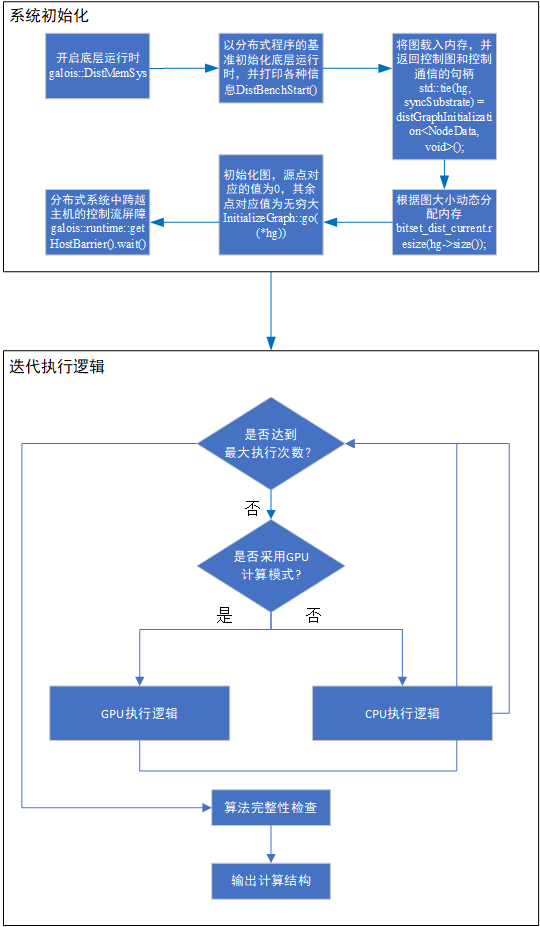
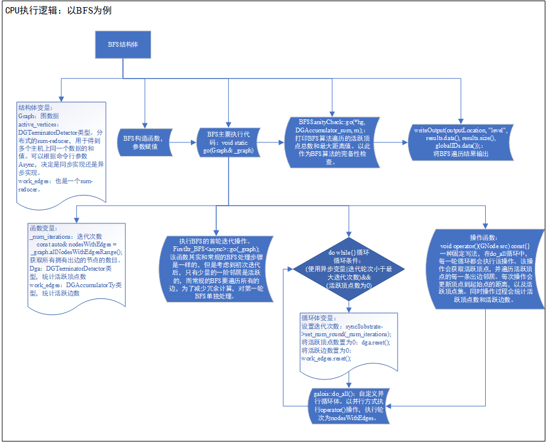

# 项目说明

DepGraph图计算系统是一个用于解决复杂问题的高性能图计算框架。它的设计目标是提供高度并行化和可扩展的图算法实现，使得在大规模图数据上运行复杂算法变得高效且容易。该系统充分利用现代多核处理器、分布式系统和计算加速器等硬件资源，以实现优异的性能表现。同时，它还提供了易用的编程接口和丰富的图算法库，使开发人员能够更轻松地实现自己的图算法。

主要特点和优势：

1. **高性能并行计算**：DepGraph系统利用多线程和多核心技术，以及分布式内存架构，能够有效地利用多个计算节点，使得图算法在大规模数据上能够高效运行。
2. **丰富的图算法库**：DepGraph提供了许多常用的图算法实现，例如最短路径算法、连通性算法、社区发现、PageRank等，开发人员可以直接调用这些算法，而无需从头开始实现。
3. **易用性**：DepGraph提供了简单而灵活的编程接口，使得开发人员可以快速上手并构建自己的图算法。此外，它还支持C++编程语言，使得在已有C++知识的开发人员中更易于推广使用。
4. **可扩展性**：DepGraph系统被设计为高度可扩展的，可以应对不断增长的数据规模和计算需求，使其在大型图上依然保持良好的性能表现。

本项目在2022年美国得克萨斯州达拉斯举办的全球超级计算大会第25届Graph 500排名中单源最短路算法(SSSP)性能全球第一，宽度优先搜索（BFS）性能在国产处理器中排名第一。

## 整体逻辑

下图展示了系统的整体逻辑，DepGraph提供了易用的编程接口，对分布式图计算系统初始化、内存管理、通信[1]进行了很好的封装，用户仅需按照系统规定实现自己的执行逻辑，其余部分遵循固定处理流程岂可。初始化阶段，按照使用抽象接口简单几步完整初始化，无需操心底层的分布式实现细节。迭代执行阶段，按照编程规范以结构体方式实现图算法。

> [1]Dathathri R, Gill G, Hoang L, et al. Gluon-async: A bulk-asynchronous system for distributed and heterogeneous graph analytics[C]//2019 28th International Conference on Parallel Architectures and Compilation Techniques (PACT). IEEE, 2019: 15-28.



## CPU执行逻辑

### CPU流程

1. **库引入和图数据结构定义**:
   - DepGraph库是为了支持并行算法（特别是在图上）而设计的。代码首先引入了这个库的核心部分。
   - `struct Graph` 定义了一个图的数据结构，假定其具备一些基本的接口来访问图的节点和边的信息。
2. **BFS结构体的定义**:
   - 结构体`BFS`是广度优先搜索算法的核心实现，接受一个图指针、一个线程完成的原子标志，以及一个GPU结果的字典。
   - 使用DepGraph库的do_all接口进行并行处理图中的每一个节点。
     - 针对每一个源节点`src`，首先获取该节点的数据。
     - 如果当前节点的旧距离大于新距离，那么处理该节点的所有边。
     - 对于每条边，计算新的距离，如果新的距离小于目标节点的当前距离，就更新目标节点的距离，并设置一个bitset来表示这个节点已经被更新过。
3. **主函数的实现**:
   - 使用`DepGraph::SharedMemSys`进行DepGraph库的初始化。
   - `LonestarStart`用于处理输入参数（例如输入文件名、运行次数等）。
   - `distGraphInitialization`方法被用来初始化图`hg`和其他必要的数据结构。
   - 一个`bitset`也被初始化，用于追踪哪些节点在每轮BFS中被更新过。
   - 主循环开始，可能进行多次BFS运行（取决于numRuns的值）。
     - 在每轮开始前，bitset会被重置，表示没有节点被更新过。
     - BFS函数被调用，执行BFS算法。
     - 结果通过`BFSSanityCheck`进行检查。
     - 如果还有下一轮运行，图的状态会被重置，准备进行下一轮的BFS。
   - 最后，如果设置了输出标志，结果将被输出到文件。

### BFS结构体流程图

下图展示了最核心的BFS结构体的流程图：

### BFS-CPU伪代码

```C++
#include <depgraph/Depgraph.h>
#include <depgraph/graphs/Graph.h>

// 图的数据结构，我们假定它有一些必要的接口用于访问节点和边的数据
struct Graph {};
// 这是BFS算法的实现，其中包含了并行部分和GPU结果的处理
void BFS(Graph *graph, std::atomic<bool>& threadFinished, std::unordered_map<GNode, uint32_t>& npuResults) {
    // 使用Depgraph库的并行for_each接口，使得BFS的计算可以并行执行
    DepGraph::do_all(DepGraph::iterate(*graph),
        [&](GNode src) {
            NodeData &snode = graph->getData(src);
            // 如果当前节点的新距离小于旧距离，对其所有的边进行处理
            if (snode.dist_old > snode.dist_current) {
                for (auto jj : graph->edges(src)) {
                    GNode dst = graph->getEdgeDst(jj);
                    auto &dnode = graph->getData(dst);
                    uint32_t new_dist = 1 + snode.dist_current;
                    // 原子操作，更新目标节点的距离，返回旧的距离
                    uint32_t old_dist = DepGraph::atomicMin(dnode.dist_current, new_dist);
                    // 如果新距离小于旧距离，则设置对应节点的bitset
                    if (old_dist > new_dist)
                        bitset_dist_current.set(dst);
                }
            }
        },
        DepGraph::no_stats(),  // 禁用统计
        DepGraph::loopname("BFS"));  // 给这个并行循环命名，用于调试和分析
}

// 主函数，进行了初始化、GPU线程的创建、BFS算法的调用和结果的输出
int main(int argc, char **argv) {
    // Depgraph库的初始化操作
    DepGraph::SharedMemSys G;
    LonestarStart(argc, argv, name, desc, url);
    // 创建和初始化图，以及相关的数据结构
    std::unique_ptr<Graph> hg;
    std::tie(hg, syncSubstrate) = distGraphInitialization<NodeData, void>();
    bitset_dist_current.resize(hg->size());
    // 开始多轮的BFS算法
    for (auto run = 0; run < numRuns; ++run) {
        bitset_dist_current.reset();
        syncSubstrate->set_num_run(run);
        // 执行BFS算法
        BFS(hg, threadFinished, npuResults);
        // 对结果进行检查
        BFSSanityCheck::go(*hg, DGAccumulator_sum, m);
        // 如果还有下一轮运行，重置图的状态
        if ((run + 1) != numRuns) {
            InitializeGraph::go(*hg);
        }
    }

    // 如果需要，将结果输出到文件
    if (output) {
        std::vector<uint32_t> results = makeResults(hg);
        writeOutput(results);
    }
    return 0;
}
```

## GPU执行逻辑

### GPU流程

#### BFS_nodesWithEdges_cuda函数

GPU的入口函数为BFS_nodesWithEdges_cuda，其内容如下：

1. **函数定义**:

   `BFS_nodesWithEdges_cuda` 是广度优先搜索(BFS)算法的入口函数。它根据是否满足某种条件来决定使用 `BFS_cuda_Pull` 还是 `BFS_cuda` 函数进行 BFS。该函数持续执行直到没有更多的活动节点。

2. **初始化部分**:

   - 创建一个 `DynamicBitset` 变量 `bitset_visited`，用于跟踪哪些节点已被访问。
   - 使用 `Get_Act_Num` 函数初始化 `active_edges`，表示有活动边的节点数。
   - 初始化计数器和累计器。

3. **主循环**:

   - 主循环的条件是有活动的节点 (`temp_active_vertices > 0`)。
     - 在每次迭代中，函数根据active_edges与local_edges / alpha 的比较来决定是调用`BFS_cuda_Pull`还是`BFS_cuda`
     - 如果 `active_edges` 大于 `local_edges / alpha`，则调用 `BFS_cuda_Pull`。
     - 否则，调用 `BFS_cuda`。
   - `work_items` 和 `active_vertices` 在每次迭代中都会累加，这两者分别表示已处理的工作项数和已访问的活动节点数。
   - 打印出调用 `BFS_cuda_Pull` 和 `BFS_cuda` 的次数。

4. **与相关函数的交互**:

   - `BFS_cuda` 和 `BFS_cuda_Pull` 都是 BFS 的不同变体。具体哪个变体被选择取决于满足的条件。
   - `BFS_cuda` 内部首先调用 `BFS` 内核函数。如果启用了负载平衡 (`enable_lb` 为 true)，它还会在必要时调用 `BFS_TB_LB`。此外，还有关于共享变量、累加器和同步的操作。
   - `BFS_TB_LB` 与 `BFS` 类似，但它是为了处理那些工作负载不均匀的图而设计的。

#### BFS_cuda函数

**BFS_cuda函数流程**：

- 使用`kernel_sizing`函数确定CUDA的blocks和threads布局。

- 初始化和分配共享内存用于累加器，这些累加器是`active_vertices`, `work_items`和`active_edges`。

- 调用`BFS`内核来进行BFS遍历。

- 同步设备以确保内核完成。

  如果启用了负载均衡`enable_lb`并且工作列表中有项:

  - 计算前缀和。
  - 同步设备。
  - 调用`BFS_TB_LB`内核。
  - 同步设备。
  - 重置工作列表。

- 调用`check_cuda_kernel`以检查任何CUDA错误。

- 从共享内存中读取结果，更新`active_vertices`, `work_items`和`active_edges`。

#### BFS_cuda_Pull函数

**BFS_cuda_Pull函数流程**：

- 使用`kernel_sizing`函数确定CUDA的blocks和threads布局。
- 初始化和分配共享内存用于累加器，这些累加器是`active_vertices`, `work_items`和`active_edges`。
- 调用`Simple_BFS_Pull`内核来进行BFS遍历。
- 同步设备以确保内核完成。
- 调用`check_cuda_kernel`以检查任何CUDA错误。
- 从共享内存中读取结果，更新`active_vertices`, `work_items`和`active_edges`。

### GPU端BFS流程图


### BFS-GPU伪代码

```c++
void BFS_nodesWithEdges_cuda() {
    DynamicBitset bitset_visited = initialize_and_reset();
    unsigned active_edges = Get_Act_Num();

    unsigned temp_active_vertices = 0;
    unsigned count1 = 0;
    unsigned count2 = 0;

    do {
        temp_active_vertices = 0;
        unsigned temp_work_items = 0;
        
        if (active_edges > threshold) {
            count1++;
            BFS_cuda_Pull(…, bitset_visited);
        } else {
            count2++;
            BFS_cuda(…, bitset_visited, active_edges);
        }
        
        work_items += temp_work_items;
        active_vertices += temp_active_vertices;
    } while (temp_active_vertices > 0);

    print(count1, count2);
}

void BFS_cuda(DynamicBitset& bitset_visited, unsigned& active_edges) {
    dim3 blocks, threads = kernel_sizing();
    // Initialize accumulators and shared memory
    ...

    BFS<<<blocks, threads>>>(...);
    cudaDeviceSynchronize();

    if (load_balancing_enabled && num_items != 0) {
        compute_prefix_sum();
        cudaDeviceSynchronize();
        BFS_TB_LB<<<blocks, threads>>>(...);
        cudaDeviceSynchronize();
        reset_thread_work();
    }

    check_cuda_kernel();
    // Read and update results from shared memory
    ...
}

void BFS_cuda_Pull(DynamicBitset& bitset_visited) {
    dim3 blocks, threads = kernel_sizing();
    // Initialize accumulators and shared memory
    ...

    Simple_BFS_Pull<<<blocks, threads>>>(...);
    cudaDeviceSynchronize();

    check_cuda_kernel();
    // Read and update results from shared memory
    ...
}
```

