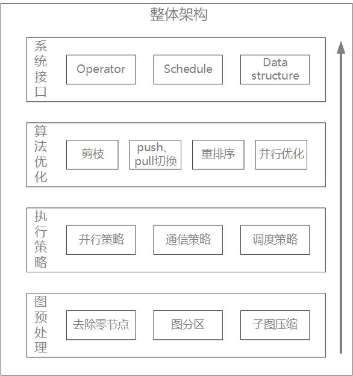
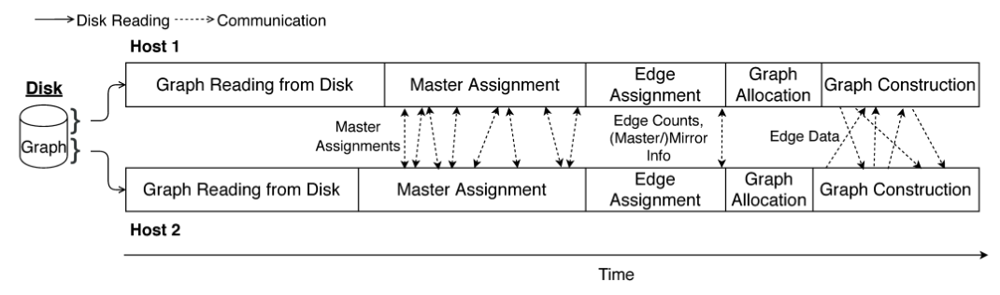
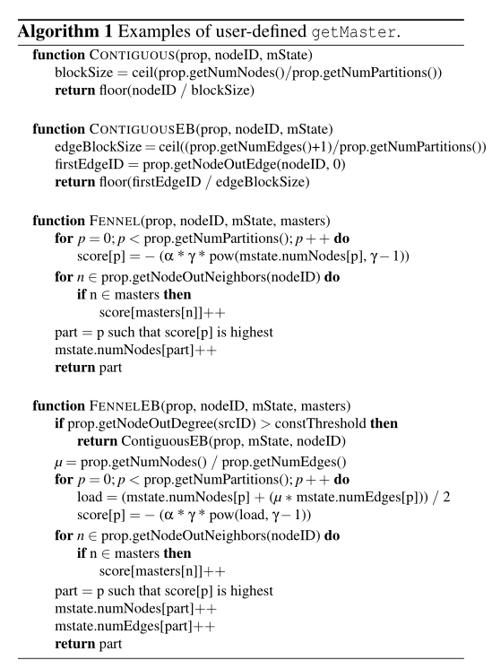
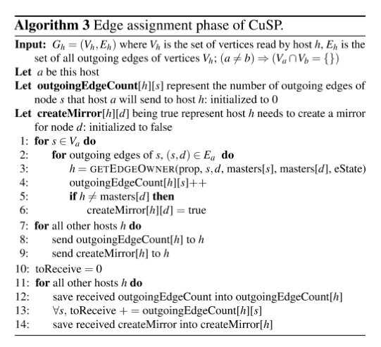
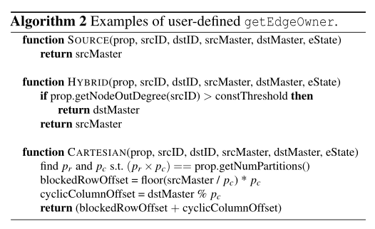
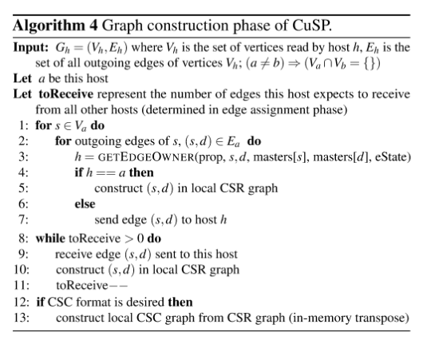

# 项目介绍

DepGraph图计算系统是一个用于解决复杂问题的高性能图计算框架。它的设计目标是提供高度并行化和可扩展的图算法实现，使得在大规模图数据上运行复杂算法变得高效且容易。

## 整体架构

DepGraph的整体架构可分为三个层次：基础层提供了图分区，任务调度，同步/异步通信等基础功能。算法层以宽度优先遍历算法为例，展示了系统采用的各种图算法优化技术。应用层展示了如何利用DepGraph开放的API接口快速部署图计算应用。

## 基础层

随着要处理的图数据集规模逐渐增大，分布式内存图计算系统成为主流，这就带来了图分区的需求。许多图计算系统采用内置图分区器，但是往往不够灵活，也有一些独立图分区器被提出，但是分区策略都不够完善。一般来说图分区器的性能可以从三个维度进行评估：1，通用性：分区器是否支持多种分区策略，还是仅限于一种或少数内置策略？2，速度：它对图进行分区的速度有多快？3，质量：针对感兴趣的算法、输入和平台生成的分区有多好？我们libcus目录实现了CuSP[1]快速流图分区框架，它的优势为：1，允许用户在高抽象级别指定所需的分区策略。2，可以快速生成高质量的图分区。我们的实验表明，它生成高质量分区的速度比文献中的独立分区器快 6 倍，同时生成高质量分区并支持广泛的分区策略。

> [1]CuSP: A Customizable Streaming Edge Partitioner for Distributed Graph Analytics
>
> 注意，这里并不是对流图进行图分区，而是在分区的时候，采用一些并行的策略来加快图分区任务。

### 图分区

#### CuSP处理流程

- 首先，要分区的图必须以压缩稀疏行 (CSR) 或压缩稀疏列 (CSC) 格式存储在磁盘上。为了便于解释，我们假设该图以 CSR 格式读取（注意 CSC 中的传出边对应于 CSR 中的传入边）。

- 为了指定特定的分区策略，程序员必须向 CuSP 提供所需分区的数量，并提供 (i) 选择主顶点和 (ii) 向分区分配边的规则。 CuSP 从磁盘流入图的边缘，并使用这些规则将它们分配给分区并选择主分区。

- 为了指定分区规则，可以方便地假设存在一个名为 prop 的结构，它存储分区的数量和图的静态属性，例如节点和边的数量、节点的传出边或邻居以及输出- 节点的度。这个结构体可以通过分区规则来查询；例如，prop.getNumNodes() 返回图中的节点数。分区规则可能是历史敏感的；例如，可以将边分配给当前分配给它的边数最少的分区。每个分区规则都可以定义自定义类型来跟踪可更新状态。CuSP 在主机之间透明地同步此状态。

- 为了指定策略，用户编写两个函数：

  - getMaster(prop, nodeID, mState, masters)：返回节点nodeID的主代理的分区； masters 可用于查询节点邻居的主代理的（先前）分配的分区。

  - getEdgeOwner(prop, srcID, dstID, srcMaster, dstMaster, eState)：返回必须分配边（srcID，dstID）的分区； srcMaster和dstMaster分别是包含srcID和dstID节点的主代理的分区。

- 用户分别在 getMaster() 和 getEdgeOwner() 中定义跟踪的 mState 和 eState 的类型。使用相同参数多次调用这些函数必须返回相同的值。当不需要状态时，mState 或 eState 类型无效。当节点的主分配不依赖于其邻居的分配时，可以在没有 masters 参数的情况下定义 getMaster()。

- CuSP 在与所需分区数量相同数量的分布式主机上运行。对图进行分区后，CuSP 在每个主机上构建一个分区。

#### CuSP框架

与上节的处理流程对应，CuSP的整体框架如下：

图：CuSP的控制流和数据流（注意，上图省略了图分区后续的同步处理步骤）

- 输入图以 CSR 或 CSC 格式存储在磁盘上。不失一般性，我们假设该图以 CSR 格式存储。每台主机以 CSR 或 CSC 格式构建图的一个分区。如果应将边分配给本地分区，则将其添加到该分区；否则，它将被转发到适当的主机。 CuSP 可以有效地处理并行实施此方法时出现的许多复杂情况。

  - CSR 或CSC 格式的图无法增量构建，因为为CSR 或CSC 格式分配底层数组需要了解节点数量以及每个节点的传出或传入边。因此，在构建图表之前必须确定这些计数。

  - 主机之间需要进行边缘通信，因为主机可能会处理边缘并确定它属于与其正在构建的分区不同的分区。

  - 如果分区规则是历史敏感的，则一台主机上所做的决策将影响其他主机上所做的决策。因此，分区状态必须在所有主机上同步。

- 图形读取

  - CSR 格式的边数组在主机之间大致均等划分，以便每个主机从该数组读取并处理一组连续的边。为了减少主机间的同步，这种划分被四舍五入，以便给定节点的传出边缘不会在主机之间划分。实际上，此方法为每个主机分配一组连续的顶点，以便每个主机具有大致相同数量的边，并且这些顶点的传出边由该主机处理。用户可以更改此初始分配，以便将节点考虑在内，并为节点和/或边缘平衡分配重要性。每个主机将其一组顶点和边从磁盘加载到内存中，因此未来的阶段将直接从内存中读取它们。

- 主分配

  - 每个主机循环遍历从磁盘读取其边的顶点。对于每个这样的顶点 v，它使用 getMaster() 确定分配该顶点的主节点的分区，并将其存储在本地主节点映射中，该映射将顶点的全局 ID 映射到分配的分区。主站映射可以定期与其他主机的映射同步。

    

- 边缘分配

  - 每个主机 hi 循环遍历它从磁盘读取的边缘（算法 3）。对于它负责的每个顶点 v 以及每个主机 h j ，它确定 (i) v 的多少个传出边将被发送到 h j 以及 (ii) h j 上这些边的目的地的代理顶点是否将是镜像。一旦所有边缘都被处理，该信息就会被发送到其他主机。

    

- 图分配

  - 当边缘分配阶段完成时，主机对其分区中将有多少顶点和边缘有了完整的了解。每个主机以CSR格式为其分区分配内存，并为其顶点创建从全局id到本地id的映射。主机还没有从其他主机接收到它的边，但是通过事先为边分配内存，可以在从其他主机接收到边时并行地将边插入数据结构中。分区状态被重置为初始值，以便在图构建阶段调用用户指定的函数将返回与在边缘分配阶段相同的值。

- 图构建

  - 每个主机将再次循环遍历其所有读边(算法4)。它不像在赋值阶段那样编译元数据，而是将边缘发送到适当的主机getEdgeOwner()返回的信息。当边从传入消息反序列化时，将并行地插入到前一阶段构造的CSR结构中。如果需要的话，一旦图形构建完成，每个主机都会在内存中执行CSR图形的转置，以构建(无需通信)它们的CSC图形。

    

    

### 任务调度

