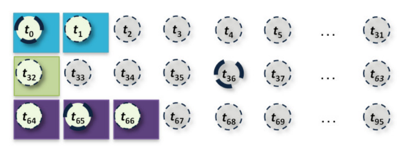

# 项目介绍

DepGraph图计算系统是一个用于解决复杂问题的高性能图计算框架。它的设计目标是提供高度并行化和可扩展的图算法实现，使得在大规模图数据上运行复杂算法变得高效且容易。

## 整体架构


DepGraph的整体架构自下而上可分为：图预处理（将原始的图数据集转化为适合分布式系统处理的图数据，并做了一定的优化）、执行策略（描述了系统使用的通信策略和调度策略）、算法优化（以BFS算法为例，讲述了我们采用的针对性的优化措施）、系统接口（介绍如何使用系统提供的api接口，快速部署图算法，从而利用系统的性能）。

## 图预处理

### 去除零节点

Yasui等人[1]研究发现，GRAPH 500使用的数据集Kronecker生成图中存在大量度数为0的孤立顶点(isolated vertex)。下表展示了对于不同顶点规模的Kronecker生成图,孤立顶点占全部顶点的百分比。可以看到，孤立顶点能够占到全部顶点的一半，而且随着顶点规模的增加,孤立顶点的占比还在不断扩大。由于既不存在出边也不存在入边，因此在BFS、SSSP等算法在计算过程中对这些孤立顶点的访问都是无效的，不会影响自身和其他顶点的结果。因此可以对生成的数据进行预处理，去除掉这些孤立顶点，并将顶点重新编号，最后产生结果时可以直接将孤立顶点的值设置为初始值（例如SSSP中设置为无穷大）。这样一来可以减少图计算过程中顶点的访问数量，提高应用效率。

> [1]Yasui Y, Fujisawa K, Sato Y. Fast and energy-efficient breadth-first search on a single NUMA system//International Supercomputing Conference. New Orleans, USA, 2014: 365-381

| 顶点规模 | 孤立顶点占全部顶点的百分比 |
| :------: | :------------------------: |
|   224    |           47.1%            |
|   225    |           49.2%            |
|   226    |           51.1%            |
|   227    |           53.0%            |
|   228    |           54.8%            |
|   229    |           56.6%            |
|   230    |           58.3%            |

<center>表：Kronecker生成图的孤立顶点占比 </center>

### 图分区

在分布式图计算系统中，为了使每个分布式节点上的工作均衡，需要对图数据进行划分，以确保算法高效运行。DepGraph支持多种图划分策略[2]：

> [2]Roshan DathathriGurbinder GillLoc HoangHoang-Vu DangAlex BrooksNikoli DrydenMarc SnirKeshav Pingali.Gluon: A Communication-Optimizing Substrate for Distributed Heterogeneous Graph Analytics[J].ACM SIGPLAN Notices: A Monthly Publication of the Special Interest Group on Programming Languages, 2018, 53(4).


- 无约束顶点划分（Unconstrained Vertex-Cut UVC）：这种策略可以将一个顶点的出边和入边分给不同的主机，不受主顶点还是镜像顶点的限制。由于节点的主节点和镜像节点可以具有传出和传入边缘，因此可以在计算阶段写入任何代理节点。在每一轮结束时，镜像节点的标签被传送给主节点并组合以产生最终值。该值被写入主节点并广播到镜像节点。因此，reduce和broadcast都是需要的。
- 笛卡尔顶点划分（Cartesian Vertex-Cut CVC）：这是一种受约束的顶点划分策略，只有主顶点可以同时拥有入边和出边，而镜像代理可以有入边也可以有出边，但是不能同时拥有两者。因此，镜像节点要么从标签读取，要么写入标签，但不能同时读取两者。在一轮结束时，仅具有传入边缘的一组镜像将其值传达给主设备以产生最终值。然后主设备将该值广播到仅具有传出边缘的镜像组。与 UVC 一样，CVC 需要减少和广播同步模式，但每种模式仅使用镜像节点的特定子集，而不是所有镜像节点。这可以为许多程序带来更好的大规模性能。
- 入边划分（Incoming Edge-Cut IEC）：这种策略只有主顶点可以拥有入边，而镜像顶点只能拥有出边。主节点将此更新后的值传送给镜像节点以进行下一轮。因此，仅需要广播同步模式。
- 出边划分（Outgoing Edge-Cut OEC）：这种策略是IEC的镜像，即只有主代理可以拥有出边，其他代理只能拥有入边。在一轮结束时，推送到镜像的值被组合以在主设备上产生最终结果，并且镜像上的值可以被重置为下一轮归约操作的（广义）零。因此，只需要reduce同步模式。

我们主要采用了OEC的图分区策略，具体如下：


上图是一个**出边划分策略**（OEC，Outgoing Edge-Cut）的例子。这种策略按照边的数量进行划分，每个主机负责的边数大致相同，同时被分配的顶点在原始图数据中也是连续的。原始图有十个顶点`A-J`，其中顶点`{A,B,E,F,I}`被分配给主机`h1`，其他被分配给`h2`。每个主机为分配给它的顶点创建一个代理顶点，称为主顶点（master），它保存着该顶点的准确值。而有的边（如边`(B,G)`）的两个顶点跨越了不同主机（顶点`B`在主机`h1`，而顶点`G`在主机`h2`），则OEC分区会在该条边的源顶点`B`所在主机`h1`上，为目标顶点`G`创建一个代理顶点，称为镜像顶点（mirror），并且在`h1`上创建一条从`B`到`G`的边。即这种分区策略会将每一个顶点`N`分配给（且只分配给）一个主机，则该主机上的顶点称为`N`的主顶点，而其他主机虽然未被分配`N`，但是它也可能使用到顶点`N`，所以其他主机也可能存在`N`副本，称为`N`的镜像顶点。而在每个主机获得的子图中，所有的边连接的目的顶点都在该主机上有一个代理。在OEC策略中，每个主机拥有其主顶点的所有出边，而镜像顶点只会有入边而没有出边（镜像顶点的出边在拥有其作为主顶点的主机上）。这样一来，每个主机执行计算时便可以直接获取所需的所有数据，而无需在计算时进行数据传输，而每台主机也就不会意识到其他分区或者主机的存在，在每次计算完毕后统一进行数据同步，从而将计算与通信独立开来。

### 子图压缩

本节针对的是GPU模式下的图计算。为处理图数据规模超过GPU内存容量(out-of-GPU-memory)的情况，现有的基于GPU的图分析算法主要采用基于分区的方法。具体来说，大规模图首先被划分为多个子图，使每个子图都能完整加载入GPU内存（如下图），然后在每轮迭代图处理过程中依次将每个子图加载入GPU进行处理。然而，子图迭代处理过程中的大多数迭代的活跃顶点比例通常很低，被加载入GPU的图分区中往往只有少量图数据需要被处理，这导致了高额的数据传输开销，同时也使得活跃顶点状态无法在图的拓扑结构中高效传播，从而导致图处理性能急剧下降。


为了减小CPU-GPU之间的传输开销，我们采用了一种基于依赖感知的GPU图算法优化技术，该优化技术使用一种高效的运行时依赖子图生成算法，能够在迭代图处理过程中利用GPU的高并行性提取稀疏分布的活跃顶点来对子图进行压缩，使图算法只需加载和处理与活跃顶点相关的图数据，从而显著地减少CPU-GPU数据传输开销，提高图算法的执行速度。

子图的原始图数据采用CSR(Compressed Sparse Row)格式进行存储。如图所示，CSR格式的图数据由两个数组构成：顶点数组(数组下标对应顶点Id，数组内容存储顶点出边偏移量)与边数组(存储出边)。通常，大规模图数据中的边数据占用绝大部分存储空间，而顶点数据仅占用小部分存储空间，为减少CPU-GPU通信开销，该优化技术**在GPU中同样存储一组原始图数据的顶点数组，而原始图数据的边数组则只存储在CPU内存中**(所以每个计算回合，都需要进行一次子图压缩，得到压缩后的边数组，传递给GPU)。


<center>图：CSR图存储格式</center>

为了高效地从CSR格式的图数据中提取依赖子图，依赖子图生成算法采用CSR风格的依赖子图存储格式，具体而言，依赖子图由三个数组构成，分别是子图顶点数组(存储活跃顶点Id)、顶点出边偏移数组和子图边数组。依赖子图存储格式如图所示：


<center>图：依赖子图存储格式</center>

运行时的依赖子图生成由CPU与GPU共同完成，除了需要使用CSR格式的原始图数据(CSR顶点数组与边数组)，还需要活跃顶点标记数组与顶点出度数组。具体的依赖子图生成步骤如下：

- 首先根据活跃顶点标记数组计算活跃顶点标记前缀和，即子图中活跃顶点对应位置。此步骤可通过GPU的高并行性快速完成。如图所示：


<center>图：获取活跃顶点标记前缀和</center>

- 然后根据活跃顶点标记数组与活跃顶点标记前缀和获得子图顶点数组，此步骤也可通过GPU的高并行性快速完成。如图所示：


<center>图：构建子图顶点数组</center>

- 生成子图顶点数组之后，根据活跃顶点标记数组与顶点度数数组获取子图顶点度数数组。如图所示，将非活跃顶点的度数置为0，此步骤可利用GPU快速完成。


<center>图：获取子图顶点度数数组</center>

- 获取子图顶点度数数组之后，计算其前缀和，即对应子图顶点的出边偏移量，如图所示，此步骤可通过GPU快速完成。


<center>图：获取子图顶点度数前缀和</center>

- 根据活跃顶点标记数组、活跃顶点标记前缀和子图顶点度数前缀和获取子图顶点出边偏移数组，如图所示，此步骤可利用GPU快速完成


<center>图：构建子图顶点出边偏移数组</center>

- 最后，根据子图顶点数组与子图顶点出边偏移数组，以及CSR格式的原始图数据获取子图边数组。如图所示，将由于原始图数据的边数组只存储在CPU内存中，此步骤的并行性只能通过多个CPU线程完成。


<center>图：构建子图边数组</center>

## 执行策略

### 通信策略

在大图处理过程中，往往每轮迭代都有许多顶点（数百万）数据需要同步。同时由于不同主机处理自己的子图时会使用顶点的局部ID，而在数据同步时显然需要全局ID来让其他分区知道数据属于哪些顶点（图分区部分参考2.2章节）。所以就需要局部ID到全局ID（发送时）以及全局ID到局部ID（接收时）的转换，同时发送数据时还要带上顶点的全局ID。这样就会增加传输开销与数据转换开销。DepGraph采用了一种通信优化策略，可以让不同主机之间无需全局ID就可以进行数据交换，进而降低甚至消除这种额外开销。 


<center>index转换映射</center>

如上图所示，在分区完毕以后，每个主机将其所拥有的镜像顶点生成`mirrors`数组，并通知给其他主机。例如主机`h1`通知`h2`它拥有镜像顶点`C、G、J`。在通知完毕以后，所有主机都可以形成`masters`数组，例如`master[h2]`就是那些在主机`h2`上的有镜像而主顶点在`h1`上的顶点。然后各个主机将全局ID转化为局部ID，这种转化每次图划分只会进行一次，如果以后不再重新划分，则整个程序运行时只进行一次。然后每个主机都保存着其与其他各个主机进行数据交换的顶点数组。然后在每次广播或者规约操作时，它可以获取对应主机`hx`的`mirrors[hx]`或`masters[hx]`数组，然后按照该数组顺序将数据发送到目标主机。同时目标主机将其写入到对应的`masters`或者`mirror`s数组中。整个过程都是顺序进行的，所以不用传递全局ID，也不用进行额外的全局-局部ID转换。  
上面的方法虽然可以避免额外的数据传输开销，但是很多图应用在每轮迭代中活跃顶点的数据可能较少，所以每次数据传输可能只需要传输镜像顶点的一部分。而如果直接使用上述方法的话，目标主机可能无法得知哪些顶点需要更新。所以DepGraph引入了一个**位数组**，它跟踪主机中的顶点值是否发生改变。在发送数据时，发送方根据位数组生成对应`mirros`数组的更新位数组，连同更新数据发送给目标主机。目标主机则根据更新位数组中值为`0`或`1`，来判断对应的数据是否需要更新。同时DepGraph会根据数据传输是否密集来选择不同的策略。如果更新密集，则不传输更新位数组，而是将整个`mirrors[hx]`的数据发送到目标主机。而如果更新比较稀疏，则发送更新位数组。如果更新非常稀疏，则可以利用传统的方法同时传输全局ID。

### 调度策略

#### CPU——拓扑感知+软优先级的异步调度策略

传统的以点为中心的计算模型通常采用同步调度策略，虽然能够满足处理一般性的图分析任务的要求，但在执行高性能图分析任务时效率不高，而基于数据驱动的异步调度，应用程序在其数据可用时被安排执行，所以能够实现更好的性能（不是所有算法都能采用异步调度方式实现），但需要有相应的优先级设置和细粒度调度以实现负载均衡。为此，DepGraph提出了拓扑感知工作窃取调度策略（适用于无优先级调度）和obim软优先级调度策略（适用于有优先级调度）。

DepGraph调度器的核心是基于机器拓扑感知的任务调度，当应用没有设置特定优先级时，它会使用并发包装载任务，这些任务是无序可并行执行的，可以插入新任务也可以请求内部任务。具体过程如下图所示，每个计算核心都有一个chunk结构，它是一个环状缓冲区，可以容纳8-64（由用户在编译时确定）个任务，计算核心可以用它插入新任务或获取任务工作。DepGraph的调度分级如下，一个Bag并发包中有多个package列表，每个package列表记录一组chunk数据结构，如果某个计算核心的chunk已满，就会从package中插入任务到其他chunk，如果chunk为空，就会从package中查找其他chunk的任务，如果package也为空，就去另一个package查找。


针对一些应用需要进行优先级调度的情况，DepGraph提出了obim软优先级调度器，将机器拓扑感知任务调度策略与任务具有优先级的情况结合。obim包含一系列并发包，每个包中放置同等优先级的任务，可以任意顺序并发执行，不同包之间的任务按优先级执行。如下图所示，图中包含3个包，分别存放任务1、3、7，全局维护一个操作日志记录全局包活跃；每个线程维护一个本地包映射，缓存全局包结构，记录日志点。当线程需要插入和获取任务时，首先到本地查找特定优先级的包，若无，从全局获取最新结构，若仍无，则创建新优先级的包，同步全局和本地包和日志。使得所有线程共享当前处理任务的优先级，提高任务获取效率，保证任务的执行顺序。


#### GPU——基于Scan + Warp + CTA的负载均衡策略

在常用的以顶点为中心的图算法中，GPU的每个线程会负责处理图的一个顶点，而现实中的图大多是幂律分布（power-law）的，各个顶点的度数分布不均匀。有的顶点的度数很大，而有的顶点的度数很小，这就导致了在GPU中，有的线程会处理很多的边，而有的线程会处理较少的边，这就导致了负载不均衡的问题，影响算法整体性能。因此我们采用一种基于Scan+Warp+CTA的负载均衡策略。该策略的核心思想是：根据顶点度数执行混合调度策略，以解决同一个Warp中不同线程以及同一个CTA中不同Warp间的负载不均衡问题。

> [3]   MerrillK. Wang, D. Fussell, and C. Lin, “A fast work-efficient SSSP algorithm for GPUs,” in *Proceedings of the 26th ACM SIGPLAN Symposium on Principles and Practice of Parallel Programming*, New York, NY, USA, Feb. 2021, pp. 133–146. doi: [10.1145/3437801.3441605](https://doi.org/10.1145/3437801.3441605).

遍历顶点的边阶段，采用不同的任务处理粒度的效果：

-  顺序收集


顺序收集的方法为每个线程分配一个顶点，各个线程获取其处理顶点对应的邻居。如上图所示，线程所处理的顶点分别有2、1、0、3个邻居。显然，在各个顶点的度分布不均匀的情况下，这种方法会导致同一个Warp中不同线程的负载不均衡。

- 基于warp的粗粒度收集



基于warp的粗粒度收集方法允许线程对其所在warp的控制权进行竞争，竞争成功的线程可以使用整个warp的资源来处理其所分配的顶点，处理完以后其他线程继续竞争。这种方法一定程度上可以减少负载不均衡问题，但是很多时候一个顶点的邻居数目是少于一个warp中的线程数目的，这样就会产生性能未充分利用的问题。同时，有时候不同warp中线程被分配顶点的总度数相差较大，又会产生warp之间的负载不均衡。


基于扫描的细粒度收集方法允许一个CTA中的线程共享一个列索引偏移量数组，并生成相应的共享收集向量（shared gather vector）。这个向量的内容对应于分配给该CTA的顶点的邻接表，然后利用整个CTA对于相应的顶点进行处理：每个线程从共享向量中取出一条边进行处理。这样一来，线程间的负载不均衡就不会被昂贵的全局内存访问放大。但是，这种方法也可能出现共享数组无法充分利用的问题，例如某个顶点的邻居数据过大，几乎占满了整个共享向量，其他线程对应的邻接表就无法被处理。

**Scan + Warp + CTA**：将基于扫描的细粒度以及基于CTA和warp的粗粒度的任务分配策略结合起来。基于CTA的策略与warp类似，只是线程将会争夺整个CTA的控制权。首先将顶点分配个线程，那些顶点的邻接表大于CTA（中的线程个数）的线程，会竞争CTA，使用整个CTA来处理其顶点的邻接表；那些邻接表比CTA小，但是比warp大的，会竞争warp；而对于那些比warp还要小的邻接表，则使用scan，将线程对应的邻接表整合到共享内存中来共同处理。这种混合策略能有效地克服单独一种方法的不足，从而在多种图算法中都达到较好的负载均衡效果。

## 算法优化

算法优化部分主要实现了BFS算法的push、pull切换，并且附加了一些优化措施。

### 整体流程


### 基础方案

在传统的BFS算法中，遍历方向是自顶向下(Top-down, TD)。 Beamer等人[4-5]开创性地提出一种方向性优化技术，将自顶向下与自底向上(Bottom-up, BU)的遍历方式相结合，并在两种遍历方式间动态切换，减少遍历过程中不必要的边访问。 针对非一致内存访问架构(Non-uniform memory access, NUMA)。

> [4] Beamer S, Asanovic K, Patterson D, et al. Searching for a parent instead of fighting over children: A fast breadth-first search implementation for graph500. EECS Department, University of California, Berkeley, Tech. Rep. UCB/EECS-2011-117, 2011.
>
> [5] Beamer S, Asanovic K, Patterson D. Direction-optimizing breadth-first search//Proceedings of the International Conference on High Performance Computing, Networking, Storage and Analysis. IEEE, 2012: 1-10.

#### Top-down 算法

传统的BFS算法采用Top-down的遍历方式，从已访问的顶点出发，沿着出边，寻找未访问过的顶点。 具体的过程如下所示：


其中，**visited**数组保存着顶点是否被访问过的状态，**parents**记录了当前顶点在BFS生成树上的父亲顶点，**current_frontier**和**next_frontier**分别保存着当前层和下一层的活跃顶点集。

Top-down算法是一种迭代式的算法，分为初始化阶段和迭代阶段。 在算法的初始化阶段(第1行到第5行)，将起始点**s**设置为已访问并加入到**current_frontier**(当前层活跃顶点集)中。 随后算法就开启了一轮又一轮的迭代，直至**current_frontier**为空。 在每轮迭代中，对于每个在**current** **frontier**中的活跃顶点**u**，算法会检查它是否有未访问过的出边邻居顶点，然后将所有未访问过的出边邻居顶点设置为已访问并加入到**next_frontier**中。 每轮迭代结束前，设置新的**current_frontier**和**next_frontier**。

#### Bottom-up 算法

Top-down算法需要遍历从活跃顶点集出发的每条出边，在大多数顶点已经被访问过的情况下会产生大量无效边遍历。 于是提出了Bottom-up算法，以减少了BFS算法中后期的无效边遍历。 Bottom-up遍历过程如下所示。


如上图所示,Bottom-up算法采用了与Top-down算法相反的搜索方向，从未访问的顶点出发，在它的入边邻居中寻找活跃顶点。 只要在入边邻居中寻找到一个活跃顶点，便可跳出循环，避免无效的边遍历

#### Top-down 算法和Bottom-up 算法自动切换

- 初始化 `visited` 数组，`queue`。
- 开始 BFS 循环。
- 在每次循环中，判断当前队列的大小。
- 若队列的大小小于总节点数的一半，采用 `push` 策略；否则采用 `pull` 策略。
- 对于 `push` 策略：对队列中的每个节点，将其未访问的邻居节点加入队列并标记为已访问。
- 对于 `pull` 策略：遍历所有未访问的节点，检查它们是否有邻居在当前的队列中，如果有则将它们加入队列并标记为已访问。

算法伪代码：

```c++
    class Graph {
    public:
        vector<vector<int>> adjList;  // 邻接表，表示图的结构
    };

    /**
     * 使用 push 策略处理 BFS 的当前层。
     * @param adjList: 图的邻接表
     * @param queue: 当前需要处理的节点队列
     * @param visited: 标记每个节点是否被访问
     */
    void processPush(vector<vector<int>>& adjList, vector<int>& queue, vector<bool>& visited) {
        int n = queue.size();
        vector<int> nextLayer;

        // 遍历当前层的每个节点
        for (int i = 0; i < n; ++i) {
            int node = queue[i];
            for (int neighbor : adjList[node]) {
                if (!visited[neighbor]) {
                    visited[neighbor] = true;
                    nextLayer.push_back(neighbor);
                }
            }
        }
        queue = nextLayer;  // 更新队列为下一层节点
    }

    /**
     * 使用 pull 策略处理 BFS 的当前层。
     * @param adjList: 图的邻接表
     * @param queue: 当前需要处理的节点队列
     * @param visited: 标记每个节点是否被访问
     */
    void processPull(vector<vector<int>>& adjList, vector<int>& queue, vector<bool>& visited) {
        vector<bool> inCurrentLayer(queue.size()， false);
        for (int val : queue) {
            inCurrentLayer[val] = true;
        }

        vector<int> nextLayer;
        // 遍历所有未访问的节点，查找与当前层相邻的节点
        for (int i = 0; i < adjList.size(); ++i) {
            if (!visited[i] && any_of(adjList[i].begin()， adjList[i].end()， [&](int neighbor) { return inCurrentLayer[neighbor]; })) {
                visited[i] = true;
                nextLayer.push_back(i);
            }
        }
        queue = nextLayer;  // 更新队列为下一层节点
    }

    /**
     * 使用双向策略进行 BFS。
     * @param graph: 图的数据结构
     * @param start: BFS 的起始节点
     */
    void BFS_bidirectional(Graph& graph, int start) {
        vector<bool> visited(graph.adjList.size()， false);
        vector<int> queue = {start};
        visited[start] = true;

        // BFS 循环
        while (!queue.empty()) {
            // 根据当前队列的大小判断使用哪种策略
            if (queue.size() < graph.adjList.size() / 2) {
                processPush(graph.adjList, queue, visited);
            } else {
                processPull(graph.adjList, queue, visited);
            }
        }
    }
```

### 优化措施

#### 图重排序

在基于Pull的BFS算法中，当遍历到一个为访问顶点时，需要查找其入边邻居，并且只需找到一个已访问的入边邻居顶点便可提前终止寻找。因此，如果能够将已访问的入边邻居顶点排在未访问的入边邻居顶点的前面,便可快速终止寻找，避免过多的无效内存访问。我们容易发现，一个顶点的度数越高，其被访问的概率越大，因此我们可以将子图的顶点按照度数从大到小进行排序，并将每个顶点度数最高的入边邻居放置在一个单独的数据结构中，在进行Pull遍历时，优先访问这些入边邻居顶点，能够提高访存效率[6]。

> [6]Yasui Y, Fujisawa K, Sato Y. Fast and energy-efficient breadth-first search on a single NUMA system//International Supercomputing Conference. New Orleans, USA, 2014: 365-381.

#### 悬挂顶点的剪枝

我们发现Kronecker生成图中存在着大量度数为1的顶点，我们称之为悬挂顶点(hanging vertex)，实验统计悬挂顶点的总数能够占到非孤立顶点的27%(顶点规模2^30)。在bottom up的实现过程中，未访问顶点会优先访问顶点的最高度数入边邻居，当处于未访问状态时，会无条件地继续访问该顶点的其余入边邻居。但是对于度数为1的悬挂顶点，它并没有其余的入边邻居，第二次内存访问是冗余的。这部分冗余内存访问不容忽视，在所有需要访问其余入边邻居的顶点中，悬挂顶点所占比例均高于50%，在某些阶段甚至高达99%。针对这个问题，我们利用顶点子集中顶点按度数降序排列的这一特点，以极小的开销判断该顶点是否是悬挂顶点，进而消除对悬挂顶点的冗余内存访问。

优化后的Bottom-up算法也分为两个阶段：预处理阶段和遍历阶段。下列算法展示了预处理阶段，整体上与Top-down算法的预处理相同。唯一的两点区别是第7-13行和第16-17行。第7-13行的目的是找寻每个顶点子集中悬挂顶点的起始位置*hangVtxStart*，因为每个顶点子集中的顶点是按度数降序排列的，所以[*hangVtxStart*[*threadId*]， *VthreadId*。*end*]中的顶点的度数均为1。第16行，将每个顶点的入边邻居顶点按其度数降序排列，以减少遍历过程中访问入边邻居的个数。第17行，将每个顶点的最高度数入边邻居单独放置在一个数组*highestInNgh*中，在遍历时优先进行遍历。


下面的算法描述了优化后的Bottom-up算法的遍历过程。在每一轮迭代开始前，根据已访问顶点数与非孤立顶点总数的比值预测可能产生的远端随机内存访问数量，并根据这一结果选择是否将*visited*在每个NUMA节点上拷贝一份(第5行。每个线程在运行时先获取本NUMA节点上的*visited*，如果不存在的话就使用全局的*visited*(第7行。在处理每个未访问顶点时，首先会检查它的最高度数入边邻居*highestNgh*是否已被访问过，如果已被访问过，可以直接更新顶点状态。否则如果该顶点的度数大于1(非悬挂顶点)，接着访问其剩余入边邻居。


### 并行优化

传统的Top-down算法采用顶点并行(vertex-parallel)的遍历方式,将当前层的活跃顶点集(current frontier)在线程间均分,由每个线程独立地遍历部分活跃顶点的所有出边. 如下图所示,线程1遍历顶点1的所有出边,线程2遍历顶点3的所有出边,以此类推.


这种任务分配方式比较直观,而且实现起来也相对简单,但是在众核架构上会导致严重的性能问题,主要有以下两点原因:

1，由于图存在幂律分布的特性，在度数呈幂律分布的情况下,顶点并行的遍历方式不能很好地平衡线程间的工作量分布,会导致严重的负载均衡问题。同时在BFS算法执行的不同时期工作量的变化也非常巨大，在BFS算法处于扩张阶段的初期，frontier中的活跃顶点中的活跃顶点还比较稀少，随着迭代进行，frontier的顶点数会迅速增加。

2，传统的顶点并行Top-down算法对于目标顶点的更新需要使用原子操作。 这是由于不同活跃顶点可能会有共同的出边邻居，存在同时更新目标顶点的可能性，因此需要使用原子操作保证更新的正确性。 如上图所示，顶点1和顶点3的出边邻居中均有顶点2, 因此线程1和线程2可能会同时更新顶点2的状态。 实验结果表明，在Top-down算法的运行阶段中，更新的平均成功率仅为14.5%，这意味着有近85%的更新操作可能会产生冲突。 而且冲突的代价会随着核心数的增多变得更大，因此在Top-down算法中使用原子操作会严重影响该算法在众核架构上的可扩展性。

针对上述两个问题，本文提出一项边并行(edge-parallel)的Top-down遍历优化技术，能够显著改善Top-down算法在众核架构上的负载均衡性，并完全消除Top-down算法中的原子操作。 

该优化技术的核心思想是将传统Top-down算法中「每个线程负责遍历一部分活跃顶点的所有出边」等价变换为「每个线程负责遍历所有活跃顶点的部分出边」。 如上图所示，优化前线程1需要遍历顶点1的所有出边，线程2需要遍历顶点3的所有出边，产生了严重的负载不均衡问题，而且因为线程1和线程2可能会同时更新顶点2的状态，因此需要使用原子操作保证正确性。 优化后，线程1负责遍历目标顶点在[1,2]范围内的边，线程2负责遍历目标顶点在[3,4]范围内的边，以此类推。 这样的分配方式，不仅提升了算法的负载均衡性，而且对于某个目标顶点，仅存在一个线程会修改它的状态，消除了原子操作，提升了算法的可扩展性。

边并行的Top-down算法分为两个阶段：预处理阶段和遍历阶段。下列 算法展示的是预处理阶段。 首先(第1行)，去除原图中的孤立顶点后将顶点按度数降序排列并重新编号。 其次(第2行)，使用Zhang等人[12]提出的静态shuffle优化，将顶点按度数降序以轮询调度(Round Robin)的方式分配给每个线程，从而将顶点集划分为一系列顶点子集，以减小不同顶点子集的度数差异。 然后(第3行)，将顶点集按照shuffle后顶点子集的顺序重新编号，即顶点子集内部按度数降序依次连续编号，不同顶点子集间按线程ID依次编号。 最后(4-6行)，将每个顶点的出边列表按目标顶点的编号升序排列，便于后续使用二分法查找每个线程需要遍历的范围，而且顺序访问也能最大程度上利用好缓存的预取机制。


下列算法展示了优化后Top-down算法的遍历阶段。 算法的第7-20使用OpenMP的语法定义了一个并行区域。 进入并行区域后，首先每个线程获取自身的*threadId*(第7行)，用于后续获取per-thread的数据结构。 不同于传统的Top-down算法将活跃顶点集均分给每个线程，在优化后的Top-down算法中，每个线程都需要遍历整个活跃顶点集(第8行)，并在活跃顶点的出边列表中寻找本线程需要遍历的那部分出边(第10-11行)。 因为在预处理阶段已经将顶点的出边列表排好序了，可以使用二分法以*log*(*v*。*degree*)的复杂度选出需要遍历出边的范围。 然后，顺序地遍历这些出边(第12行)，对那些未访问过的出边邻居顶点(第14行)，使用非原子操作进行更新(第15-17行)。


边并行的Top-down优化技术能够有效缓解Top-down算法在众核架构上的负载不均衡，提升算法的可扩展性。图3展示了优化前后运行Top-down算法时每个线程的负载情况，优化前不同线程的负载差异可以达到6.6倍，而优化后不同线程的负载差异最高仅为1.03倍。 同时，优化后的Top-down算法完全避免了原子操作，并将每个线程对重要数据结构的写入局限在一个较小且互不重叠的范围中，避免了缓存行因写入冲突而频繁失效。

## 系统接口

DepGraph提供了一个隐式并行编程模型，用户按照按照指定编程规范，实现图算法的结构体函数，选择合适的并行迭代器，程序就会按照规定的顺序并发执行。这个过程用户无需关注系统底层的并行、同步等细节。如下图实现了BFS算法的结构体。其中的成员函数go规定了BFS算法的执行过程，do_all函数规定了计算任务之间的并行执行策略，operator()运算符重载函数规定了针对每个节点的计算的逻辑。


### 并行循环迭代器

DepGraph包括三种主要类型的并行循环结构：do_all、for_each、on_each。这些并行循环提供了一个接口，用于运行具有各种计划的给定运算符。

其中do_all 适用于需要运行一系列完全独立的任务的情况，它在可用的线程之间平均划分工作项，并且假定不需要冲突检测。do_all支持工作窃取选项，如果关闭了工作窃取，则将计算分区均匀划分，并且每个线程独立地在自己的分区上工作。如果启用了工作窃取，则工作范围将划分为 N 次迭代的区块，其中 N 是区块大小。然后为每个线程分配一组初始块，并从集合的开头开始工作。如果一个线程完成了它自己的块，但其他线程仍在处理他们的块，它将从另一个线程的块集末端窃取块。

for_each 适用于任务可能发生冲突的情况，例如，在正在运行的运算符中需要每次迭代分配、需要特殊调度或在循环运行时可以发现新工作等更一般的情况。on_each 是一个较低级别的接口，用于在每个线程上运行操作，并行程度最低。

在BFS实现算法中，采用do_all循环方式，每一轮循环都会执行该操作。该操作会获取活跃顶点，并遍历活跃顶点的每一条出边邻居。每次操作会更新顶点到起始点的距离，以及活跃顶点集。同时操作过程会统计活跃顶点数和活跃边数。

### 操作逻辑实现

operator运算符重载函数，定义了do_all函数在执行并行算法时针对基础运算单元执行运算的逻辑。例如，在以点为中心的BFS算法中，基础的运算单元应当是一个个顶点，它的计算逻辑是，比较所有的入边邻居到起始点的距离d，选取d的最小值dmin，如果这个值加一比自己当前的距离值更小，那么就更新自己当前的距离值。下面展示了push和pull两种风格的操作函数

- push-style的运算符重载函数 

```c++
//push-style的运算符重载函数 
void operator()(GNode src) const  //push-style的运算符重载函数 
  {
    NodeData &snode = graph->getData(src);  //push-style的运算符重载函数 
    if (snode.dist_old > snode.dist_current)  //如果顶点的值发生了更新,就进入下面的处理逻辑,将顶点的影响传递给它的出边邻居
    {
      snode.dist_old = snode.dist_current;  //更新顶点的dist_old值
      for (auto jj : graph->edges(src))  //访问顶点的边
      {
          GNode dst = graph->getEdgeDst(jj);   //访问顶点的出边邻居
          auto &dnode = graph->getData(dst);
          uint32_t new_dist = 1 + snode.dist_current;   //更新顶点的new_dist值
          uint32_t old_dist = galois::atomicMin(dnode.dist_current, new_dist);  //原子方式写入顶点值
          if (old_dist > new_dist)
              bitset_dist_current.set(dst);  // 分布式程序顶点可能有多个镜像节点，这句话是用于分布式同步
        }
    }
  }
```

- pull-style的运算符重载函数 

```c++
//pull-style的运算符重载函数 
void operator()(GNode src) const {  //pull-style的运算符重载函数 
    NodeData& snode = graph->getData(src);  //pull-style的运算符重载函数 
    for (auto jj : graph->edges(src)) {  //访问顶点的入边
        GNode dst         = graph->getEdgeDst(jj);  
        auto& dnode       = graph->getData(dst);  //访问顶点的入边邻居
        uint32_t new_dist = dnode.dist_current + 1;
        uint32_t old_dist = galois::min(snode.dist_current, new_dist);  //比较入边邻居的距离值+1,和自身当前的距离值,选取最小值.
        if (old_dist > new_dist) {
            bitset_dist_current.set(src);  // 分布式程序顶点可能有多个镜像节点，这句话是用于分布式同步
        }
    }
}
```

