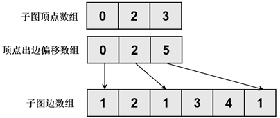
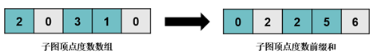

# 项目介绍

DepGraph图计算系统是一个用于解决复杂问题的高性能图计算框架。它的设计目标是提供高度并行化和可扩展的图算法实现，使得在大规模图数据上运行复杂算法变得高效且容易。

## 整体架构

DepGraph的整体架构可分为三个层次：基础层提供了图分区，任务调度，同步/异步通信等基础功能。算法层以宽度优先遍历算法为例，展示了系统采用的各种图算法优化技术。应用层展示了如何利用DepGraph开放的API接口快速部署图计算应用。

## 图预处理

### 去除零节点

Yasui等人[2]研究发现，GRAPH 500使用的数据集Kronecker生成图中存在大量度数为0的孤立顶点(isolated vertex)。下表展示了对于不同顶点规模的Kronecker生成图,孤立顶点占全部顶点的百分比。可以看到，孤立顶点能够占到全部顶点的一半，而且随着顶点规模的增加,孤立顶点的占比还在不断扩大。这些孤立顶点的存在会使得BFS算法访问所有顶点时一半的访问是无效的。项目在生成子图时，会筛选出度数为0的孤立顶点，从而提高了BFS算法的计算效率。

> [2]Yasui Y, Fujisawa K, Sato Y. Fast and energy-efficient breadth-first search on a single NUMA system//International Supercomputing Conference. New Orleans, USA, 2014: 365-381

| 顶点规模 | 孤立顶点占全部顶点的百分比 |
| :------: | :------------------------: |
|   224    |           47.1%            |
|   225    |           49.2%            |
|   226    |           51.1%            |
|   227    |           53.0%            |
|   228    |           54.8%            |
|   229    |           56.6%            |
|   230    |           58.3%            |

表：Kronecker生成图的孤立顶点占比 

### 图分区

在分布式图计算系统中，为了使每个分布式节点上的工作均衡，需要对图数据进行划分，以确保算法高效运行。DepGraph支持多种图划分策略：

- 无约束顶点划分（Unconstrained Vertex-Cut UVC）：这种策略可以将一个顶点的出边和入边分给不同的主机，不受主顶点还是镜像顶点的限制。由于节点的主节点和镜像节点可以具有传出和传入边缘，因此可以在计算阶段写入任何代理节点。在每一轮结束时，镜像节点的标签被传送给主节点并组合以产生最终值。该值被写入主节点并广播到镜像节点。因此，reduce和broadcast都是需要的。
- 笛卡尔顶点划分（Cartesian Vertex-Cut CVC）：这是一种受约束的顶点划分策略，只有主顶点可以同时拥有入边和出边，而镜像代理可以有入边也可以有出边，但是不能同时拥有两者。因此，镜像节点要么从标签读取，要么写入标签，但不能同时读取两者。在一轮结束时，仅具有传入边缘的一组镜像将其值传达给主设备以产生最终值。然后主设备将该值广播到仅具有传出边缘的镜像组。与 UVC 一样，CVC 需要减少和广播同步模式，但每种模式仅使用镜像节点的特定子集，而不是所有镜像节点。这可以为许多程序带来更好的大规模性能。
- 入边划分（Incoming Edge-Cut IEC）：这种策略只有主顶点可以拥有入边，而镜像顶点只能拥有出边。主节点将此更新后的值传送给镜像节点以进行下一轮。因此，仅需要广播同步模式。
- 出边划分（Outgoing Edge-Cut OEC）：这种策略是IEC的镜像，即只有主代理可以拥有出边，其他代理只能拥有入边。在一轮结束时，推送到镜像的值被组合以在主设备上产生最终结果，并且镜像上的值可以被重置为下一轮归约操作的（广义）零。因此，只需要reduce同步模式。

我们主要采用了OEC的图分区策略，具体如下：

上图是一个**出边划分策略**（OEC，Outgoing Edge-Cut）的例子。这种策略按照边的数量进行划分，每个主机负责的边数大致相同，同时被分配的顶点在原始图数据中也是连续的。原始图有十个顶点`A-J`，其中顶点`{A,B,E,F,I}`被分配给主机`h1`，其他被分配给`h2`。每个主机为分配给它的顶点创建一个代理顶点，称为主顶点（master），它保存着该顶点的准确值。而有的边（如边`(B,G)`）的两个顶点跨越了不同主机（顶点`B`在主机`h1`，而顶点`G`在主机`h2`），则OEC分区会在该条边的源顶点`B`所在主机`h1`上，为目标顶点`G`创建一个代理顶点，称为镜像顶点（mirror），并且在`h1`上创建一条从`B`到`G`的边。即这种分区策略会将每一个顶点`N`分配给（且只分配给）一个主机，则该主机上的顶点称为`N`的主顶点，而其他主机虽然未被分配`N`，但是它也可能使用到顶点`N`，所以其他主机也可能存在`N`副本，称为`N`的镜像顶点。而在每个主机获得的子图中，所有的边连接的目的顶点都在该主机上有一个代理。在OEC策略中，每个主机拥有其主顶点的所有出边，而镜像顶点只会有入边而没有出边（镜像顶点的出边在拥有其作为主顶点的主机上）。这样一来，每个主机执行计算时便可以直接获取所需的所有数据，而无需在计算时进行数据传输，而每台主机也就不会意识到其他分区或者主机的存在，在每次计算完毕后统一进行数据同步，从而将计算与通信独立开来。

### 子图压缩

本节针对的是GPU模式下的图计算。为处理图数据规模超过GPU内存容量(out-of-GPU-memory)的情况，现有的基于GPU的图分析算法主要采用基于分区的方法。具体来说，大规模图首先被划分为多个子图，使每个子图都能完整加载入GPU内存（如下图），然后在每轮迭代图处理过程中依次将每个子图加载入GPU进行处理。然而，子图迭代处理过程中的大多数迭代的活跃顶点比例通常很低，被加载入GPU的图分区中往往只有少量图数据需要被处理，这导致了高额的数据传输开销，同时也使得活跃顶点状态无法在图的拓扑结构中高效传播，从而导致图处理性能急剧下降。

为了减小CPU-GPU之间的传输开销，我们采用了一种基于依赖感知的GPU图算法优化技术，该优化技术使用一种高效的运行时依赖子图生成算法，能够在迭代图处理过程中利用GPU的高并行性提取稀疏分布的活跃顶点来对子图进行压缩，使图算法只需加载和处理与活跃顶点相关的图数据，从而显著地减少CPU-GPU数据传输开销，提高图算法的执行速度。

子图的原始图数据采用CSR(Compressed Sparse Row)格式进行存储。如图所示，CSR格式的图数据由两个数组构成：顶点数组(数组下标对应顶点Id，数组内容存储顶点出边偏移量)与边数组(存储出边)。通常，大规模图数据中的边数据占用绝大部分存储空间，而顶点数据仅占用小部分存储空间，为减少CPU-GPU通信开销，该优化技术**在GPU中同样存储一组原始图数据的顶点数组，而原始图数据的边数组则只存储在CPU内存中**(所以每个计算回合，都需要进行一次子图压缩，得到压缩后的边数组，传递给GPU)。

图：CSR图存储格式

为了高效地从CSR格式的图数据中提取依赖子图，依赖子图生成算法采用CSR风格的依赖子图存储格式，具体而言，依赖子图由三个数组构成，分别是子图顶点数组(存储活跃顶点Id)、顶点出边偏移数组和子图边数组。依赖子图存储格式如图所示：

图：依赖子图存储格式

运行时的依赖子图生成由CPU与GPU共同完成，除了需要使用CSR格式的原始图数据(CSR顶点数组与边数组)，还需要活跃顶点标记数组与顶点出度数组。具体的依赖子图生成步骤如下：

- 首先根据活跃顶点标记数组计算活跃顶点标记前缀和，即子图中活跃顶点对应位置。此步骤可通过GPU的高并行性快速完成。如图所示：

图：获取活跃顶点标记前缀和

- 然后根据活跃顶点标记数组与活跃顶点标记前缀和获得子图顶点数组，此步骤也可通过GPU的高并行性快速完成。如图所示：

图：构建子图顶点数组

- 生成子图顶点数组之后，根据活跃顶点标记数组与顶点度数数组获取子图顶点度数数组。如图所示，将非活跃顶点的度数置为0，此步骤可利用GPU快速完成。

图：获取子图顶点度数数组

- 获取子图顶点度数数组之后，计算其前缀和，即对应子图顶点的出边偏移量，如图所示，此步骤可通过GPU快速完成。

图：获取子图顶点度数前缀和

- 根据活跃顶点标记数组、活跃顶点标记前缀和子图顶点度数前缀和获取子图顶点出边偏移数组，如图所示，此步骤可利用GPU快速完成

图：构建子图顶点出边偏移数组

- 最后，根据子图顶点数组与子图顶点出边偏移数组，以及CSR格式的原始图数据获取子图边数组。如图所示，将由于原始图数据的边数组只存储在CPU内存中，此步骤的并行性只能通过多个CPU线程完成。

图：构建子图边数组

## 执行策略

### 通信策略

### 调度策略

