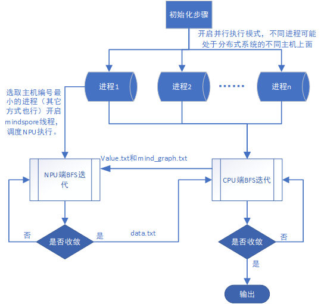
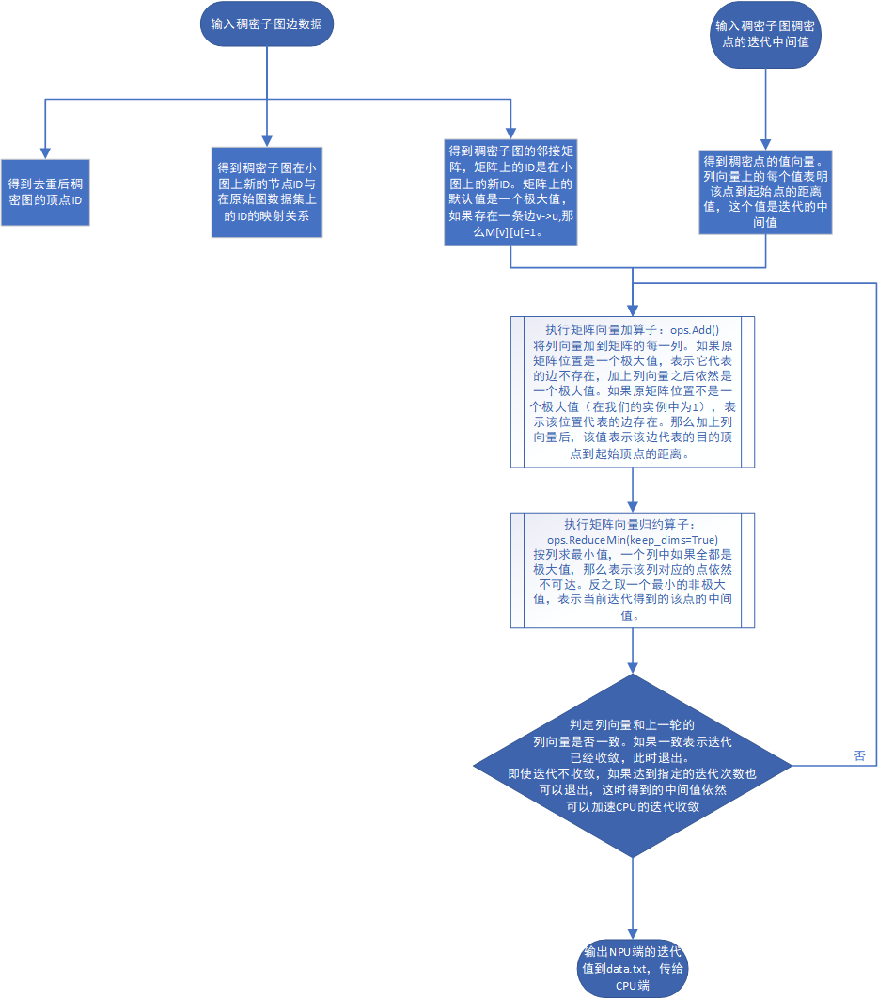
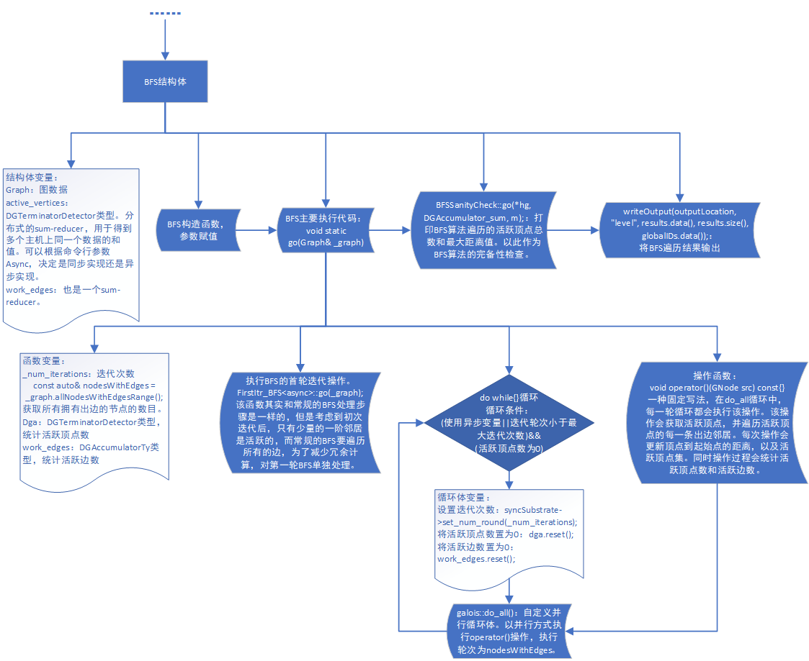

# 项目总结

## 项目简介

### 设计思路

#### 图数据能通过稀疏矩阵来表示：

- 图数据中的有向边与矩阵中的非零元素对应，矩阵非零元素的值可对应有向边的权值等（由图算法决定）
- 矩阵的横纵坐标分别对应有向边的源顶点ID和目的顶点ID

#### 图计算操作能转化为稀疏矩阵乘

#### 异步执行性能通常优于同步执行性能

- 同步：执行流程被划分为多次迭代过程，连续两次迭代过程之间需要严格进行同步，产生同步开销、负载不均衡问题。
- 异步：没有迭代间同步，图顶点状态的更新立即可用，可实现更快图顶点状态传递，具有更高灵活性。
- 异步执行性能通常优于同步执行性能主要是因为：
  - 异步可以立即快速传播图顶点状态，每次邻居顶点看到的都是最新的图顶点状态。
  - 异步可以省去同步开销，执行快的线程无需等待执行慢的线程。

### 项目架构

#### 概述

项目代码分为CPU端和NPU端两大部分，两者都执行BFS操作，根据计算架构特点执行不同算法。CPU端适合串行复杂计算任务，所以采用经典的以点为中心的遍历图算法，从起始顶点开始逐轮迭代计算每一跳邻居。NPU端适合并行简单计算任务，所以采用矩阵+向量迭代算法。首先执行”加和操作“，遍历所有边。然后进行”归约操作“，找出本轮迭代的可达边，即代表从源点开始的n阶邻居（假设迭代轮次为n）。

图数据具有幂律分布的特点，不同顶点间的稠密度相差很大。如果把这样一个幂律图全都交给CPU处理，CPU会在高度顶点（度指顶点连接的边数）迭代过多轮次，导致收敛的速度太慢。而如果把幂律图数据全都交给NPU处理，NPU需要为n个顶点开辟n*n大小的存储空间（真实世界图数据集的顶点规模远远大于NPU可用资源），这限制了NPU所能处理的图数据集的规模。此外矩阵+向量迭代算法在矩阵较为稠密时（矩阵上大部分元素都是有效的非零元素）可以快速迭代，当矩阵较为稀疏时，迭代轮次升高，执行效率变差。

针对图数据的特征和两种算法的执行特性，提出CPU+NPU的异构图计算模型。CPU端负责载入图数据，并根据顶点度数筛选稠密顶点，以文件的方式单独保存稠密子图数据。接着采用多线程运行方式，其中一个线程负责调度NPU端执行程序，其余线程则以以点为中心的遍历方式执行BFS查询。NPU端会读取CPU传递过来的稠密子图（稠密子图中两条边都属于稠密顶点），用矩阵向量算法执行运算。运算结束后将保存迭代值，并生成一个结束标志。CPU检测到结束标志会将NPU端的计算值更新到当前迭代值中。CPU采用异步计算的方式进行迭代，当某一轮后发现迭代结果值未发生改变，代表算法已经收敛，计算完成。

#### NPU端执行逻辑

#### CPU端执行逻辑

## 理论分析

## 实验结果

## 总结