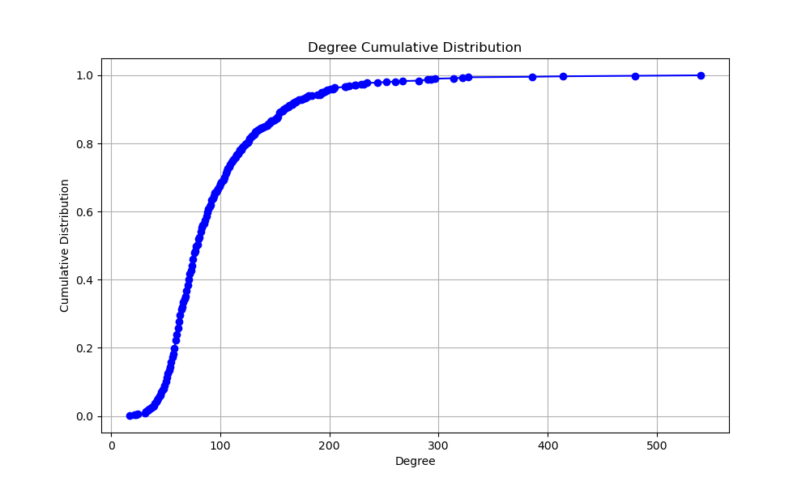

# 项目总结

## 项目简介

### 设计思路

#### 图数据能通过稀疏矩阵来表示：

- 图数据中的有向边与矩阵中的非零元素对应，矩阵非零元素的值可对应有向边的权值等（由图算法决定）
- 矩阵的横纵坐标分别对应有向边的源顶点ID和目的顶点ID

#### 图计算操作能转化为稀疏矩阵乘

很多图算法中对顶点的操作可以转化为稀疏矩阵乘的形式。如下图所示：

- 左边展示了图计算中经典的“**以顶点为中心**”的“**pull-style**”计算模型。在Process Edge阶段顶点4会拉取它所有的入边邻居的信息，在Reduce阶段顶点V4对所有拉取的邻居信息进行处理。
- 右边展示了使用**稀疏矩阵乘**实现同样的计算过程。方块代表图的邻接矩阵。绿色条带代表所有顶点目前的值向量。紫色条带代表顶点计算更新后的值向量。橙色条带代表了指向顶点4的入边邻居顶点。条带中的黑色点是非零值（对于有权图，该位置的值为权值，对无权图，该位置的值为1），代表真实存在的顶点，其余位置为零值，表示该位置的顶点关系并不存在（因为图是用邻接矩阵形式表示的，所以无论是存在，都要保留）。进行稀疏矩阵乘时，矩阵的每一行（橙色条带）都会与值向量（绿色条带）相乘，图中的示例行代表顶点4的入边邻居将自身的值加到顶点4上，然后经历一步Reduce操作后得到顶点4的更新值。其它顶点的更新过程也是这样。

大部分可以用“以顶点为中心”形式实现的图算法都可以实现上述转换过程。它们的计算步骤可以被抽象为Process Edge和Reduce两步：

Process Edge和Reduce的具体实现会根据不同的图算法而调整，相应的它们转换为稀疏矩阵乘后的操作也不同。下表统计了几个常见图算法的操作：

|          **图算法**          | Process Edge操作 | Reduce操作 |
| :--------------------------: | :--------------: | :--------: |
|           PageRank           |        ×         |     +      |
|           NumPaths           |        ×         |     +      |
|          Adsorption          |        ×λ        |     +      |
|             BFS              |        +         |    min     |
| Single Source Shortest Path  |        +         |    min     |
|     Connected Components     |        ×         |    min     |
|  Single Source Widest Path   |       min        |    max     |
| Single Source Narrowest Path |       min        |    min     |
|   Minimum Reliability Path   |        ×         |    min     |
|   Maximum Reliability Path   |        ×         |    max     |
|      Maximum Cost Path       |        +         |    max     |
|  Single Source Reachability  |       and        |     or     |

#### 异步执行性能通常优于同步执行性能

- 同步：执行流程被划分为多次迭代过程，连续两次迭代过程之间需要严格进行同步，产生同步开销、负载不均衡问题。
- 异步：没有迭代间同步，图顶点状态的更新立即可用，可实现更快图顶点状态传递，具有更高灵活性。
- 异步执行性能通常优于同步执行性能主要是因为：
  - 异步可以立即快速传播图顶点状态，每次邻居顶点看到的都是最新的图顶点状态。
  - 异步可以省去同步开销，执行快的线程无需等待执行慢的线程。

### 项目架构

#### 概述

项目代码分为CPU端和NPU端两大部分，两者都执行BFS操作，根据计算架构特点执行不同算法。CPU端适合串行复杂计算任务，所以采用经典的以点为中心的遍历图算法，从起始顶点开始逐轮迭代计算每一跳邻居。NPU端适合并行简单计算任务，所以采用矩阵+向量迭代算法。首先执行”**Process Edge操作**“，遍历所有边。然后进行”**Reduce操作**“，找出本轮迭代的可达边，即代表从源点开始的n阶邻居（假设迭代轮次为n）。

图数据具有幂律分布的特点，不同顶点间的稠密度相差很大。如果把这样一个幂律图全都交给CPU处理，CPU会在高度顶点（度指顶点连接的边数）迭代过多轮次，导致收敛的速度太慢。而如果把幂律图数据全都交给NPU处理，NPU需要为n个顶点开辟n*n大小的存储空间（真实世界图数据集的顶点规模远远大于NPU可用资源），这限制了NPU所能处理的图数据集的规模。此外矩阵+向量迭代算法在矩阵较为稠密时（矩阵上大部分元素都是有效的非零元素）可以快速迭代，当矩阵较为稀疏时，迭代轮次升高，执行效率变差。

针对图数据的特征和两种算法的执行特性，提出CPU+NPU的异构图计算模型。CPU端负责载入图数据，并根据顶点度数筛选稠密顶点，以文件的方式单独保存稠密子图数据。接着采用多线程运行方式，其中一个线程负责调度NPU端执行程序，其余线程则以以点为中心的遍历方式执行BFS查询。NPU端会读取CPU传递过来的稠密子图（稠密子图中两条边都属于稠密顶点），用矩阵向量算法执行运算。运算结束后将保存迭代值，并生成一个结束标志。CPU检测到结束标志会将NPU端的计算值更新到当前迭代值中。CPU采用异步计算的方式进行迭代，当某一轮后发现迭代结果值未发生改变，代表算法已经收敛，计算完成。

#### 鲲鹏端执行逻辑

鲲鹏端运行DepGraph图计算框架，框架本身对分布式图计算系统初始化、内存管理、通信[2]进行了很好的封装。用户在执行时只需要在通用图算法执行流程的基础上，按照给定的接口规范，实现自己的图算法的结构体。

> [2]Dathathri R, Gill G, Hoang L, et al. Gluon-async: A bulk-asynchronous system for distributed and heterogeneous graph analytics[C]//2019 28th International Conference on Parallel Architectures and Compilation Techniques (PACT). IEEE, 2019: 15-28.

#### 昇腾端执行逻辑

下图展示了昇腾端接收稠密子图，并进行稀疏矩阵乘操作的流程：

上图展示了昇腾端在稠密子图上执行通用图算法的过程，其中processEdge操作和Reduce操作因算法而异，具体可以参照1.1.2章节。下面以BFS为例，介绍其实现：

- BFS的processEdge操作：执行矩阵向量加算子：ops.Add()
  将列向量加到矩阵的每一列。如果原矩阵位置是一个极大值，表示它代表的边不存在，加上列向量之后依然是一个极大值。如果原矩阵位置不是一个极大值，表示该位置代表的边存在。那么加上列向量后，该值表示该边代表的目的顶点到起始顶点的距离。 

- BFS的Reduce操作：执行矩阵向量归约算子：ops.ReduceMin(keep_dims=True) 

  按列求最小值，一个列中如果全都是极大值，那么表示该列对应的点依然不可达。反之取一个最小的非极大值，表示当前迭代得到的该点的中间值。

- 判断哪是否收敛：将本轮得到的值向量与上一轮得到的值向量进行比较（如果是第一轮迭代，则将第一轮迭代的向量与用户输入的值向量进行比较）。如果两个值向量是一致的，则表示迭代已经收敛此时退出，否则回到processEdge步骤。注意，在特殊情况下，如果迭代执行到用户指定的最大迭代次数仍然未收敛，此时也可以将值返回，此时的中间值也是有效的。

## 实验测试

实验测试的目的是设计合理的实验流程，证明实验方法的**“理论正确性”和“操作正确性”**。

### 数据集分析

#### 数据集选取

实验选取了两种数据集：

- 1、**真实世界的自然图**，数据集来源：[Stanford Large Network Dataset Collection](http://snap.stanford.edu/data/)
- 2、**Graph500提供的图生成工具**，可以指定生成特定规模（顶点的数目）和稠密度（边的数目）的图。

测试选取了三种不同类型的数据集：分别是社交网络图、电商平台交易图、道路交通图。实验尽可能涵盖了不同规模的图数据，但是由于网上开源的图数据有限，无法做同一类型不同规模的图数据集的横向测试，且由于资源限制，图数据的规模无法选取过大。

> 选取了ego-Gplus: Social circles from Google+，具有107614个点，13673453条边。实际测试解压后数据集规模达到数G,放弃实验。 

#### 原始图分布

- 原始分布，以Wiki-Vote为例。

首先将图数据转化为矩阵形式，然后将矩阵绘制成图像。矩阵的非零点（表示该位置存在一条边）用蓝色像素表示，矩阵的零点（表示该位置不存在边）用白色像素表示。整幅图像呈现淡蓝色，原因是蓝色像素稀疏地分布在整幅图像。放大看图像的细节，在对角线附近蓝色像素较为集中，这是图的幂律分布特性所决定的[1]。

> [1] Arai, Junya, et al. "Rabbit order: Just-in-time parallel reordering for fast graph analysis." *2016 IEEE International Parallel and Distributed Processing Symposium (IPDPS)*. IEEE, 2016

- 不同度数顶点的度数，以Wiki-Vote为例。

横轴是顶点的度数，纵轴是该度数出现的次数。右上角有统计信息，展示了边的数目、顶点的数目、顶点的平均度数、顶点的最大度数。此外我还将顶点按度数从小到大排序，最小的度数是1，最大的度数是1167。

- 顶点度数的累积分布函数，以Wiki-Vote为例。

根据统计到的度绘制了累计分布函数。

- 统计数据集中的非零节点数

==结论：真实世界原始图数据集很稀疏。==

#### 稠密子图分布

以Wiki-Vote为例，使用三个阈值划分稠密子图。

- 阈值选取：度数排名（从大到小）第10%的度数值、第5%的度数值、第1%的度数值。
- 子图划分：遍历图数据集的每一条边，如果边的两个顶点（源点和目的顶点）的度数都大于阈值，那么该边就被划分为稠密子图。
- 下方展示了按照10%、5%、1%三个阈值进行划分。

- 不同度数顶点的度数分布情况，以Wiki-Vote为例。

- 稠密子图的顶点度数的累积分布函数，以Wiki-Vote为例。

==结论：对原始图进行重排序后的数据集依然很稀疏，且稠密度并没有随着筛选顶点度数阈值提高而提高。==

### 性能分析

- 由于自然图数据集可选项很少，灵活性较差。所以该部分使用Graph500图生成工具，生成特定规模、特定度数的图。
- 之前的代码没有考虑过起始点选取的问题，但是对于BFS算法来说，选取不同起始点对性能的影响很大。所以我增设了一个处理步骤，测试前遍历图数据集，选择出度最大的顶点作为BFS起始点。
- 原有代码中NPU端牵涉复杂的数据传输、类型转换以及Profiling工作，为了准确起见，这里把Profiling得到的算子执行总时间作为NPU端时间。
- NPU中不止加算子和reduce算子，这里只展示了主要的算子（所以单算子相加的时间和总算子耗时不一致）。
- 之前的NPU代码存在一个问题：数据集中存在孤立点，在设置矩阵大小的时候，自动剔除了孤立点。比如设置2^16个顶点，矩阵名义上有2 ^16维，实际上会小于2 ^16。所以理论上规模不变，随着稠密度的提升，整体计算时间完全不变。但是实际上，随着稠密度提升，孤立点减少，矩阵的规模发生了细微变化，整体计算时间发生了变化。

==结论：    1、NPU端的执行效率远落后于CPU端。==

​				==2、NPU端的可计算的矩阵规模受限。==

​				==3、NPU的性能与矩阵稠密度无关，与矩阵规模有关。CPU性能与矩阵规模和稠密度成正相关。==

## 思考

- 当前按照顶点度数阈值的划分方式，提取出来的子图不够稠密。

- 如果采用某种方式提取稠密子图，需要避免预处理开销太大，否则可能反向优化。

- 即使提取处理稠密子图，按照目前的性能对比，是否能带来性能增益。

- 可以找一些特定的应用场景，可以以低开销的方式找出稠密子图。

  

 
